## introdução

- Esta é a CS50, a introdução da Universidade de Harvard aos empreendimentos intelectuais da ciência da computação e à arte da programação, tanto para grandes quanto para os não grandes, com ou sem experiência anterior em programação. Um curso de nível básico ministrado por David J. Malan, o CS50 ensina os alunos a pensar algoritmicamente e resolver problemas de forma eficiente. Os tópicos incluem abstração, algoritmos, estruturas de dados, encapsulamento, gerenciamento de recursos, segurança, engenharia de software e desenvolvimento web. As linguagens incluem C, Python, SQL e JavaScript, além de CSS e HTML. Conjuntos de problemas inspirados em domínios do mundo real de biologia, criptografia, finanças, ciência forense e jogos. A versão no campus do CS50x, CS50, é o maior curso de Harvard. 

## O que é ciência da computação?

- A ciência da computação é fundamentalmente a **solução de problemas.**
- Podemos pensar na solução de problemas como o processo de pegar algumas informações (detalhes sobre nosso problema) e gerar algumas saídas (a solução para nosso problema). A “caixa preta” do meio é a ciência da computação, ou o código que aprenderemos a escrever.

<h1 align="center">
   
</h1>

- Para começar a fazer isso, precisaremos de uma maneira de representar entradas e saídas, para que possamos armazenar e trabalhar com informações de forma padronizada.

## Números representativos

- Podemos começar com a tarefa de tomar atendimento contando o número de pessoas em uma sala. Com a nossa mão, podemos levantar um dedo de cada vez para representar cada pessoa, mas não poderemos contar muito alto. Este sistema é denominado unário , onde cada dígito representa um único valor de um.
- Provavelmente aprendemos um sistema mais eficiente para representar números, onde temos dez dígitos, de 0 a 9:

```
0 1 2 3 4 5 6 7 8 9
```

- Este sistema é denominado decimal, ou **base 10** , uma vez que existem dez valores diferentes que um dígito pode representar.
- Os computadores usam um sistema mais simples chamado **binário** , ou **base dois**, com apenas dois dígitos possíveis, **0** e **1**.
Cada dígito binário também é chamado de **bit** . 
- Como os computadores funcionam com eletricidade, que pode ser ligada ou desligada, podemos convenientemente representar um bit ligando ou desligando alguma chave para representar 0 ou 1.
- Com uma lâmpada, por exemplo, podemos ligá-la para contar até 1.
- Com três lâmpadas, podemos acendê-las em padrões diferentes e contar de 0 (com as três apagadas) a 7 (com as três acesas):

<h1 align="center">
   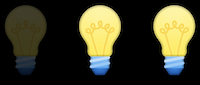
</h1>

- Dentro dos computadores modernos, não existem lâmpadas, mas milhões de pequenos interruptores chamados **transistores** que podem ser ligados e desligados para representar valores diferentes.
- Por exemplo, sabemos que o seguinte número em decimal representa cento e vinte e três.

```
1 2 3
```

- O `3` está na coluna das unidades, o `2` está na coluna das dezenas e o `1` está na coluna das centenas.
- Então `123` é `100×1 + 10×2 + 1×3 = 100 + 20 + 3 = 123.`
- Cada casa de um dígito representa uma potência de dez, pois há dez dígitos possíveis para cada casa. O lugar mais à direita é para 10^0 , o do meio 10^1 e o lugar mais à esquerda 10^2 :

```
10^2 10^1 10^0
1 2 3
```

- Em binário, com apenas dois dígitos, temos potências de dois para cada valor de casa:

```
2^2 2^1 2^0
# # #
```

- Isso é equivalente a:

```
4 2 1
# # #
```

- Com todas as lâmpadas ou interruptores desligados, ainda teríamos um valor de 0:

```
4 2 1
 0 0 0
```

- Agora, se mudarmos o valor binário para, digamos, `0 1 1` o valor decimal seria 3, já que somamos o 2 e o 1:
- Se tivéssemos mais lâmpadas, poderíamos ter um valor binário de `110010`, que teria o valor decimal equivalente de `50`:

```
32 16 8 4 2 1
 1 1 0 0 1 0
```

- Observe isso 32 + 16 + 2 = 50.
- Com mais bits, podemos contar até números ainda maiores

## Texto

- Para representar as letras, tudo o que precisamos fazer é decidir como os números são mapeados para as letras. Alguns humanos, muitos anos atrás, decidiram coletivamente um mapeamento padrão de números em letras. A letra **“A”**, por exemplo, é o número **65**, e **“B”** é **66** e assim por diante. Ao usar o contexto, como se estivéssemos olhando uma planilha ou um e-mail, diferentes programas podem interpretar e exibir os mesmos bits como números ou texto.
- O mapeamento padrão, [`ASCII`](https://pt.wikipedia.org/wiki/ASCII) , também inclui letras minúsculas e pontuação.
- Se recebeu uma mensagem de texto com um padrão de bits que tiveram os valores decimais `72`, `73` e `33`, esses bits seria mapear para as letras `HI!`. Cada letra é geralmente representado com um padrão de **oito bits**, ou **um byte** , então as seqüências de bits nós recebemos são `01001000`, `01001001` e `00100001`.
- Podemos já estar familiarizados com o uso de bytes como uma unidade de medida para dados, como em megabytes ou gigabytes, para milhões ou bilhões de bytes.
Com oito bits, ou um byte, podemos ter 2^8 ou **256** valores diferentes (incluindo zero). (O valor mais alto que podemos contar seria **255**.)
Outros caracteres, como letras com acentos e símbolos em outros idiomas, fazem parte de um padrão chamado [`Unicode`](https://pt.wikipedia.org/wiki/Unicode) , que usa mais bits do que ASCII para acomodar todos esses caracteres.
- Quando recebemos um emoji, nosso computador está apenas recebendo um número binário que mapeia para a imagem do emoji baseado no padrão Unicode.
- Por exemplo, o emoji “rosto com lágrimas de alegria” é apenas uma parte `000000011111011000000010`:

<h1 align="center">
   
</h1>

## Imagens, vídeo, sons

- Uma imagem, como a imagem do emoji, é composta de cores.
- Com apenas bits, podemos mapear números para cores também. Existem muitos sistemas diferentes para representar cores, mas um comum é **RGB** , que representa cores diferentes indicando a quantidade de vermelho, verde e azul dentro de cada cor.
- Por exemplo, o nosso padrão de bits anteriormente, `72`, `73`, e `33` pode indicar a quantidade de vermelho, verde e azul em uma cor. (E nossos programas saberiam que esses bits são mapeados para uma cor se abríssemos um arquivo de imagem, em vez de recebê-los em uma mensagem de texto.)
- Cada número pode ser um byte, com 256 valores possíveis, portanto, com três bytes, podemos representar milhões de cores. Nossos três bytes de cima representariam um tom escuro de amarelo:

<h1 align="center">
   
</h1>

- Os pontos, ou quadrados, em nossas telas são chamados de **pixels** , e as imagens são compostas por muitos milhares ou milhões desses pixels também. Portanto, usando três bytes para representar a cor de cada pixel, podemos criar imagens. Podemos ver os pixels em um emoji se aumentarmos o zoom, por exemplo:

<h1 align="center">
   
</h1>

- A **resolução** de uma imagem é o número de pixels que existe, horizontal e verticalmente, portanto, uma imagem de alta resolução terá mais pixels e exigirá mais bytes para ser armazenada.
- Os vídeos são compostos de muitas imagens, mudando várias vezes por segundo para nos dar a aparência de movimento, como um flipbook antiquado faria.
- A música também pode ser representada com bits, com mapeamentos de números para notas e durações, ou mapeamentos mais complexos de bits para frequências de som em cada momento do tempo.
- Os formatos de arquivo, como JPEG e PNG, ou documentos do Word ou Excel, também são baseados em algum padrão com o qual alguns humanos concordaram, para representar informações com bits.

## Algoritmos

- Agora que podemos representar entradas e saídas, podemos trabalhar na resolução de problemas. A caixa preta anterior conterá algoritmos , instruções passo a passo para resolver problemas:

<h1 align="center">
   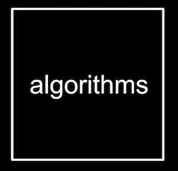
</h1>

- Os humanos também podem seguir algoritmos, como receitas para cozinhar. Ao programar um computador, precisamos ser mais precisos com nossos algoritmos para que nossas instruções não sejam ambíguas ou mal interpretadas.
- Podemos ter um aplicativo em nossos telefones que armazena nossos contatos, com seus nomes e números de telefone classificados em ordem alfabética. O equivalente da velha escola pode ser uma lista telefônica, uma cópia impressa de nomes e números de telefone.
- Nossa contribuição para o problema de encontrar o número de alguém seria a lista telefônica e um nome a ser procurado. Podemos abrir o livro e começar da primeira página, procurando um nome uma página de cada vez. Este algoritmo estaria **correto** , já que eventualmente encontraremos o nome se ele estiver no livro.
- Podemos folhear o livro duas páginas por vez, mas esse algoritmo não estará correto, pois podemos pular a página com nosso nome nela. Podemos consertar esse bug , ou engano, voltando uma página se formos longe demais, pois sabemos que a lista telefônica está classificada em ordem alfabética.
- Outro algoritmo seria abrir a lista telefônica ao meio, decidir se nosso nome ficará na metade esquerda ou direita do livro (porque o livro está em ordem alfabética) e reduzir o tamanho do nosso problema pela metade. Podemos repetir isso até encontrar nosso nome, dividindo o problema pela metade a cada vez. Com 1.024 páginas para começar, precisaríamos apenas de 10 etapas de divisão ao meio antes de termos apenas uma página restante para verificar. Podemos ver isso visualizado em uma [`animação de dividir uma lista telefônica ao meio repetidamente , em comparação com a animação de pesquisar uma página por vez.`](https://www.youtube.com/watch?v=F5LZhsekEBc)
- Na verdade, podemos representar a eficiência de cada um desses algoritmos com um gráfico:

<h1 align="center">
   
</h1>

- Nossa primeira solução, pesquisar uma página por vez, pode ser representada pela linha vermelha: nosso tempo para resolver aumenta linearmente à medida que o tamanho do problema aumenta. n é um número que representa o tamanho do problema, portanto, com n páginas em nossas listas telefônicas, temos que realizar até n etapas para encontrar um nome.
- A segunda solução, pesquisar duas páginas por vez, pode ser representada pela linha amarela: nossa inclinação é menos acentuada, mas ainda linear. Agora, precisamos apenas de (aproximadamente) n / 2 etapas, já que viramos duas páginas de cada vez.
- Nossa solução final, dividindo a lista telefônica ao meio a cada vez, pode ser representada pela linha verde, com uma relação fundamentalmente diferente entre o tamanho do problema e o tempo de resolvê-lo: [`logarítmico`](https://pt.wikipedia.org/wiki/Logaritmo) , já que nosso tempo de resolver aumenta cada vez mais lentamente conforme o tamanho do problema aumenta. Em outras palavras, se a lista telefônica fosse de 1.000 para 2.000 páginas, precisaríamos apenas de mais uma etapa para encontrar nosso nome. Se o tamanho dobrasse novamente de 2.000 para 4.000 páginas, ainda precisaríamos apenas mais uma etapa. A linha verde é rotulada log 2~n , ou log base 2 de n , já que estamos dividindo o problema por dois em cada etapa.
- Quando escrevemos programas usando algoritmos, geralmente nos preocupamos não apenas com o quão corretos eles são, mas com o quão bem projetados são, considerando fatores como eficiência.

## Pseudo-código

- Podemos escrever **pseudocódigo** , que é uma representação de nosso algoritmo em inglês preciso (ou alguma outra linguagem humana):

```
1 Pegue a lista telefônica
2 Abra no meio da lista telefônica
3 Olhe para a página
4 Se a pessoa estiver na página
5 Ligar para pessoa
6 Caso contrário, se a pessoa estiver no início do livro
7 Aberto no meio da metade esquerda do livro
8 Volte para a linha 3
9 Caso contrário, se a pessoa estiver mais tarde no livro
10 Aberto no meio da metade direita do livro
11 Volte para a linha 3
12 mais
13 desistir
```

- Com essas etapas, verificamos a página do meio, decidimos o que fazer e repetimos. Se a pessoa não estiver na página e não houver mais páginas sobrando no livro, paramos. E esse caso final é particularmente importante para lembrar. Quando outros programas em nossos computadores esqueceram esse caso final, eles podem parecer travar ou parar de responder, uma vez que encontraram um caso que não foi contabilizado, ou continuam a repetir o mesmo trabalho continuamente nos bastidores, sem fazer nenhum progresso.
- Algumas dessas linhas começam com verbos ou ações. Começaremos chamando essas funções : 

```
1   Pegue a lista telefônica
2   Abra no meio da lista telefônica
3   Olhe para a página
4 Se a pessoa estiver na página
5       Ligar para pessoa
6 Caso contrário, se a pessoa estiver no início do livro
7       Aberto no meio da metade esquerda do livro
8 Volte para a linha 3
9 Caso contrário, se a pessoa estiver mais tarde no livro
10      Aberto no meio da metade direita do livro
11 Volte para a linha 3
12 mais
13      desistir
```

- Também temos ramificações que levam a caminhos diferentes, como bifurcações na estrada, que chamaremos de condições :

```
1 Pegue a lista telefônica
2 Abra no meio da lista telefônica
3 Olhe para a página
4   Se a pessoa estiver na página
5 Ligar para pessoa
6   Caso contrário, se a pessoa estiver no início do livro
7 Aberto no meio da metade esquerda do livro
8 Volte para a linha 3
9   Caso contrário, se a pessoa estiver mais tarde no livro
10 Aberto no meio da metade direita do livro
11 Volte para a linha 3
12 mais
13 desistir
```

- E as questões que decidem para onde vamos são chamadas de expressões booleanas , que eventualmente resultam em um valor de sim ou não, ou verdadeiro ou falso:

```
1 Pegue a lista telefônica
2 Abra no meio da lista telefônica
3 Olhe para a página
4 Se a pessoa estiver na página
5 Ligar para pessoa
6 Caso contrário, se a pessoa estiver no início do livro
7 Aberto no meio da metade esquerda do livro
8 Volte para a linha 3
9 Caso contrário, se a pessoa estiver mais tarde no livro
10 Aberto no meio da metade direita do livro
11 Volte para a linha 3
12 mais
13 desistir
```

- Por último, temos palavras que criam ciclos, onde podemos repetir partes do nosso programa, chamadas loops :

```
1 Pegue a lista telefônica
2 Abra no meio da lista telefônica
3 Olhe para a página
4 Se a pessoa estiver na página
5 Ligar para pessoa
6 Caso contrário, se a pessoa estiver no início do livro
7 Aberto no meio da metade esquerda do livro
8       Volte para a linha 3
9 Caso contrário, se a pessoa estiver mais tarde no livro
10 Aberto no meio da metade direita do livro
11      Volte para a linha 3
12 mais
13 desistir
```

## Scratch

- Podemos escrever programas com os blocos de construção que acabamos de descobrir:
-- funções
-- condições
-- Expressões booleanas
-- rotações
- E descobriremos recursos adicionais, incluindo:
-- variáveis
-- tópicos
-- eventos
-- …
- Antes de aprendermos a usar uma linguagem de programação baseada em texto chamada C, usaremos uma linguagem de programação gráfica chamada Scratch , onde arrastaremos e soltaremos blocos que contêm instruções.
Um programa simples em C que imprime "hello, world" seria assim:

```c
#include <stdio.h>

int main(void)
{
    printf("hello, world\n");
}
```

- Existem muitos símbolos e sintaxe, ou arranjo desses símbolos, que teríamos que descobrir.
- O ambiente de programação do Scratch é um pouco mais amigável:

<h1 align="center">
   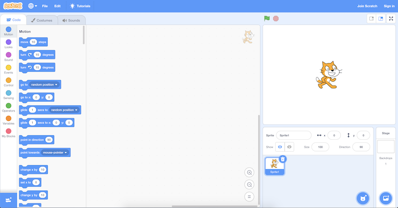
</h1>
- No canto superior direito, temos um estágio que será mostrado pelo nosso programa, onde podemos adicionar ou alterar planos de fundo, personagens (chamados de sprites no Scratch) e muito mais.
- À esquerda, temos peças de quebra-cabeça que representam funções ou variáveis, ou outros conceitos, que podemos arrastar e soltar em nossa área de instrução no centro.
- No canto inferior direito, podemos adicionar mais caracteres para nosso programa usar.
- Podemos arrastar alguns blocos para fazer o Scratch dizer “olá, mundo”:

<h1 align="center">
   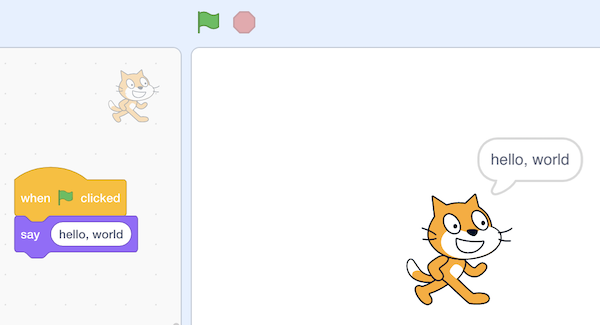
</h1>
- O bloco "quando a bandeira verde é clicada" refere-se ao início do nosso programa (já que há uma bandeira verde acima do estágio que podemos usar para iniciá-lo), e abaixo dela nós encaixamos um bloco "diga" e digitamos "Olá Mundo". E podemos descobrir o que esses blocos fazem explorando a interface e experimentando.
- Também podemos arrastar o bloco “perguntar e esperar”, com uma pergunta como “Qual é o seu nome?”, E combiná-lo com um bloco “dizer” para a resposta:

<h1 align="center">
   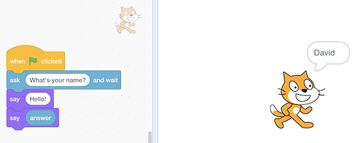
</h1>

- O bloco “responder” é uma variável, ou valor, que armazena o que o usuário do programa digita, e podemos colocá-lo em um bloco “dizer” arrastando e soltando também.
- Mas não esperamos depois de dizer “Olá” com o primeiro bloco, então podemos usar o bloco “juntar” para combinar duas frases para que nosso gato possa dizer “olá, David”:

<h1 align="center">
   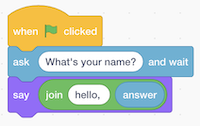
</h1>

- Quando tentamos aninhar blocos, ou colocá-los uns dentro dos outros, o Scratch nos ajudará expandindo os locais onde eles podem ser usados.
- Na verdade, o bloco "dizer" em si é como um algoritmo, onde fornecemos uma entrada de "olá, mundo" e ele produziu a saída de Scratch (o gato) "dizendo" essa frase:

<h1 align="center">
   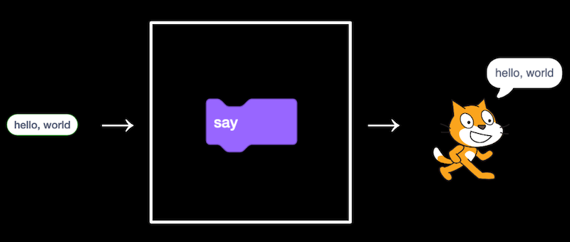
</h1>
- O bloco "perguntar" também recebe uma entrada (a pergunta que queremos fazer) e produz a saída do bloco "responder":

<h1 align="center">
   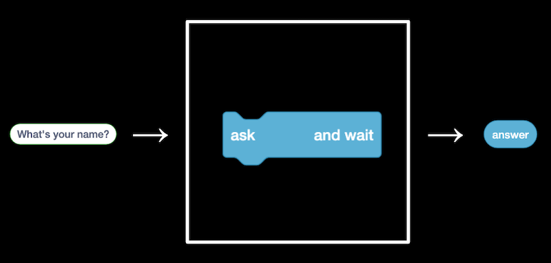
</h1>
- Podemos então usar o bloco “responder” junto com nosso próprio texto, “olá,“, como duas entradas para o algoritmo de junção.

<h1 align="center">
   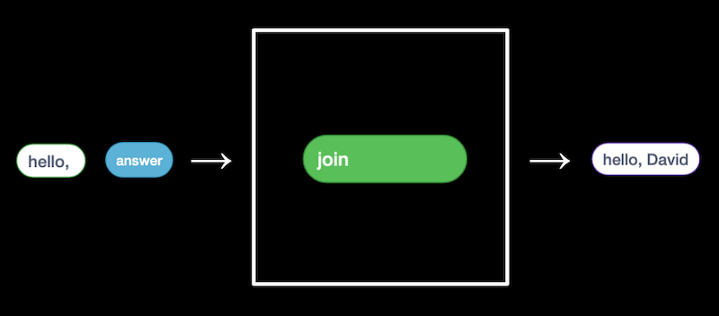
</h1>
- ... a saída da qual passamos pode como entrada para o bloco "dizer":

<h1 align="center">
   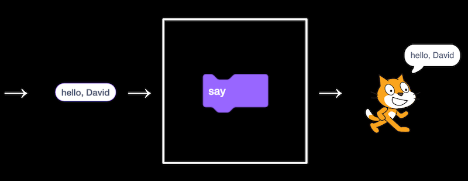
</h1>

- No canto inferior esquerdo da tela, vemos um ícone para extensões, e um deles é chamado de Texto para fala. Depois de adicioná-lo, podemos usar o bloco "falar" para ouvir nosso gato falar:

<h1 align="center">
   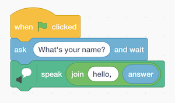
</h1>

- A extensão Text to Speech, graças à nuvem, ou servidores de computador na internet, está convertendo nosso texto em áudio.
- Podemos tentar fazer o gato dizer miau:

<h1 align="center">
   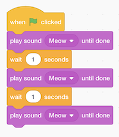
</h1>

- Podemos dizer miau três vezes, mas agora estamos repetindo blocos indefinidamente.
- Vamos usar um loop ou um bloco de “repetição”:

<h1 align="center">
   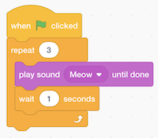
</h1>

- Agora nosso programa atinge os mesmos resultados, mas com menos blocos. Podemos considerar que ele tem um design melhor: se há algo que queremos mudar, só precisaríamos mudar em um lugar ao invés de três.
- Podemos fazer com que o gato aponte para o mouse e se mova em direção a ele:

<h1 align="center">
   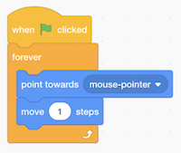
</h1>

- Experimentamos a extensão da caneta, usando o bloco "caneta para baixo" com uma condição:

<h1 align="center">
   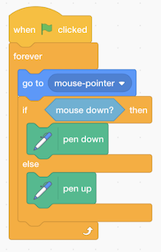
</h1>

- Aqui, movemos o gato até o ponteiro do mouse, e se o mouse for clicado, ou para baixo, colocamos a “caneta para baixo”, que desenha. Caso contrário, colocamos a caneta para cima. Repetimos isso muito rapidamente, uma e outra vez, então acabamos com o efeito de desenhar sempre que mantemos o mouse pressionado.
- Scratch também tem diferentes fantasias, ou imagens, que podemos usar para nossos personagens.
- Faremos um programa que pode contar:

<h1 align="center">
   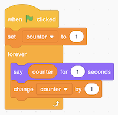
</h1>

- Aqui `counter` está uma variável, cujo valor podemos definir, usar e alterar.
- Vemos mais alguns programas, como o [`salto`](https://scratch.mit.edu/projects/277536611/editor/) , em que o gato se move para frente e para trás na tela para sempre, girando sempre que estivermos na borda da tela.
- Podemos melhorar a animação fazendo com que o gato mude para uma roupa diferente a cada 10 passos no [bounce1`](https://scratch.mit.edu/projects/277536630/editor/) . Agora, quando clicamos na bandeira verde para executar nosso programa, vemos o gato alternar o movimento de suas pernas.
- Podemos até gravar nossos próprios sons com o microfone de nosso computador e reproduzi-los em nosso programa.
- Para construir programas cada vez mais complexos, começamos com cada um desses recursos mais simples e os colocamos em camadas um sobre o outro.
- Também podemos ter Scratch meow se [`tocarmos`](https://scratch.mit.edu/projects/277537223/editor/) com o ponteiro do mouse, no [`pet0`](https://scratch.mit.edu/projects/277537223/editor/) .
- Na [`bark`](https://scratch.mit.edu/projects/326130490/editor/) , não temos um, mas dois programas no mesmo projeto Scratch. Ambos os programas serão executados ao mesmo tempo depois que a bandeira verde for clicada. Um deles tocará um som de leão-marinho se a `muted` variável for definida como `false`, e o outro irá definir a `muted` variável de `true` para `false`, ou `false` para `true`, se a tecla de espaço for pressionada.
- Outra extensão olha para o vídeo conforme capturado pela webcam do nosso computador e reproduz o som de miado se o vídeo tiver movimento acima de algum limite.
- Com vários sprites ou personagens, podemos ter diferentes conjuntos de blocos para cada um deles:

<h1 align="center">
   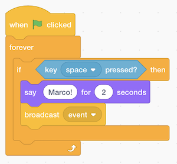
</h1>

- Para um fantoche, temos esses blocos que dizem “Marco!” E, em seguida, um bloco de “evento de transmissão”. Este “evento” é usado para nossos dois sprites se comunicarem, como enviar uma mensagem nos bastidores. Portanto, o nosso outro fantoche pode apenas esperar por este “evento” para dizer “Polo!”:

<h1 align="center">
   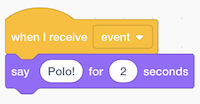
</h1>

- Também podemos usar a extensão Translate para dizer algo em outros idiomas:

<h1 align="center">
   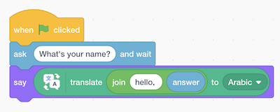
</h1>

- Aqui, a saída do bloco “join” é usada como entrada para o bloco “translate”, cuja saída é passada como entrada para o bloco “say”.
- Agora que sabemos algumas noções básicas, podemos pensar sobre o design ou a qualidade de nossos programas. Por exemplo, podemos querer que o gato mia três vezes com o bloco "repetir":

<h1 align="center">
   
</h1>

- Podemos usar **abstração** , o que simplifica um conceito mais complexo. Neste caso, podemos definir nosso próprio bloco “miau” no Scratch e reutilizá-lo em outro lugar em nosso programa, como visto em [`miau3`](https://scratch.mit.edu/projects/421542702/editor/) . A vantagem é que não precisamos saber como o miado é implementado ou escrito em código, mas apenas usá-lo em nosso programa, tornando-o mais legível.
- Podemos até definir um bloco com uma entrada em [`meow4`](https://scratch.mit.edu/projects/421543064/editor/) , onde temos um bloco que faz o gato miar um certo número de vezes. - Agora podemos reutilizar esse bloco em nosso programa para miar qualquer número de vezes, da mesma forma como podemos usar os blocos “traduzir” ou “falar”, sem saber os **detalhes de implementação** ou como o bloco realmente funciona.
- Vamos dar uma olhada em mais algumas demos, incluindo [`Gingerbread tales remix`](https://scratch.mit.edu/projects/277536784/) e [`Oscartime`](https://scratch.mit.edu/projects/277537196/) , que combinam loops, condições e movimento para criar um jogo interativo.
- Oscartime foi na verdade feito por David muitos anos atrás, e ele começou adicionando um sprite, então um recurso de cada vez, e assim por diante, até que eles adicionassem um programa mais complicado.
- Um ex-aluno, Andrew, criou o [`Raining Men`](https://scratch.mit.edu/projects/37412/) . Embora Andrew tenha acabado por não seguir a ciência da computação como profissão, as habilidades de resolução de problemas, algoritmos e ideias que aprenderemos no curso são aplicáveis em todos os lugares.
- Até a próxima vez!

Link para [`Week 1`](https://github.com/wmaidson/CS50-pt-br)
