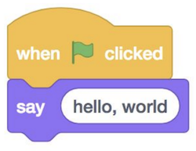
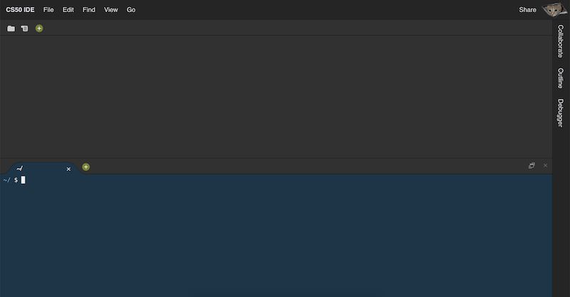
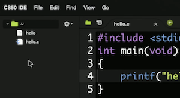

## C

- Hoje vamos aprender uma nova linguagem, C : uma linguagem de programação que tem todos os recursos do Scratch e muito mais, mas talvez um pouco menos amigável, pois é puramente em texto:

```c
#include <stdio.h>

int main(void)
{
    printf("hello, world");
}
```

- Embora a princípio, pegando emprestado uma frase do MIT, tentar absorver todos esses novos conceitos pode parecer como beber de uma mangueira de incêndio, tenha certeza de que, no final do semestre, estaremos capacitados e experientes em aprender e aplicar esses conceitos .
- Podemos comparar muitos dos recursos de programação em C aos blocos que já vimos e usamos no Scratch. Os detalhes da sintaxe são muito menos importantes do que as ideias, às quais já fomos apresentados.
- Em nosso exemplo, embora as palavras sejam novas, as ideias são exatamente as mesmas que os blocos "quando a bandeira verde for clicada" e "diga (olá, mundo)" no Scratch:

<h1 align="center">
   
</h1>

- Ao escrever o código, podemos considerar as seguintes qualidades:
-- **Correção** , ou se nosso código funciona corretamente, conforme pretendido.
-- **Design** , ou uma medida subjetiva de quão bem escrito nosso código é, com base em quão eficiente ele é e quão elegante ou logicamente legível é, sem repetição desnecessária.
-- **Estilo** , ou o quão esteticamente formatado nosso código é, em termos de indentação consistente e outro posicionamento de símbolos. As diferenças de estilo não afetam a exatidão ou o significado do nosso código, mas afetam o quão legível é visualmente.

## CS50 IDE

- Para começar a escrever nosso código rapidamente, usaremos uma ferramenta para o curso, [`CS50 IDE`](https://ide.cs50.io/) , um *ambiente de desenvolvimento integrado* que inclui programas e recursos para escrever código. CS50 IDE é construído sobre um IDE baseado em nuvem popular usado por programadores gerais, mas com recursos educacionais adicionais e personalização.
- Abriremos o IDE e, após o login, veremos uma tela como esta:

<h1 align="center">
   
</h1>

- O painel superior, em branco, conterá arquivos de texto nos quais podemos escrever nosso código.
- O painel inferior, uma janela de **terminal** , nos permitirá digitar vários comandos e executá-los, incluindo programas de nosso código acima.
- Nosso IDE é executado na nuvem e vem com um conjunto padrão de ferramentas, mas saiba que também existem muitos IDEs baseados em desktop, oferecendo mais personalização e controle para diferentes fins de programação, ao custo de maior tempo e esforço de configuração.
- No IDE, iremos para Arquivo> Novo arquivo e, em seguida, Arquivo> Salvar para salvar nosso arquivo como `hello.c`, indicando que nosso arquivo será um código escrito em C. Veremos que o nome de nossa guia realmente mudou para `hello.c`, e agora colaremos nosso código acima:

```c
#include <stdio.h>

int main(void)
{
    printf("hello, world");
}
```

- Para executar nosso programa, usaremos uma CLI, ou **interface de linha de comando** , um prompt no qual precisamos inserir comandos de texto. Isso contrasta com a interface gráfica do usuário , ou GUI, como o Scratch, onde temos imagens, ícones e botões além do texto.


## Compilando


- No terminal no painel inferior de nosso IDE, iremos **compilar** nosso código antes de podermos executá-lo. Os computadores só entendem binário, que também é usado para representar instruções como imprimir algo na tela. Nosso **código-fonte** foi escrito em caracteres que podemos ler, mas precisa ser compilado: convertido em **código de máquina** , padrões de zeros e uns que nosso computador possa entender diretamente.
- Um programa chamado **compilador** pegará o código-fonte como entrada e produzirá o código de máquina como saída. No IDE CS50, já temos acesso a um compilador, por meio de um comando chamado **make** . Em nosso terminal, digitaremos `make hello`, o que encontrará automaticamente nosso `hello.c`arquivo com nosso código-fonte e o compilará em um programa chamado hello. Haverá alguma saída, mas nenhuma mensagem de erro em amarelo ou vermelho, então nosso programa foi compilado com sucesso.
- Para executar nosso programa, digitaremos outro comando ./hello,, que procura na pasta atual ., por um programa chamado helloe o executa.
- O `$` no terminal é um indicador de onde está o prompt ou onde podemos digitar mais comandos.

## Funções e argumentos

- Usaremos as mesmas ideias que exploramos no Scratch.
- Funções são pequenas ações ou verbos que podemos usar em nosso programa para fazer algo, e as entradas para funções são chamadas de **argumentos** .
-- Por exemplo, o bloco “diga” no Scratch pode ter considerado algo como “olá, mundo” como um argumento. Em C, é chamada a função de imprimir algo na tela `printf`(com a `f` posição de texto “formatado”, que veremos em breve). E em C, passamos os argumentos entre parênteses, como em `printf("hello, world");`. As aspas duplas indicam que queremos imprimir as letras `hello, world` literalmente, e o ponto-e-vírgula no final indica o final de nossa linha de código.
- As funções também podem ter dois tipos de saídas:
-- **efeitos colaterais** , como algo impresso na tela,
-- e **valores de retorno** , um valor que é passado de volta ao nosso programa que podemos usar ou armazenar para mais tarde.
O bloco “perguntar” no Scratch, por exemplo, criou um bloco “responder”.
- Para obter a mesma funcionalidade do bloco “ask”, usaremos uma **biblioteca** ou um conjunto de código já escrito. A Biblioteca CS50 incluirá algumas funções básicas e simples que podemos usar imediatamente. Por exemplo, `get_string` pedirá ao usuário uma **string** , ou alguma sequência de texto, e a retornará ao nosso programa. `get_string` recebe alguma entrada como prompt para o usuário, como What's your name?, e teremos que salvá-la em uma variável com:

```c
string answer = get_string("What's your name? ");
```

- Em C, o single `=` indica atribuição , ou configuração do valor à direita para a variável à esquerda. E C chamará a `get_string` função para obter sua saída primeiro.
- E também precisamos indicar que nossa variável chamada `answer` tem um **tipo** de string, então nosso programa sabe interpretar os zeros e uns como texto.
- Finalmente, precisamos nos lembrar de adicionar um ponto-e-vírgula para encerrar nossa linha de código.
No Scratch, também usamos o bloco “responder” dentro de nossos blocos “juntar” e “dizer”. Em C, faremos isso:

```c
printf("hello, %s", answer);
```

- O `%s` é chamado de código de formato , o que significa apenas que queremos que a `printf` função substitua uma variável onde está o `%s` espaço reservado. E a variável que queremos usar é `answer`, que fornecemos `printf` como outro argumento, separado do primeiro por uma vírgula. ( `printf("hello, answer")` seria literalmente impresso `hello, answer` todas as vezes).
- De volta ao IDE CS50, adicionaremos o que descobrimos:


```c
#include <cs50.h>
#include <stdio.h>

int main(void)
{
    string answer = get_string("What's your name? ");
    printf("hello, %s", answer);
}
```

- Precisamos dizer ao compilador para incluir a Biblioteca CS50, com `#include <cs50.h>`, para que possamos usar a `get_string` função.
- Também temos a oportunidade de usar um estilo melhor aqui, já que poderíamos nomear nossa `answer` variável com qualquer coisa, mas um nome mais descritivo nos ajudará a entender sua finalidade melhor do que um nome mais curto como `a`ou `x`.
- Depois de salvar o arquivo, precisaremos recompilar nosso programa com `make hello`, já que alteramos apenas o código-fonte, mas não o código de máquina compilado. Outras linguagens ou IDEs podem não exigir que recompilemos manualmente nosso código depois de alterá-lo, mas aqui temos a oportunidade de ter mais controle e compreensão do que está acontecendo nos bastidores.
- Agora, `./hello` executará nosso programa e solicitará nosso nome conforme pretendido. Podemos notar que o próximo prompt é impresso imediatamente após a saída de nosso programa, como em `hello, Brian~/ $`. Podemos adicionar uma nova linha após a saída de nosso programa, de modo que o próximo prompt esteja em sua própria linha, com `\n`:

```c
printf("hello, %s\n", answer);
```

- `\n` é um exemplo de sequência de escape ou algum texto que representa algum outro texto.

## principal, arquivos de cabeçalho

- O bloco “quando a bandeira verde for clicada” no Scratch inicia o que consideramos ser o programa principal. Em C, a primeira linha para o mesmo é `int main(void)`, sobre a qual aprenderemos mais nas próximas semanas, seguida por uma chave aberta `{`e uma chave fechada `}`, envolvendo tudo o que deveria estar em nosso programa.

```c
int main(void)
{

}
```

- Aprenderemos mais sobre como podemos modificar essa linha nas próximas semanas, mas, por enquanto, simplesmente usaremos isso para iniciar nosso programa.
Os **arquivos de cabeçalho** que terminam com `.h` referem-se a algum outro conjunto de código, como uma biblioteca, que podemos usar em nosso programa. Nós os incluímos com linhas como `#include <stdio.h>`, por exemplo, para a biblioteca de *entrada / saída* padrão, que contém a `printf` função.

## Ferramentas

- Com toda a nova sintaxe, é fácil cometer erros ou esquecer algo. Temos algumas ferramentas criadas pela equipe para nos ajudar.
Podemos esquecer de incluir uma linha de código e, quando tentamos compilar nosso programa, vemos muitas linhas de mensagens de erro que são difíceis de entender, pois o compilador pode ter sido projetado para um público mais técnico. `help50` é um comando que podemos executar para explicar problemas em nosso código de uma forma mais amigável. Podemos executá-lo adicionando `help50` à frente de um comando que estamos tentando, como `help50 make hello`, obter conselhos que podem ser mais compreensíveis.
- Acontece que, em C, novas linhas e indentação geralmente não afetam a forma como nosso código é executado. Por exemplo, podemos alterar nossa `main` função para uma linha, `int main(void){printf("hello, world");}` mas é muito mais difícil de ler, por isso consideramos que tem um estilo ruim. Podemos executar `style50` , como acontece `style50 hello.c` como nome do arquivo do nosso código-fonte, para ver sugestões de novas linhas e recuo.
- Além disso, podemos adicionar **comentários** , notas em nosso código-fonte para nós mesmos ou para outras pessoas que não afetem a forma como nosso código é executado. Por exemplo, podemos adicionar uma linha como `// Greet user`, com duas barras `//` para indicar que a linha é um comentário e, em seguida, escrever a finalidade do nosso código ou programa para nos ajudar a lembrar mais tarde.
- `check50` irá verificar a exatidão do nosso código com alguns testes automatizados. A equipe escreve testes especificamente para alguns dos programas que escreveremos no curso, e as instruções de uso `check50` serão incluídas em cada conjunto de problemas ou laboratório, conforme necessário. Depois de executarmos `check50`, veremos alguma saída informando se nosso código passou nos testes relevantes. 
- O IDE CS50 também nos dá o equivalente a nosso próprio computador na nuvem, em algum lugar da internet, com nossos próprios arquivos e pastas. Se clicarmos no ícone da pasta no canto superior esquerdo, veremos uma árvore de arquivos, uma GUI dos arquivos em nosso IDE:

<h1 align="center">
   
</h1>

- Para abrir um arquivo, podemos apenas clicar duas vezes nele. `hello.c` é o código-fonte que acabamos de escrever, e `hello` ele mesmo terá muitos pontos vermelhos, cada um dos quais são caracteres não imprimíveis, pois representam instruções binárias para nossos computadores.


## Comandos

- Como o IDE CS50 é um computador virtual na nuvem, também podemos executar comandos disponíveis no Linux, um sistema operacional como o macOS ou Windows.
No terminal, podemos digitar `ls`, abreviação de lista, para ver uma lista de arquivos e pastas na pasta atual:

```
~/ $ ls
hello*  hello.c
```

- `hello` está em verde com um asterisco para indicar que podemos executá-lo como um programa.
- Também podemos remover arquivos com `rm`, com um comando como `rm hello`. Isso nos solicitará uma confirmação e podemos responder com `y` ou `n` com sim ou não.
- Com `mv`, ou mover , podemos renomear arquivos. Com `mv hello.c goodbye.c`, renomeamos nosso  `hello.c` arquivo para ser nomeado `goodbye.c`.
- Com `mkdir`, ou fazer diretório , podemos criar pastas ou diretórios. Se executarmos `mkdir lecture`, veremos uma pasta chamada `lecturee` podemos mover arquivos para diretórios com um comando como `mv hello.c lecture/`.
- Para alterar os diretórios em nosso terminal, podemos usar `cd`, como com `cd lecture/`. Nosso prompt mudará de `~/` para `~/lecture/`, indicando que estamos no lecturediretório interno `~`. `~`significa nosso diretório inicial ou a pasta padrão de nível superior de nossa conta.
Também podemos usar `..` como abreviatura para o pai ou pasta de conteúdo. Dentro `~/lecture/`, podemos executar `mv hello.c ..` para movê-lo de volta ~, já que é a pasta pai de `lecture/`. `cd ..`, da mesma forma, mudará o diretório de nosso terminal para o pai atual. Um único ponto,, .refere-se ao diretório atual, como em .`/hello`.
Agora que nossa `lecture/` pasta está vazia, podemos removê-la `rmdir lecture/` também.

## Tipos, códigos de formato,

- Existem muitos **tipos de dados** que podemos usar para nossas variáveis, que indicam ao computador que tipo de dados eles representam:
-- `bool`, uma expressão booleana de trueoufalse
-- `char`, um único caractere ASCII como aou2
-- `double`, um valor de ponto flutuante com mais dígitos do que um float
-- `float`, um valor de ponto flutuante ou número real com um valor decimal
-- `int`, inteiros até um certo tamanho ou número de bits
-- `long`, inteiros com mais bits, para que possam contar mais do que um int
-- `string`, uma série de caracteres
- E a biblioteca CS50 tem funções correspondentes para obter entrada de vários tipos:
-- `get_char`
-- `get_double`
-- `get_float`
-- `get_int`
-- `get_long`
-- `get_string`
- Pois `printf`, também, existem marcadores de posição diferentes para cada tipo:
-- `%c` para chars
-- `%f` para carros alegóricos, duplos
-- `%i` para ints
-- `%li` por muito tempo
-- `%s` para cordas

## Operadores, limitações, truncamento

- Existem vários operadores matemáticos que podemos usar também:
-- `+` para adição
-- `-` para subtração
-- `*` para multiplicação
-- `/` para divisão
--`%` para o resto
- Faremos um novo programa addition.c:

```c
#include <cs50.h>
#include <stdio.h>

int main(void)
{
    int x = get_int("x: ");

    int y = get_int("y: ");

    printf("%i\n", x + y);
}
```

- Incluiremos arquivos de cabeçalho para bibliotecas que sabemos que queremos usar e, em seguida, chamaremos `get_int` para obter inteiros do usuário, armazenando-os nas variáveis chamadas `x` e `y`.
- Em seguida, printfimprimiremos um espaço reservado para um inteiro,, `%i`seguido por uma nova linha. Como queremos imprimir a soma de `x` e `y`, passaremos `x + y` por `printf` para substituir na string.
Vamos salvar, executar `make addition` no terminal e depois .`/addition` ver nosso programa funcionando. Se digitarmos algo que não seja um inteiro, veremos `get_int` nos pedindo um inteiro novamente. Se digitarmos um número muito grande, por exemplo `4000000000`, `get_int` nos alertará de novo também. Isso ocorre porque, como em muitos sistemas de computador, um `int` no CS50 IDE é de 32 bits, que pode conter apenas cerca de quatro bilhões de valores diferentes. E uma vez que os inteiros podem ser positivos ou negativos, o maior valor positivo para um `int` pode ser apenas cerca de dois bilhões, com um valor negativo mais baixo de cerca de dois bilhões negativos, para um total de cerca de quatro bilhões de valores totais.
Podemos mudar nosso programa para usar o `long` tipo:

```c
#include <cs50.h>
#include <stdio.h>

int main(void)
{
    long x = get_long("x: ");

    long y = get_long("y: ");

    printf("%li\n", x + y);
}
```

- Agora podemos digitar inteiros maiores e ver um resultado correto conforme o esperado.
- Sempre que ocorrer um erro durante a compilação, é uma boa ideia rolar para cima para ver o primeiro erro e corrigi-lo primeiro, já que às vezes um erro no início do programa fará com que o resto do programa seja interpretado com erros também 
- Vejamos outro exemplo `truncation.c`:

```c
#include <cs50.h>
#include <stdio.h>

int main(void)
{
    // Get numbers from user
    int x = get_int("x: ");
    int y = get_int("y: ");

    // Divide x by y
    float z = x / y;
    printf("%f\n", z);
}
```

- Armazenaremos o resultado de `x` dividido por `y` em `z`, um valor de ponto flutuante ou número real e também o imprimiremos como um ponto flutuante.
- Mas quando compilamos e executamos nosso programa, vemos `z` impressos como números inteiros como `0.000000` ou `1.000000`. Acontece que, em nosso código, `x / y` é dividido *primeiro* como dois inteiros , portanto, o resultado fornecido pela operação de divisão também é um inteiro. O resultado é truncado , com o valor após a vírgula perdida. Mesmo sendo `z` um `float`, o valor que estamos armazenando nele já é um número inteiro.
- Para corrigir isso, vamos lançar , ou converter, nossos números inteiros para carros alegóricos antes de dividi-los:

```
float z = (float) x / (float) y;
```

- O resultado será um float como esperamos e, na verdade, podemos lançar apenas um de `x`ou `y`e obter um float também.

## Variáveis, açúcar sintático

- No Scratch, tínhamos blocos como “set [counter] to (0)” que definem uma variável para algum valor. Em C, escreveríamos `int counter = 0;` para o mesmo efeito.
- Podemos aumentar o valor de uma variável com `counter = counter + 1;`, onde olhamos primeiro para o lado direito, pegando o valor original de `counter`, adicionando 1 e, em seguida, armazenando-o no lado esquerdo (de volta counterneste caso).
- C também suporta açúcar sintático ou expressões abreviadas para a mesma funcionalidade. Nesse caso, poderíamos dizer de maneira equivalente `counter += 1;` para adicionar um a `counter` antes de armazená-lo novamente. Também poderíamos simplesmente escrever `counter++;`, e podemos aprender isso (e outros exemplos) olhando a documentação ou outras referências online.

## Condições

- Podemos traduzir condições, ou blocos “se”, com:

```c
if (x < y)
{
    printf("x is less than y\n");
}
```

- Observe que em C, usamos `{`e `}` (bem como recuo) para indicar como as linhas de código devem ser aninhadas.
Podemos ter condições “if” e “else”:

```c
if (x < y)
{
    printf("x is less than y\n");
}
else
{
    printf("x is not less than y\n");
}
```
- E até mesmo “senão se”:

```c
if (x < y)
{
    printf("x is less than y\n");
}
else if (x > y)
{
    printf("x is greater than y\n");
}
else if (x == y)
{
    printf("x is equal to y\n");
}
```


- Observe que, para comparar dois valores em C, usamos `==`dois sinais de igual.
- E, logicamente, não precisamos do `if (x == y)` na condição final, já que esse é o único caso restante, então podemos apenas dizer else:
 
```c
if (x < y)
{
    printf("x is less than y\n");
}
else if (x > y)
{
    printf("x is greater than y\n");
}
else
{
    printf("x is equal to y\n");
}
```

- Vamos dar uma olhada em outro exemplo `conditions.c`:

```c
#include <cs50.h>
#include <stdio.h>

int main(void)
{
    // Prompt user for x
    int x = get_int("x: ");

    // Prompt user for y
    int y = get_int("y: ");

    // Compare x and y
    if (x < y)
    {
        printf("x is less than y\n");
    }
    else if (x > y)
    {
        printf("x is greater than y\n");
    }
    else
    {
        printf("x is equal to y\n");
    }
}
```

- Incluímos as condições que acabamos de ver, junto com duas chamadas, ou usos, `get_int` para obter `x` e `y` do usuário.
- Vamos compilar e executar nosso programa para ver se ele realmente funciona conforme o planejado.
-Em `agree.c`, podemos pedir ao usuário para confirmar ou negar algo:

```c
#include <cs50.h>
#include <stdio.h>

int main(void)
{
    char c = get_char("Do you agree? ");

    // Check whether agreed
    if (c == 'Y' || c == 'y')
    {
        printf("Agreed.\n");
    }
    else if (c == 'N' || c == 'n')
    {
        printf("Not agreed.\n");
    }
}
```

- Com `get_char`, podemos obter um único caractere e, como só temos um em nosso programa, parece razoável chamá-lo `c`.
- Usamos duas barras verticais,, `||` para indicar um “ou” lógico, se qualquer uma das expressões pode ser verdadeira para a condição a ser seguida. (Dois e comercial,, `&&` indicam um "e" lógico, onde ambas as condições teriam de ser verdadeiras.) E observe que usamos dois sinais de igual,, `==` para comparar dois valores, bem como aspas simples,, 'para cercar nossos valores de simples personagens.
- Se nenhuma das expressões for verdadeira, nada acontecerá, pois nosso programa não tem um loop.

- Expressões booleanas, loops

- Podemos traduzir um bloco “para sempre” no Scratch com:

```c
while (true)
{
    printf("hello, world\n");
}
```
- A whilepalavra-chave requer uma condição, por isso a usamos truecomo expressão booleana para garantir que nosso loop seja executado para sempre. `while` dirá ao computador para verificar se a expressão é avaliada como truee, em seguida, executa as linhas dentro das chaves. Em seguida, ele repetirá isso até que a expressão não seja mais verdadeira. Nesse caso, truesempre será verdadeiro, então nosso loop é um **loop infinito** , ou que será executado para sempre.

- Poderíamos fazer algo um certo número de vezes com while:
 
```c
int i = 0;
while (i < 50)
{
    printf("hello, world\n");
    i++;
}
```

- Criamos uma variável,, ie a definimos como 0. Então, enquanto `i` for menor que 50, executamos algumas linhas de código, incluindo uma em que adicionamos 1 a `i` cada vez. Dessa forma, nosso loop acabará eventualmente quando `i` atingir o valor de 50.
- Nesse caso, estamos usando a variável icomo um contador, mas como ela não tem nenhum propósito adicional, podemos simplesmente nomeá-la `i`.
- Mesmo que poderia fazer o seguinte e iniciar a contagem em 1, por convenção que deve começar em 0:

```c
int i = 1;
while (i <= 50)
{
    printf("hello, world\n");
    i++;
}
```

- Outra solução correta, mas possivelmente menos bem projetada, pode começar em 50 e contar para trás:

```c
int i = 50;
while (i > 0)
{
    printf("hello, world\n");
    i--;
}
```

- Nesse caso, a lógica do nosso loop é mais difícil de raciocinar sem servir a nenhum propósito adicional e pode até mesmo confundir os leitores.
- Finalmente, mais comumente, podemos usar a forpalavra-chave:

```c
for (int i = 0; i < 50; i++)
{
    printf("hello, world\n");
}
```

- Novamente, primeiro criamos uma variável chamada ie a definimos como 0. Em seguida, verificamos isso i < 50toda vez que chegarmos ao topo do loop, antes de executar qualquer código interno. Se essa expressão for verdadeira, executamos o código interno. Finalmente, depois de executar o código interno, usamos i++para adicionar um a ie o loop se repete.
- O forloop é mais elegante do que um whileloop neste caso, pois tudo relacionado ao loop está na mesma linha e apenas o código que realmente queremos executar várias vezes está dentro do loop.
- Observe que para muitas dessas linhas de código, como ifcondições e forloops, não colocamos um ponto-e-vírgula no final. É assim que a linguagem C foi projetada, muitos anos atrás, e uma regra geral é que apenas as linhas para ações ou verbos têm ponto e vírgula no final.

## Abstração

- Podemos escrever um programa que imprime meowtrês vezes:

```c
#include <stdio.h>

int main(void)
{
    printf("meow\n");
    printf("meow\n");
    printf("meow\n");
}
```

- Poderíamos usar um forloop, para não ter que copiar e colar tantas linhas:

```c
#include <stdio.h>

int main(void)
{
    for (int i = 0; i < 3; i++)
    {
        printf("meow\n");
    }
}
```
- Podemos mover a `printf` linha para sua própria função, como nossa própria peça de quebra-cabeça:

```c
#include <stdio.h>

void meow(void) {
  printf("meow\n");
}

int main(void)
{
    for (int i = 0; i < 3; i++)
    {
        meow();
    }
}
```

- Definimos uma função `meow`,, acima de nossa `main` função.
Mas, convencionalmente, nossa `main` função deve ser a primeira função em nosso programa, então precisamos de mais algumas linhas:

```c
#include <stdio.h>

void meow(void);

int main(void)
{
    for (int i = 0; i < 3; i++)
    {
        meow();
    }
}

void meow(void)
{
    printf("meow\n");
}
```

- Acontece que precisamos declarar nossa meowfunção primeiro com um **protótipo** , antes de usá-lo `main`, e realmente defini-lo depois. O compilador lê nosso código-fonte de cima para baixo, então ele precisa saber que `meow` existirá mais tarde no arquivo.
- Podemos até mudar nossa `meow` função para receber algumas informações `n`, e `n` tempos de `miau` :

```c
#include <stdio.h>

void meow(int n);

int main(void)
{
    meow(3);
}

void meow(int n)
{
    for (int i = 0; i < n; i++)
    {
        printf("meow\n");
    }
}
```

- O voidantes que os `meow` meios de função que ele não retorna um valor, e da mesma forma em `main` que não podemos fazer qualquer coisa com o resultado de `meow`, por isso, só chamá-lo.
- A abstração aqui leva a um design melhor, já que agora temos a flexibilidade de reutilizar nossa `meow` função em vários lugares no futuro.
- Vejamos outro exemplo de abstração `get_positive_int.c`:


```c
#include <cs50.h>
#include <stdio.h>

int get_positive_int(void);

int main(void)
{
    int i = get_positive_int();
    printf("%i\n", i);
}

// Prompt user for positive integer
int get_positive_int(void)
{
    int n;
    do
    {
        n = get_int("Positive Integer: ");
    }
    while (n < 1);
    return n;
}
```

- Temos nossa própria função que chama `get_int` repetidamente até que tenhamos algum número inteiro não inferior a 1. Com um loop do-while, nosso programa fará algo primeiro, depois verificará alguma condição e repetirá enquanto a condição for verdadeira. Um loop while, por outro lado, verificará a condição primeiro.
- Precisamos declarar nosso inteiro `n` fora do loop do-while, pois precisamos usá-lo após o término do loop. O **escopo** de uma variável em C se refere ao contexto, ou linhas de código, dentro do qual ela existe. Em muitos casos, serão as chaves ao redor da variável.
- Observe que a função `get_positive_int` agora começa com `int`, indicando que ela tem um valor de retorno do tipo `int`, e na `main` verdade o armazenamos em `i` após a chamada `get_positive_int()`. Em `get_positive_int`, temos uma nova palavra-chave,, `return` para retornar o valor nao local onde a função foi chamada. 

## Mario

- Podemos querer um programa que imprima parte de uma tela de um videogame como Super Mario Bros. Em `mario.c`, podemos imprimir quatro pontos de interrogação, simulando blocos:

```c
#include <stdio.h>

int main(void)
{
    printf("????\n");
}
```

- Com um loop, podemos imprimir vários pontos de interrogação, seguindo-os com uma única nova linha após o loop:
 
```c
#include <stdio.h>

int main(void)
{
    for (int i = 0; i < 4; i++)
    {
        printf("?");
    }
    printf("\n");
}
```

- Podemos obter um número inteiro positivo do usuário e imprimir esse número de pontos de interrogação, usando `n` para nosso loop:

```c
#include <cs50.h>
#include <stdio.h>

int main(void)
{
    // Get positive integer from user
    int n;
    do
    {
        n = get_int("Width: ");
    }
    while (n < 1);

    // Print out that many question marks
    for (int i = 0; i < n; i++)
    {
        printf("?");
    }
    printf("\n");
}
```

- E podemos imprimir um conjunto bidimensional de blocos com loops aninhados, um dentro do outro:

```c
#include <cs50.h>
#include <stdio.h>

int main(void)
{
    for (int i = 0; i < 3; i++)
    {
        for (int j = 0; j < 3; j++)
        {
            printf("#");
        }
        printf("\n");
    }
}
```

- Temos dois loops aninhados, onde o loop externo usa `i` para fazer tudo dentro de 3 vezes, e o loop interno usa `j`, uma variável diferente, para fazer algo 3 vezes para cada um desses tempos. Em outras palavras, o loop externo imprime 3 “linhas”, ou linhas, terminando cada uma delas com uma nova linha, e o loop interno imprime 3 “colunas”, ou `#` caracteres, sem uma nova linha.

## Memória, imprecisão e estouro

- Nosso computador tem memória, em chips de hardware chamados RAM, memória de acesso aleatório. Nossos programas usam essa RAM para armazenar dados durante a execução, mas essa memória é finita.
- Com imprecision.c, podemos ver o que acontece quando usamos flutuadores:

```c
#include <cs50.h>
#include <stdio.h>

int main(void)
{
    float x = get_float("x: ");
    float y = get_float("y: ");

    printf("%.50f\n", x / y);
}
```

Com `%.50f`, podemos especificar o número de casas decimais exibidas.
Hmm, agora nós temos ...

```c
x: 1
y: 10
0.10000000149011611938476562500000000000000000000000
```

- Acontece que isso é chamado de **imprecisão de ponto flutuante** , em que não temos bits suficientes para armazenar todos os valores possíveis. Com um número finito de bits para a float, não podemos representar todos os números reais possíveis (dos quais existe um número infinito de), então o computador tem que armazenar o valor mais próximo que puder. E isso pode levar a problemas em que mesmo pequenas diferenças no valor se somam, a menos que o programador use alguma outra maneira para representar os valores decimais com a precisão necessária.
- Na semana passada, quando tínhamos três bits e precisávamos contar mais do que sete (ou `111`), adicionamos outro bit para obter oito 1000,. Mas se tivéssemos apenas três bits disponíveis, não teríamos lugar para o extra `1`. Ele iria desaparecer e estaríamos de volta `000`. Esse problema é chamado de **estouro de inteiro** , em que um inteiro só pode ser tão grande antes de ficar sem bits.
- O problema **Y2K** surgiu porque muitos programas armazenavam o ano civil com apenas dois dígitos, como 98 para 1998 e 99 para 1999. Mas quando o ano 2000 se aproximou, os programas tiveram que armazenar apenas 00, levando a confusão entre os anos 1900 e 2000 .
Em 2038, também ficaremos sem bits para rastrear o tempo, já que há muitos anos alguns humanos decidiram usar 32 bits como o número padrão de bits para contar o número de segundos desde 1º de janeiro de 1970. Mas com 32 bits representando apenas números positivos, só podemos contar até cerca de quatro bilhões e, em 2038, atingiremos esse limite, a menos que atualizemos o software em todos os nossos sistemas de computador.
