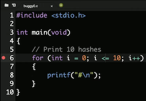
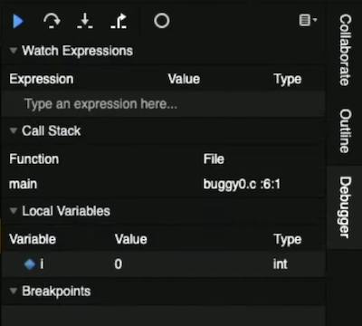
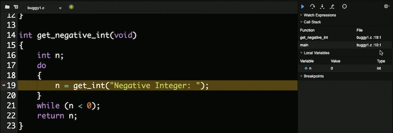
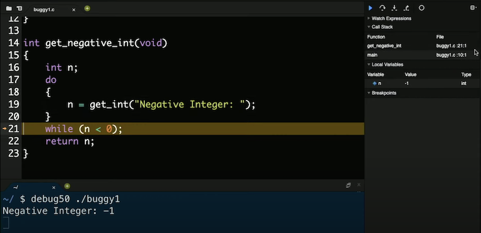
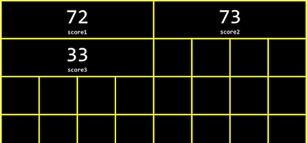
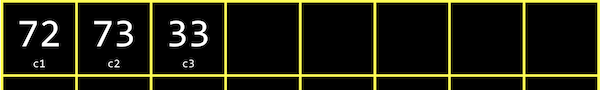
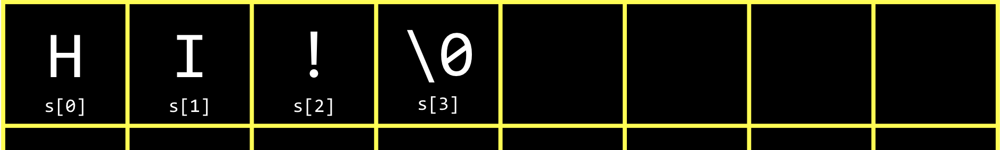
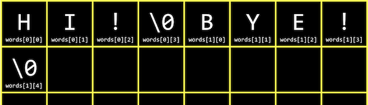

## Compilando

- Da última vez, aprendemos a escrever nosso primeiro programa em C, imprimindo “olá, mundo” na tela.
- Nós o compilamos `make hello` primeiro, transformando nosso código-fonte em código de máquina antes de podermos executar o programa compilado com `./hello`.
- `make` na verdade, é apenas um programa que chama `clang`, um compilador, com opções. Poderíamos compilar nosso arquivo de código-fonte `hello.c`, nós mesmos, executando o comando `clang hello.c`. Parece que nada aconteceu, o que significa que não houve erros. E se executarmos ls, agora vemos um `a.out` arquivo em nosso diretório. O nome do arquivo ainda é o padrão, para que possamos realmente executar um mais comando específico: `clang -o hello hello.c`.
-  Adicionamos outro **argumento de linha de comando** ou uma entrada para um programa na linha de comando como palavras extras após o nome do programa. `clang` é o nome do programa, e `-o`, `helloe hello.c` são argumentos adicionais. Estamos dizendo `clang` para usar `hello    como nome de arquivo de saída e hello.ccomo código-fonte. Agora, podemos ver `hello` sendo criado como saída.
- Se quisermos usar a biblioteca do CS50, via `#include <cs50.h>`, para a `get_string` função, também temos que adicionar um sinalizador `clang -o hello hello.c -lcs50`:

```c
#include <cs50.h>
#include <stdio.h>


int main(void)
{
    string name = get_string("What's your name? ");
    printf("hello, %s\n", name);
}
```

- O `-l` sinalizador vincula o `cs50` arquivo, que já está instalado no IDE CS50, e inclui o código de máquina para `get_string`(entre outras funções) que nosso programa pode consultar e usar também
- Com `make`, esses argumentos são gerados para nós, uma vez que a equipe já configurou `make` no IDE CS50 também.
- Compilar o código-fonte em código de máquina é, na verdade, feito de etapas menores:
-- pré-processando
-- compilando
-- montagem
-- ligando
- O **pré - processamento** geralmente envolve linhas que começam com a `#`, like `#include`. Por exemplo, `#include <cs50.h>` dirá `clang` para procurar esse arquivo de cabeçalho, uma vez que contém o conteúdo que queremos incluir em nosso programa. Em seguida, `clang` essencialmente substituirá o conteúdo desses arquivos de cabeçalho em nosso programa.
- Por exemplo …

```c
#include <cs50.h>
#include <stdio.h>

int main(void)
{
    string name = get_string("What's your name? ");
    printf("hello, %s\n", name);
}
```

... será pré-processado em:

```c
...
string get_string(string prompt);
int printf(string format, ...);
...

int main(void)
{
    string name = get_string("Name: ");
    printf("hello, %s\n", name);
}
```

- Isso inclui os protótipos de todas as funções dessas bibliotecas que incluímos, para que possamos usá-las em nosso código.
- **A compilação** pega nosso código-fonte, em C, e o converte em outro tipo de código-fonte chamado **código assembly** , que se parece com isto:

```c
...
main:                         # @main
    .cfi_startproc
# BB#0:
    pushq    %rbp
.Ltmp0:
    .cfi_def_cfa_offset 16
.Ltmp1:
    .cfi_offset %rbp, -16
    movq    %rsp, %rbp
.Ltmp2:
    .cfi_def_cfa_register %rbp
    subq    $16, %rsp
    xorl    %eax, %eax
    movl    %eax, %edi
    movabsq    $.L.str, %rsi
    movb    $0, %al
    callq    get_string
    movabsq    $.L.str.1, %rdi
    movq    %rax, -8(%rbp)
    movq    -8(%rbp), %rsi
    movb    $0, %al
    callq    printf
    ...
```

- Essas instruções são de nível inferior e estão mais próximas das instruções binárias que o processador de um computador pode entender diretamente. Eles geralmente operam nos próprios bytes, em oposição a abstrações como nomes de variáveis.
- A próxima etapa é pegar o código do assembly e traduzi-lo em instruções em binário, **montando** -o. As instruções em binário são chamadas de **código de máquina** , que a CPU de um computador pode executar diretamente.
- A última etapa é a **vinculação** , onde versões previamente compiladas de bibliotecas que incluímos anteriormente, como `cs50.c`, são realmente combinadas com o binário de nosso programa. Então vamos acabar com um arquivo binário, `a.out` ou `hell`o, que é o código de máquina combinada para `hello.c`, `cs50.c`, e `stdio.c`. (No IDE CS50, o código de máquina pré-compilado para `cs50.c`e `stdio.c` já foi instalado e `clang` foi configurado para localizá-los e usá-los.)
Essas quatro etapas foram abstraídas, ou simplificadas, por `make`, então tudo que temos que implementar é o código para nossos programas.

## Depurando

- **Bugs** são erros ou problemas em programas que fazem com que eles se comportem de maneira diferente do pretendido. E a depuração é o processo de localização e correção desses bugs.
-- Na semana passada, aprendemos sobre algumas ferramentas que nos ajudam a escrever código que compila, tem bom estilo e está correto:
- `help50`
- `style50`
- `check50`
- Podemos usar outra “ferramenta”, a `printf` função, para imprimir mensagens e variáveis para nos ajudar a depurar.
- Vamos dar uma olhada em `buggy0.c`:
 
```c
#include <stdio.h>

int main(void)
{
    // Print 10 hashes
    for (int i = 0; i <= 10; i++)
    {
        printf("#\n");
    }
}
```

- Hmm, queremos imprimir apenas 10 `#`s, mas há 11. Se não soubéssemos qual é o problema (já que nosso programa está compilando sem erros e agora temos um erro lógico), poderíamos adicionar outro `printf` temporariamente:

```c
#include <stdio.h>

int main(void)
{
    for (int i = 0; i <= 10; i++)
    {
        printf("i is now %i\n", i);
        printf("#\n");
    }
}
```

- Agora, podemos ver que `i` começou em 0 e continuou até chegar a 10, mas devemos fazer nosso forloop parar quando estiver em 10, com em `i < 10` vez de `i <= 10`.
- No IDE CS50, temos outra ferramenta,, **debug50** para nos ajudar a depurar programas. Esta é uma ferramenta escrita pela equipe que se baseia em uma ferramenta padrão chamada `gdb`. Ambos os **depuradores** são programas que executam nossos próprios programas passo a passo e nos permitem examinar as variáveis e outras informações enquanto nosso programa está em execução.
- Executaremos o comando `debug50 ./buggy0` e ele nos dirá para recompilar nosso programa desde que o alteramos. Então, ele nos dirá para adicionar um **ponto de interrupção** ou indicador para uma linha de código onde o depurador deve pausar nosso programa.
- Usando as teclas para cima e para baixo no terminal, podemos reutilizar comandos do passado sem digitá-los novamente.
- Clicaremos à esquerda da linha 6 em nosso código e um círculo vermelho aparecerá:
 
<h1 align="center">

</h1>

- Agora, se executarmos `debug50 ./buggy0` novamente, veremos o painel do depurador aberto à direita:

<h1 align="center">

</h1>

- Vemos que a variável que criamos,, `i` está sob a Local Variablesseção e vemos que há um valor de 0.
 - Nosso ponto de interrupção pausou nosso programa na linha 6, destacando essa linha em amarelo. Para continuar, temos alguns controles no painel do depurador. O triângulo azul continuará nosso programa até chegarmos a outro ponto de interrupção ou o fim de nosso programa. A seta curva à sua direita, Step Over, irá “passar por cima” da linha, executando-a e pausando nosso programa novamente imediatamente após.
 - Portanto, usaremos a seta curva para percorrer a próxima linha e ver o que muda depois. Estamos na `printf` linha e pressionando a seta curva novamente, vemos um único `#` impresso em nossa janela do terminal. Com outro clique na seta, vemos o valor da `i` mudança para `1`. Podemos continuar clicando na seta para assistir à execução do nosso programa, uma linha de cada vez.
 - Para sair do depurador, podemos pressionar `control + C` para parar o programa em execução.
 - Vejamos outro exemplo `buggy1.c`:
 
```c
#include <cs50.h>
#include <stdio.h>

// Prototype
int get_negative_int(void);

int main(void)
{
    // Get negative integer from user
    int i = get_negative_int();
    printf("%i\n", i);
}

int get_negative_int(void)
{
    int n;
    do
    {
        n = get_int("Negative Integer: ");
    }
    while (n < 0);
    return n;
}
```

- Implementamos outra função, `get_negative_int`para obter um número inteiro negativo do usuário. Precisamos lembrar o protótipo antes de nossa mainfunção e, em seguida, nosso código é compilado.
- Mas quando executamos nosso programa, ele continua nos pedindo um número inteiro negativo, mesmo depois de fornecermos um. Vamos definir um ponto de interrupção na linha 10 `int i = get_negative_int();`, já que é a primeira linha de código interessante. Vamos executar `debug50 ./buggy1` e ver na seção Pilha de chamadas do painel de depuração que estamos na `main` função. (A "pilha de chamadas" refere-se a todas as funções que foram chamadas em nosso programa no momento e ainda não retornaram. Até agora, apenas a `main` função foi chamada.)
- Clicaremos na seta apontando para baixo, Step Into, e o depurador nos levará para a função chamada nessa linha `get_negative_int`,. Vemos a pilha de chamadas atualizada com o `n`ome da função e a variável ncom um valor de `0`:

<h1 align="center">

</h1>

- Podemos clicar na seta Passar sobre novamente e ver nser atualizado com `-1`, que é realmente o que inserimos:

<h1 align="center">

</h1>

- Clicamos em Step Over novamente e vemos nosso programa voltando para dentro do loop. Nosso `while` loop ainda está em execução, portanto, a condição que ele verifica deve ser `true` imóvel. E vemos que isso `n < 0` é verdade mesmo se inserirmos um número inteiro negativo, então devemos corrigir nosso bug alterando-o para `n >= 0`.
- Podemos economizar muito tempo no futuro investindo um pouco agora para aprender como usar `debug50`!
- Também podemos usar `ddb`, abreviação de “depurador de pato”, uma técnica real em que explicamos o que estamos tentando fazer com um pato de borracha e, muitas vezes, percebemos nosso próprio erro de lógica ou implementação conforme o explicamos.

## Memória 

- Em C, temos diferentes tipos de variáveis que podemos usar para armazenar dados, e cada uma delas ocupa uma quantidade fixa de espaço. Na verdade, diferentes sistemas de computador variam na quantidade de espaço realmente usado para cada tipo, mas trabalharemos com as quantidades aqui, conforme usadas no IDE CS50:
- `bool 1 byte`
- `char 1 byte`
- `double 8 bytes`
- `float 4 bytes`
- `int 4 bytes`
- `long 8 bytes`
- `string ? bytes`
- …
- Dentro de nossos computadores, temos chips chamados RAM, memória de acesso **aleatório** , que armazena dados para uso de curto prazo, como o código de um programa enquanto está sendo executado ou um arquivo enquanto está aberto. Podemos salvar um programa ou arquivo em nosso disco rígido (ou SSD, unidade de estado sólido) para armazenamento de longo prazo, mas usar RAM porque é muito mais rápido. No entanto, a RAM é volátil ou requer energia para manter os dados armazenados.
- Podemos pensar nos bytes armazenados na RAM como se estivessem em uma grade:

<h1 align="center">

</h1>

- Na realidade, existem milhões ou bilhões de bytes por chip.
- Cada byte terá uma localização no chip, como o primeiro byte, o segundo byte e assim por diante.
- Em C, ao criarmos uma variável do tipo char, que terá o tamanho de um byte, ela ficará fisicamente armazenada em uma dessas caixas na RAM. Um inteiro, com 4 bytes, ocupará quatro dessas caixas.

## Matrizes

- Digamos que quiséssemos calcular a média de três variáveis:

```c
#include <stdio.h>

int main(void)
{
    int score1 = 72;
    int score2 = 73;
    int score3 = 33;

    printf("Average: %f\n", (score1 + score2 + score3) / 3.0);
}
```

- Dividimos por não `3`, mas `3.0` o resultado também é um float.
- Podemos compilar e executar nosso programa e ver uma média impressa.
- Enquanto nosso programa está em execução, as três `int` variáveis são armazenadas na memória:


<h1 align="center">

</h1>

- Cada um `int` ocupa quatro caixas, representando quatro bytes, e cada byte, por sua vez, é composto de oito bits, 0s e 1s armazenados por componentes elétricos
- Acontece que, na memória, podemos armazenar variáveis uma após a outra, consecutivamente, e acessá-las mais facilmente com loops. Em C, uma lista de valores armazenados um após o outro de forma contígua é chamada de **array**.
- Para nosso programa acima, podemos usar `int scores[3];` para declarar um array de três inteiros.
- E podemos atribuir e usar variáveis em um array com `scores[0] = 72`. Com os colchetes, estamos indexando ou indo para a posição “0” na matriz. As matrizes são indexadas por zero, o que significa que o primeiro valor tem índice 0 e o segundo valor tem índice 1 e assim por diante.
- Vamos atualizar nosso programa para usar um array:
 
```c
#include <cs50.h>
#include <stdio.h>

int main(void)
{
    int scores[3];
    scores[0] = get_int("Score: ");
    scores[1] = get_int("Score: ");
    scores[2] = get_int("Score: ");

    // Print average
    printf("Average: %f\n", (scores[0] + scores[1] + scores[2]) / 3.0);
}
```

- Agora, estamos pedindo ao usuário três valores e imprimindo a média como antes, mas usando os valores armazenados no array.
- Como podemos definir e acessar itens em uma matriz com base em sua posição, e essa posição também pode ser o valor de alguma variável, podemos usar um loop:

```c
#include <cs50.h>
#include <stdio.h>

int main(void)
{
    int scores[3];
    for (int i = 0; i < 3; i++)
    {
      scores[i] = get_int("Score: ");
    }

    // Print average
    printf("Average: %f\n", (scores[0] + scores[1] + scores[2]) / 3.0);
}
```
- Agora, em vez de codificar permanentemente ou especificar manualmente cada elemento três vezes, usamos um forloop e icomo o índice de cada elemento no array.
- E repetimos o valor 3, que representa o comprimento do nosso array, em dois lugares diferentes. Portanto, podemos usar uma constante ou variável com um valor fixo em nosso programa:
- 
```c
#include <cs50.h>
#include <stdio.h>

const int TOTAL = 3;

int main(void)
{
    int scores[TOTAL];
    for (int i = 0; i < TOTAL; i++)
    {
      scores[i] = get_int("Score: ");
    }

    printf("Average: %f\n", (scores[0] + scores[1] + scores[2]) / TOTAL);
}
```

- Podemos usar a constpalavra-chave para dizer ao compilador que o valor de `TOTAL` nunca deve ser alterado por nosso programa. E por convenção, colocaremos nossa declaração da variável fora da `main` função e colocaremos seu nome em maiúscula, o que não é necessário para o compilador, mas mostra a outros humanos que essa variável é uma constante e torna fácil ver desde o início.
- Mas agora nossa média estará incorreta ou quebrada se não tivermos exatamente três valores.
- Vamos adicionar uma função para calcular a média:

```c
float average(int length, int array[])
{
    int sum = 0;
    for (int i = 0; i < length; i++)
    {
        sum += array[i];
    }
    return sum / (float) length;
}
```

- Vamos passar o comprimento e um array de `int`s (que pode ser de qualquer tamanho) e usar outro loop dentro de nossa função auxiliar para adicionar os valores em uma sumvariável. Costumamos `(float)` lançar `length` em um `float`, então o resultado que obtemos ao dividir os dois também é um `float`.
- Agora, em nossa `main`função, podemos chamar nossa nova `average` função com `printf("Average: %f\n", average(TOTAL, scores);`. Observe que os nomes das variáveis em `main` não precisam corresponder ao que as `average` chama, uma vez que apenas os valores são passados.
- Precisamos passar o comprimento do array para a `average` função, para que ela saiba quantos valores existem.

## Caracteres

- Podemos imprimir um único caractere com um programa simples:

```c
#include <stdio.h>

int main(void)
{
    char c = '#';

    printf("%c\n", c);
}
```

- Quando executamos este programa, somos `#` impressos no terminal.
- Vamos ver o que acontece se mudarmos nosso programa para imprimir `c` como um inteiro:

```c
#include <stdio.h>

int main(void)
{
    char c = '#';

    printf("%i\n", (int) c);
}
```

- Quando executamos este programa, somos `35` impressos. Acontece que esse `35` é realmente o código ASCII para um símbolo `#`.
- Na verdade, não precisamos lançar cpara um intexplicitamente; o compilador pode fazer isso por nós neste caso.
- A charé um único byte, então podemos imaginá-lo como sendo armazenado em uma caixa na grade de memória acima.


## Laços

- Podemos imprimir uma string, ou algum texto, criando uma variável para cada caractere e imprimindo-os:

```c
#include <stdio.h>

int main(void)
{
    char c1 = 'H';
    char c2 = 'I';
    char c3 = '!';

    printf("%c%c%c\n", c1, c2, c3);
}
```

- Aqui, veremos `HI!` impresso.
- Agora vamos imprimir os valores inteiros de cada caractere:

```c
#include <stdio.h>

int main(void)
{
    char c1 = 'H';
    char c2 = 'I';
    char c3 = '!';

    printf("%i %i %i\n", c1, c2, c3);
}
```

- Veremos `72 73 33` impressos e perceberemos que esses caracteres são armazenados na memória da seguinte forma:

<h1 align="center">

</h1>

- **Strings** são, na verdade, apenas matrizes de caracteres e definidas não em C, mas pela biblioteca CS50. Se tivéssemos uma matriz chamada `s`, cada personagem pode ser acessado com `s[0], s[1]` e assim por diante.
- E acontece que uma string termina com um caractere especial `'\0'`, ou um byte com todos os bits definidos como 0. Esse caractere é chamado de caractere **nulo** ou NUL. Então, na verdade, precisamos de quatro bytes para armazenar nossa string com três caracteres:
 
 <h1 align="center">

</h1>

- Podemos usar uma string como uma matriz em nosso programa e imprimir os códigos ASCII, ou valores inteiros, de cada caractere da string: 

```c
#include <cs50.h>
#include <stdio.h>

int main(void)
{
    string s = "HI!";
    printf("%i %i %i %i\n", s[0], s[1], s[2], s[3]);
}
```

- E como poderíamos esperar, vemos `72 73 33 0` impresso.
- Na verdade, poderíamos tentar acessar `s[4]` e ver algum símbolo inesperado impresso. Com C, nosso código tem a capacidade de acessar ou alterar a memória que de outra forma não deveria, o que é poderoso e perigoso.
- Podemos usar um loop para imprimir todos os caracteres em uma string:

```c
#include <cs50.h>
#include <stdio.h>

int main(void)
{
    string s = get_string("Input:  ");
    printf("Output: ");
    for (int i = 0; s[i] != '\0'; i++)
    {
        printf("%c", s[i]);
    }
    printf("\n");
}
```

- Podemos alterar a condição do nosso loop para continuar independentemente do que iseja, mas apenas quando s[i] != '\0'ou quando o caractere na posição atual em s não for o caractere nulo.
- Podemos usar uma função que vem com a stringbiblioteca de C ,, strlenpara obter o comprimento da string para nosso loop:

```c
#include <cs50.h>
#include <stdio.h>
#include <string.h>

int main(void)
{
    string s = get_string("Input:  ");
    printf("Output: ");
    for (int i = 0; i < strlen(s); i++)
    {
        printf("%c", s[i]);
    }
    printf("\n");
}
```

- Temos a oportunidade de aprimorar o design de nosso programa. Nosso loop foi um pouco ineficiente, pois verificamos o comprimento da string, após cada caractere ser impresso, em nossa condição. Mas como o comprimento da string não muda, podemos verificar o comprimento da string uma vez:

```c
#include <cs50.h>
#include <stdio.h>
#include <string.h>

int main(void)
{
    string s = get_string("Input: ");
    printf("Output:\n");
    for (int i = 0, n = strlen(s); i < n; i++)
    {
        printf("%c\n", s[i]);
    }
}
```

- Agora, no início do nosso loop, que inicializar tanto um ie nvariável, e lembre-se o comprimento da nossa cadeia no n. - Então, podemos verificar os valores sem ter que chamar strlenpara calcular o comprimento da string a cada vez.
- E precisávamos usar um pouco mais de memória para armazenar n, mas isso nos economiza algum tempo por não termos que verificar o comprimento da string todas as vezes.
- Podemos declarar uma matriz de duas strings:

```c
string words[2];
words[0] = "HI!";
words[1] = "BYE!";
```

- E na memória, a matriz de strings pode ser armazenada e acessada com:

<h1 align="center">

</h1>

- `words[0]` refere-se ao primeiro elemento, ou valor, da `words` matriz, que é uma string e, portanto, `words[0][0]` refere-se ao primeiro elemento dessa string, que é um caractere.
- Portanto, um array de strings é apenas um array de arrays de caracteres.
- Agora podemos combinar o que vimos para escrever um programa que pode capitalizar letras:

```c
#include <cs50.h>
#include <stdio.h>
#include <string.h>

int main(void)
{
    string s = get_string("Before: ");
    printf("After:  ");
    for (int i = 0, n = strlen(s); i < n; i++)
    {
        if (s[i] >= 'a' && s[i] <= 'z')
        {
            printf("%c", s[i] - 32);
        }
        else
        {
            printf("%c", s[i]);
        }
    }
    printf("\n");
}
```

- Primeiro, obtemos uma string `s` do usuário. Então, para cada caractere na string, se estiver em minúsculas (o que significa que tem um valor entre `a` e `z`), nós o convertemos em maiúsculas. Caso contrário, apenas imprimiremos.
- Podemos converter uma letra minúscula em seu equivalente maiúsculo subtraindo a diferença entre seus valores ASCII. (Sabemos que as letras minúsculas têm um valor ASCII mais alto do que as letras maiúsculas e a diferença é a mesma entre as mesmas letras, portanto, podemos subtrair para obter uma letra maiúscula de uma letra minúscula.)
- Acontece que existe outra biblioteca `ctype.h`, que podemos usar:

```c
#include <cs50.h>
#include <ctype.h>
#include <stdio.h>
#include <string.h>

int main(void)
{
    string s = get_string("Before: ");
    printf("After:  ");
    for (int i = 0, n = strlen(s); i < n; i++)
    {
        if (islower(s[i]))
        {
            printf("%c", toupper(s[i]));
        }
        else
        {
            printf("%c", s[i]);
        }
    }
    printf("\n");
}
```

- Agora, nosso código está mais legível e provavelmente correto, já que outros escreveram e testaram essas funções para nós.
- Podemos simplificar ainda mais e apenas passar cada caractere para `toupper`, uma vez que não altera caracteres não minúsculos:
 
```c
#include <cs50.h>
#include <ctype.h>
#include <stdio.h>
#include <string.h>

int main(void)
{
    string s = get_string("Before: ");
    printf("After:  ");
    for (int i = 0, n = strlen(s); i < n; i++)
    {
        printf("%c", toupper(s[i]));
    }
    printf("\n");
}
```


Podemos usar as [`páginas de manual`](https://man.cs50.io/) do CS50 para localizar e aprender sobre as funções comuns da biblioteca. Ao pesquisar nas páginas do manual, vemos `toupper()` uma função, entre outras, de uma biblioteca chamada ctype, que podemos usar.

## Argumentos de linha de comando

- Os nossos próprios programas também podem aceitar argumentos de linha de comando ou palavras adicionadas após o nome do nosso programa no próprio comando.
- Em `argv.c`, mudamos a mainaparência de nossa função:

```c
#include <cs50.h>
#include <stdio.h>

int main(int argc, string argv[])
{
    if (argc == 2)
    {
        printf("hello, %s\n", argv[1]);
    }
    else
    {
        printf("hello, world\n");
    }
}
```

- `argc` e `argv` são duas variáveis que nossa `main` função agora obterá automaticamente quando nosso programa for executado a partir da linha de comando. `argc` é a contagem de argumentos , ou número de argumentos, e `argv`, vetor de argumentos (ou lista de argumentos), uma matriz de strings.
- O primeiro argumento,, `argv[0]` é o nome do nosso programa (a primeira palavra digitada, como `./hello`). Neste exemplo, verificamos se temos dois argumentos e imprimimos o segundo se houver.
- Por exemplo, se executarmos `./argv David`, seremos `hello, David` impressos, já que digitamos `David`como a segunda palavra em nosso comando.
- Também podemos imprimir cada personagem individualmente:

```c
#include <cs50.h>
#include <stdio.h>
#include <string.h>

int main(int argc, string argv[])
{
    if (argc == 2)
    {
        for (int i = 0, n = strlen(argv[1]); i < n; i++)
        {
            printf("%c\n", argv[1][i]);
        }
    }
}
```

- Usaremos `argv[1][i]` para acessar cada caractere no primeiro argumento de nosso programa.
Acontece que nossa `main`função também retorna um valor inteiro. Por padrão, nossa `main`função retorna `0`para indicar que nada deu errado, mas podemos escrever um programa para retornar um valor diferente:

```c
#include <cs50.h>
#include <stdio.h>

int main(int argc, string argv[])
{
    if (argc != 2)
    {
        printf("missing command-line argument\n");
        return 1;
    }
    printf("hello, %s\n", argv[1]);
    return 0;
}
```

- O valor de retorno de `mai`nem nosso programa é chamado de **código de saída**, geralmente usado para indicar códigos de erro. (Vamos escrever return `0` explicitamente no final do nosso programa aqui, mesmo que tecnicamente não seja necessário.)
Conforme escrevemos programas mais complexos, códigos de erro como este podem nos ajudar a determinar o que deu errado, mesmo que não seja visível ou significativo para o usuário

## Formulários

- Agora que sabemos como trabalhar com strings em nossos programas, bem como códigos escritos por outros em bibliotecas, podemos analisar parágrafos de texto quanto ao seu nível de legibilidade, com base em fatores como o comprimento e a complexidade das palavras e frases.
- A **criptografia** é a arte de embaralhar ou ocultar informações. Se quisermos enviar uma mensagem a alguém, podemos **criptografar** ou, de alguma forma, embaralhar essa mensagem para que seja difícil para outras pessoas lerem. A mensagem original, ou entrada para nosso algoritmo, é chamada de **texto simples** , e a mensagem criptografada, ou saída, é chamada de **texto cifrado**. E o algoritmo que faz o embaralhamento é chamado de **cifra** . Uma cifra geralmente requer outra entrada além do texto simples. Uma **chave** , como um número, é alguma outra entrada mantida em segredo.
- Por exemplo, se quiséssemos enviar uma mensagem como `I L O V E Y O U`, podemos primeiro convertê-lo para ASCII: `73 76 79 86 69 89 79 85`. Então, podemos cifrar-lo com uma chave de apenas 1e um algoritmo simples, onde basta adicionar a chave para cada valor: `74 77 80 87 70 90 80 86`. Então, o texto cifrado depois de converter os valores de volta para ASCII seria `J M P W F Z P V`. Para decifrar isso, alguém teria que saber a chave é `1` e subtraí-la de cada caractere!
- Aplicaremos esses conceitos em nossas seções e conjunto de problemas!
