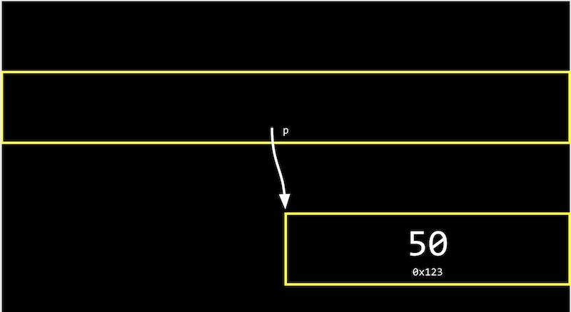
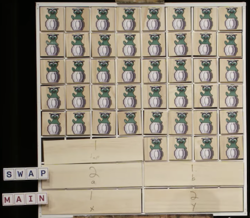

## Hexadecimal

- Na semana 2, falamos sobre memória e como cada byte tem um endereço, ou identificador, para que possamos nos referir a onde nossos dados estão realmente armazenados.
- Acontece que, por convenção, os endereços de memória usam o sistema de contagem **hexadecimal** , ou base-16, onde existem 16 dígitos: 0-9, e AF como equivalentes a 10-15.
- Vamos considerar um número hexadecimal de dois dígitos:

```
16^1 16^0
   0    A
```

- Aqui, o A na casa das unidades (uma vez que 16 ^ 0 = 1) tem um valor decimal de 10. Podemos continuar contando até `0F`, que é equivalente a 15 em decimal.
Depois `0F`, precisamos carregar o um, pois iríamos de 09 para 10 em decimal:

```
16^1 16^0
   1    0
```

- Aqui, o 1tem um valor de 16 ^ 1 * 1 = 16, então `10` em hexadecimal é 16 em decimal.
- Com dois dígitos, podemos ter um valor máximo de `FF`, ou 16 ^ 1 * 15 + 16 ^ 0 * 15 = 240 + 15 = 255, que é o mesmo valor máximo com 8 bits de binário. Portanto, dois dígitos em hexadecimal podem representar convenientemente o valor de um byte em binário. (Cada dígito em hexadecimal, com 16 valores, mapeia para quatro bits em binário.)
- Por escrito, indicamos que um valor está em hexadecimal prefixando-o com `0x`, como em `0x10`, onde o valor é igual a 16 em decimal, em oposição a 10.
- O sistema de cores RGB convencionalmente usa hexadecimal para descrever a quantidade de cada cor. Por exemplo, `000000`em hexadecimal representa 0 para cada um de vermelho, verde e azul, para uma cor combinada de preto. E `FF0000`seria 255, ou a maior quantidade possível de vermelho. `FFFFFF` indicaria o valor mais alto de cada cor, combinando para ser o branco mais brilhante. Com valores diferentes para cada cor, podemos representar milhões de cores diferentes.
Para a memória do nosso computador, também usaremos hexadecimal para cada endereço ou localização.

## Endereços

- Podemos criar um valor ne imprimi-lo:

```c
#include <stdio.h>

int main(void)
{
    int n = 50;
    printf("%i\n", n);
}
```

- Na memória do nosso computador, existem agora 4 bytes em algum lugar que têm o valor binário de 50, rotulados n:

<h1 align="center">
   
</h1>

- Acontece que, com os bilhões de bytes na memória, os bytes da variável `n` começam em algum local, que pode ser semelhante a `0x12345678`.
- Em C, podemos realmente ver o endereço com o `&`operador, o que significa “obter o endereço desta variável”:

```c
#include <stdio.h>

int main(void)
{
    int n = 50;
    printf("%p\n", &n);
}
```

- `%p` é o código de formato de um endereço.
- No IDE CS50, vemos um endereço como `0x7ffd80792f7c`. O valor do endereço em si não é útil, pois é apenas algum local na memória onde a variável está armazenada; em vez disso, a ideia importante é que podemos usar esse endereço mais tarde.
- O `*` operador, ou o operador de **desreferência**, nos permite "ir para" o local para o qual um ponteiro está apontando.
- Por exemplo, podemos imprimir `*&n`, em que “ir para” o endereço `n`, e que irá imprimir o valor de `n`, `50`, já que é o valor no endereço `n`:

```c
#include <stdio.h>

int main(void)
{
    int n = 50;
    printf("%i\n", *&n);
}
```

## Ponteiros


- Uma variável que armazena um endereço é chamada de **ponteiro** , que podemos pensar como um valor que “aponta” para um local na memória. Em C, os ponteiros podem se referir a tipos específicos de valores.
Podemos usar o `*` operador (de uma forma infelizmente confusa) para declarar uma variável que queremos ser um ponteiro:

```c
#include <stdio.h>

int main(void)
{
   int n = 50;
   int *p = &n;
   printf("%p\n", p);
}
```
- Aqui, usamos `int *p` para declarar uma variável,, pque tem o tipo de `*`, um ponteiro, para um valor do tipo int, um inteiro. Então, podemos imprimir seu valor (um endereço, algo parecido `0x12345678`), ou imprimir o valor em sua localização com `printf("%i\n", *p);`.
- Na memória do nosso computador, as variáveis serão assim:

<h1 align="center">
   
</h1>

- Uma vez que pé uma variável em si, está em algum lugar na memória, e o valor armazenado lá é o endereço de `n`.
- Os sistemas de computador modernos são “64 bits”, o que significa que eles usam 64 bits para endereçar a memória, então um ponteiro terá na realidade 8 bytes, duas vezes o tamanho de um inteiro de 4 bytes.
Podemos abstrair o valor real dos endereços, uma vez que eles serão diferentes conforme declaramos variáveis ​​em nossos programas e não muito úteis, e simplesmente pensar pcomo "apontando para" algum valor:

<h1 align="center">
   
</h1>
- No mundo real, podemos ter uma caixa de correio identificada como “p”, entre muitas caixas de correio com endereços. Dentro de nossa caixa de correio, podemos colocar um valor como `0x123`, que é o endereço de alguma outra caixa de correio n, com o endereço `0x123`.

## Strings

- Uma variável declarada com `string s = "HI!";` será armazenada um caractere por vez na memória. E podemos acessar cada caractere com s[0]`, `s[1]`, `s[2]`, e `s[3]`:

<h1 align="center">
   
</h1>

- Mas acontece que cada caractere, por estar armazenado na memória, também possui algum endereço único, e `s` na verdade é apenas um ponteiro com o endereço do primeiro caractere:

<h1 align="center">
   
</h1>

- E a variável `s` armazena o endereço do primeiro caractere da string. O valor `\0` é o único indicador do final da string:

<h1 align="center">
   
</h1>

- Como o resto dos caracteres estão em uma matriz, consecutivamente, podemos começar no endereço em `s` e continuar lendo um caractere por vez da memória até chegarmos `\0`.

- Vamos imprimir uma string:

```c
#include <cs50.h>
#include <stdio.h>

int main(void)
{
    string s = "HI!";
    printf("%s\n", s);
}
#include <cs50.h>
#include <stdio.h>

int main(void)
{
    string s = "HI!";
    printf("%s\n", s);
}

```

- Podemos ver o valor armazenado em `s` com `printf("%p\n", s);` e algo parecido, `0x4006a4` já que estamos imprimindo o endereço na memória do primeiro caractere da string.

- Se acrescentarmos uma outra linha, `printf("%p\n", &s[1]);`, nós, na verdade vamos ver o próximo endereço na memória: `0x4006a5.`

- Acontece que string sé apenas um ponteiro, um endereço para algum caractere na memória.

-  Na verdade, a biblioteca CS50 define um tipo que não existe em C,, `string` as `char *`, com `typedef char *string;`. O tipo personalizado,, `string` é definido como apenas `char *` com `typedef`. Então `string s = "HI!"`é o mesmo que `char *s = "HI!";`. E podemos usar strings em C exatamente da mesma maneira sem a biblioteca CS50, usando `char *`.

## Aritmética de ponteiro

- **A aritmética de ponteiros** são operações matemáticas em endereços com ponteiros.
Podemos imprimir cada caractere em uma string (usando`char *` diretamente):

```c
#include <stdio.h>

int main(void)
{
    char *s = "HI!";
    printf("%c\n", s[0]);
    printf("%c\n", s[1]);
    printf("%c\n", s[2]);
}
```

- Mas podemos ir diretamente para os endereços:

```c
#include <stdio.h>

int main(void)
{
    char *s = "HI!";
    printf("%c\n", *s);
    printf("%c\n", *(s+1));
    printf("%c\n", *(s+2));
}
```
- `*s` vai para o endereço armazenado em `s` e `*(s+1)` vai para o local na memória com um endereço um byte acima, ou o próximo caractere. `s[1]` é um açúcar sintático para `*(s+1)`, equivalente em função, mas mais amigável para o ser humano de ler e escrever.
Podemos até tentar ir para endereços na memória que não deveríamos, como com `*(s+10000)`, e quando executarmos nosso programa, teremos uma **falha de segmentação** ou travar como resultado de nosso programa tocar na memória em um segmento que não deveria t tenho.

## Compare e copie

- Vamos tentar comparar dois inteiros do usuário:
 
```c
#include <cs50.h>
#include <stdio.h>

int main(void)
{
    int i = get_int("i: ");
    int j = get_int("j: ");

    if (i == j)
    {
        printf("Same\n");
    }
    else
    {
        printf("Different\n");
    }
}
```

- Compilamos e executamos nosso programa, e ele funciona como esperávamos, com os mesmos valores dos dois inteiros nos dando “Mesmo” e valores diferentes “Diferentes”.
- Quando tentamos comparar duas strings, vemos que as mesmas entradas estão fazendo com que nosso programa imprima "Different":

```c
#include <cs50.h>
#include <stdio.h>

int main(void)
{
    char *s = get_string("s: ");
    char *t = get_string("t: ");

    if (s == t)
    {
        printf("Same\n");
    }
    else
    {
        printf("Different\n");
    }
}
```

- Mesmo quando nossas entradas são as mesmas, vemos "Diferente" impresso.
- Cada “string” é um ponteiro,, `char *` para um local diferente na memória, onde o primeiro caractere de cada string é armazenado. Portanto, mesmo se os caracteres na string forem iguais, isso sempre imprimirá “Diferente”.
- Por exemplo, nossa primeira string pode estar no endereço `0x123`, a segunda pode estar em `0x456` e `s` terá o valor de `0x123`, apontando para aquele local, e `t` terá o valor de `0x456`, apontando para outro local:


<h1 align="center">
   
</h1>

- E `get_string`, esse tempo todo, vem retornando apenas um `char *`, ou um ponteiro para o primeiro caractere de uma string do usuário. Como ligamos `get_string` duas vezes, recebemos duas dicas diferentes de volta.
Vamos tentar copiar uma string:

```c
#include <cs50.h>
#include <ctype.h>
#include <stdio.h>

int main(void)
{
    char *s = get_string("s: ");

    char *t = s;

    t[0] = toupper(t[0]);

    printf("s: %s\n", s);
    printf("t: %s\n", t);
}
```

- Pegamos uma string se copiamos o valor de sinto `t`. Em seguida, colocamos a primeira letra em maiúscula `t`.
Mas quando executamos nosso programa, vemos que ambos se `t` agora estão com letras maiúsculas.
- Uma vez que definimos `s` e `t` com o mesmo valor, ou o mesmo endereço, eles estão apontando para o mesmo caractere e, portanto, capitalizamos o mesmo caractere na memória!
- Para realmente fazer uma cópia de uma string, temos que trabalhar um pouco mais e copiar cada caractere spara outro lugar na memória:

- Para realmente fazer uma cópia de uma string, temos que trabalhar um pouco mais e copiar cada caractere spara outro lugar na memória:

```c
#include <cs50.h>
#include <ctype.h>
#include <stdio.h>
#include <stdlib.h>
#include <string.h>

int main(void)
{
    char *s = get_string("s: ");

    char *t = malloc(strlen(s) + 1);

    for (int i = 0, n = strlen(s); i < n + 1; i++)
    {
        t[i] = s[i];
    }

    t[0] = toupper(t[0]);

    printf("s: %s\n", s);
    printf("t: %s\n", t);
}
```

- Criamos uma nova variável,, `t` do tipo `char *`, com `char *t`. Agora, queremos apontá-lo para um novo bloco de memória grande o suficiente para armazenar a cópia da string. Com **malloc*, alocamos algum número de bytes na memória (que ainda não são usados para armazenar outros valores) e passamos o número de bytes que gostaríamos de marcar para uso. Já sabemos o comprimento de se adicionamos 1 a isso para o caractere nulo de terminação. Portanto, nossa linha final de código é `char *t = malloc(strlen(s) + 1);`.
- Em seguida, copiamos cada caractere, um de cada vez, com um `for` loop. Usamos `i < n + 1`, uma vez que realmente queremos ir até `n` , o comprimento da string, para garantir que copiaremos o caractere de terminação na string. No loop, configuramos `t[i] = s[i]`, copiando os personagens. Embora possamos usar `*(t+i) = *(s+i)` para o mesmo efeito, é indiscutivelmente menos legível.
- Agora, podemos colocar em maiúscula apenas a primeira letra de `t`.
- Podemos adicionar algumas verificações de erros ao nosso programa:

```c
#include <cs50.h>
#include <ctype.h>
#include <stdio.h>
#include <stdlib.h>
#include <string.h>

int main(void)
{
    char *s = get_string("s: ");

    char *t = malloc(strlen(s) + 1);
    if (t == NULL)
    {
        return 1;
    }

    for (int i = 0, n = strlen(s); i < n + 1; i++)
    {
        t[i] = s[i];
    }

    if (strlen(t) > 0)
    {
        t[0] = toupper(t[0]);
    }

    printf("s: %s\n", s);
    printf("t: %s\n", t);

    free(t);
}
```

- Se nosso computador estiver sem memória, `malloc` retornará `NULL` o ponteiro nulo ou um valor especial que indica que não há um endereço para o qual apontar. Portanto, devemos verificar esse caso e sair se `t` estiver `NULL`.
- Também poderíamos verificar se `t` tem um comprimento, antes de tentar colocar o primeiro caractere em maiúscula.
- Finalmente, devemos **liberar** a memória que alocamos anteriormente, o que a marca como utilizável novamente por algum outro programa. Chamamos a `free` função e passamos o ponteiro `t`, já que terminamos com aquele pedaço de memória. ( `get_string` também, chamadas `malloc` para alocar memória para strings e chamadas `free` pouco antes do `main` retorno da função.)
- Na verdade, também podemos usar a `strcpy` função, da biblioteca de strings do C, com, em `strcpy(t, s);` vez de nosso loop, para copiar a string `s`para `t.`

## Valgrind

- `valgrind` é uma ferramenta de linha de comando que podemos usar para executar nosso programa e ver se há algum **vazamento de memória** ou memória que alocamos sem liberar, o que pode eventualmente fazer com que o computador fique sem memória.
Vamos construir uma string, mas alocar menos do que precisamos em `memory.c:`

```c
#include <stdio.h>
#include <stdlib.h>

int main(void)
{
    char *s = malloc(3);
    s[0] = 'H';
    s[1] = 'I';
    s[2] = '!';
    s[3] = '\0';
    printf("%s\n", s);
}
```

- Também não liberamos a memória que alocamos.
- Executaremos `valgrind ./memory` após a compilação e veremos muitos resultados, mas podemos executar `help50 valgrind ./memory` para ajudar a explicar algumas dessas mensagens. Para este programa, vemos trechos como “Gravação inválida de tamanho 1”, “Leitura inválida de tamanho 1” e, finalmente, “3 bytes em 1 bloco são definitivamente perdidos”, com números de linha próximos. Na verdade, estamos escrevendo para a memória, o `s[3]` que não faz parte do que alocamos originalmente `s`. E quando imprimimos `s`, estamos lendo `s[3]` também. E, finalmente, `s` não é liberado ao final do nosso programa.
Podemos ter certeza de alocar o número certo de bytes e liberar memória no final:

- Podemos ter certeza de alocar o número certo de bytes e liberar memória no final:

```c
#include <stdio.h>
#include <stdlib.h>

int main(void)
{
    char *s = malloc(4);
    s[0] = 'H';
    s[1] = 'I';
    s[2] = '!';
    s[3] = '\0';
    printf("%s\n", s);
    free(s);
}
```

- Agora, valgrindnão mostra nenhuma mensagem de aviso.

## Valores de lixo

- Vamos dar uma olhada no seguinte:

```c
int main(void)
{
    int *x;
    int *y;

    x = malloc(sizeof(int));

    *x = 42;
    *y = 13;

    y = x;

    *y = 13;
}
```


- Declaramos dois ponteiros para inteiros `x` e `y`, mas não atribuímos valores a eles. Usamos `malloc` para alocar memória suficiente para um inteiro com `sizeof(int)` e armazená-lo em `x. *x = 42` vai para o endereço `x` aponta para, e define esse local na memória para o valor 42.
- Com `*y = 13`, estamos tentando colocar o valor 13 nos ypontos de endereço para. Mas, como nunca atribuímos yum valor, ele tem um **valor lixo**, ou qualquer valor desconhecido que estava na memória, de qualquer programa que estava sendo executado em nosso computador antes. Então, quando tentamos ir para o valor lixo em `y` como um endereço, estamos indo para algum endereço desconhecido, que provavelmente causará uma falha de segmentação ou segfault.
- Assistimos [`Pointer Fun with Binky`](https://www.youtube.com/watch?v=3uLKjb973HU) , um vídeo animado que demonstra os conceitos do código acima.
- Podemos imprimir valores inúteis, declarando uma matriz, mas não definindo nenhum de seus valores:

```c
#include <stdio.h>

int main(void)
{
    int scores[3];
    for (int i = 0; i < 3; i++)
    {
        printf("%i\n", scores[i]);
    }
}
```

- Quando compilamos e executamos este programa, vemos vários valores impressos.

## Troca

- Vamos tentar trocar os valores de dois inteiros.
 
```c
#include <stdio.h>

void swap(int a, int b);

int main(void)
{
    int x = 1;
    int y = 2;

    printf("x is %i, y is %i\n", x, y);
    swap(x, y);
    printf("x is %i, y is %i\n", x, y);
}

void swap(int a, int b)
{
    int tmp = a;
    a = b;
    b = tmp;
}
```

- No mundo real, se tivéssemos um líquido vermelho em um copo e um líquido azul em outro e quiséssemos trocá-los, precisaríamos de um terceiro copo para conter temporariamente um dos líquidos, talvez o vidro vermelho. Então, podemos derramar o líquido azul no primeiro copo e, finalmente, o líquido vermelho do copo temporário no segundo.
- Em nossa `swap` função, temos uma terceira variável para usar também como espaço de armazenamento temporário. Colocamos `a` em `tmp` e, em seguida, definimos `a` o valor de `b` e, finalmente, `b` podemos ser alterados para o valor original de `a`, agora em `tmp`.
- Mas, se tentamos usar essa função em um programa, não vemos nenhuma mudança. Acontece que a `swap` função obtém suas próprias variáveis `a` e , `b` quando são passadas, são cópias de `x` e `y`, portanto, alterar esses valores não altera o `x` e `y` na `main` função.

## Layout de memória

- Na memória do nosso computador, os diferentes tipos de dados que precisam ser armazenados para o nosso programa são organizados em diferentes seções:

<h1 align="center">
   
</h1>

- A seção de **código de máquina** é o código binário do nosso programa compilado. Quando executamos nosso programa, esse código é carregado no “topo” da memória.
- Logo abaixo, ou na próxima parte da memória, estão as **variáveis globais** que declaramos em nosso programa.
- A seção de **heap** é uma área vazia de onde `malloc` podemos obter memória livre para nosso programa usar. Como chamamos `malloc`, começamos a alocar memória de cima para baixo.
- A seção de **pilha** é usada por funções em nosso programa conforme são chamadas e cresce para cima. Por exemplo, nossa `main` função está na parte inferior da pilha e tem as variáveis locais `x`e `y`. A `swap` função, quando é chamado, tem sua própria área de memória que está no topo do `main`'s, com as variáveis locais `a`, `b` e `tmp`:

<h1 align="center">
   
</h1>

- Depois que a função `swap` retorna, a memória que estava usando é liberada para a próxima chamada de função. `x`e `y` são argumentos, portanto, são copiados como `a` e `b` para `swap`, portanto, não vemos nossas alterações novamente `main`.
- Ao passar o endereço de `x` e `y`, nossa `swap` função pode realmente funcionar:

```c
#include <stdio.h>

void swap(int *a, int *b);

int main(void)
{
    int x = 1;
    int y = 2;

    printf("x is %i, y is %i\n", x, y);
    swap(&x, &y);
    printf("x is %i, y is %i\n", x, y);
}

void swap(int *a, int *b)
{
    int tmp = *a;
    *a = *b;
    *b = tmp;
}
```

- Os endereços de xe ysão passados de `main`para `swap` com `&x` e `&y`, e usamos a `int *a` sintaxe para declarar que nossa `swap` função recebe ponteiros. Salvamos o valor de `x` para `tmps` eguindo o ponteiro `a` e, em seguida, pegamos o valor de `y` seguindo o ponteiro `b` e armazenamos isso no local que `a` aponta para ( `x` ). Por fim, armazenamos o valor de `tmp`no local apontado por `b`( `y` ) e pronto:

<h1 align="center">
   
</h1>

- Se `malloc` pedirmos muita memória, teremos um **estouro de heap** , pois acabamos ultrapassando nosso `heap`. Ou, se chamarmos muitas funções sem retornar delas, teremos um estouro de pilha , onde nossa pilha também tem muita memória alocada.
Vamos implementar o desenho da pirâmide de Mario, chamando uma função:

```c
#include <cs50.h>
#include <stdio.h>

void draw(int h);

int main(void)
{
    int height = get_int("Height: ");
    draw(height);
}

void draw(int h)
{
    for (int i = 1; i <= h; i++)
    {
        for (int j = 1; j <= i; j++)
        {
            printf("#");
        }
        printf("\n");
    }
}
```

- Podemos mudar drawpara ser recursivo:

```c
void draw(int h)
{
    draw(h - 1);

    for (int i = 0; i < h; i++)
    {
        printf("#");
    }
    printf("\n");
}
```

- Quando tentamos compilar isso com `make`, vemos um aviso de que a `draw` função se chamará recursivamente sem parar. Portanto, usaremos `clang` sem as verificações extras e, quando executarmos este programa, obteremos uma falha de segmentação imediatamente. `draw` está chamando a si mesmo continuamente e ficamos sem memória na pilha.
- Ao adicionar um caso base, a `draw` função irá parar de chamar a si mesma em algum ponto:

```c
void draw(int h)
{
    if (h == 0)
    {
        return;
    }

    draw(h - 1);

    for (int i = 0; i < h; i++)
    {
        printf("#");
    }
    printf("\n");
}
```

- Mas se inserirmos um valor grande o suficiente para a altura, como `2000000000`, ainda ficaremos sem memória, já que estamos chamando `draw` muitas vezes sem retornar.
- Um **estouro de buffer** ocorre quando passamos do final de um buffer, algum pedaço de memória que alocamos como um array e acessamos a memória que não deveríamos.

## scanf

- Podemos `get_int` nos implementar com uma função de biblioteca C `scanf`:

```c
#include <stdio.h>

int main(void)
{
    int x;
    printf("x: ");
    scanf("%i", &x);
    printf("x: %i\n", x);
}
```

- `scanf` assume um formato, `%i` então a entrada é “digitalizada” para esse formato. Também passamos na memória o endereço para onde queremos que essa entrada vá. Mas `scanf` não tem muita verificação de erros, então podemos não obter um número inteiro.
Podemos tentar obter uma string da mesma maneira:

```c
#include <stdio.h>

int main(void)
{
    char *s;
    printf("s: ");
    scanf("%s", s);
    printf("s: %s\n", s);
}
```

- Mas, na verdade, não alocamos nenhuma memória para `s`, portanto, precisamos chamar `malloc` para alocar memória para os caracteres de nossa string. Também podemos usar `char s[4];` para declarar um array de quatro caracteres. Em seguida, sserá tratado como um ponteiro para o primeiro caractere em `scanf` e `printf`.
- Agora, se o usuário digitar uma string de comprimento 3 ou menos, nosso programa funcionará com segurança. Mas se o usuário digitar uma string mais longa, `scanf` pode estar tentando escrever além do final de nosso array na memória desconhecida, fazendo com que nosso programa trave.
- `get_string` da biblioteca CS50 aloca continuamente mais memória à medida que `scanf` lê mais caracteres, por isso não tem esse problema.

## arquivos

- Com a capacidade de usar ponteiros, também podemos abrir arquivos, como uma lista telefônica digital:
 
```c
#include <cs50.h>
#include <stdio.h>
#include <string.h>

int main(void)
{
    FILE *file = fopen("phonebook.csv", "a");
    if (file == NULL)
    {
        return 1;
    }

    char *name = get_string("Name: ");
    char *number = get_string("Number: ");

    fprintf(file, "%s,%s\n", name, number);

    fclose(file);
}
```

- `fopen` é uma nova função que podemos usar para abrir um arquivo. Ele retornará um ponteiro para um novo tipo `FILE`,, de onde podemos ler e escrever. O primeiro argumento é o nome do arquivo, e o segundo argumento é o modo no qual queremos abrir o arquivo ( `r` para leitura, `w` para gravação e `a` para anexar ou adicionar).
- Adicionaremos uma marca de verificação para sair, caso não possamos abrir o arquivo por algum motivo.
Depois de obter algumas strings, podemos usar fprintfpara imprimir em um arquivo.
- Finalmente, fechamos o arquivo com `fclose`.
- Agora podemos criar nossos próprios arquivos CSV, um arquivo de valores separados por vírgulas (como uma mini planilha), programaticamente.

## Gráficos

- Podemos ler em binário e mapeá-los em pixels e cores, para exibir imagens e vídeos. Com um número finito de bits em um arquivo de imagem, porém, só podemos ampliar até certo ponto antes de começarmos a ver pixels individuais.
- Com inteligência artificial e aprendizado de máquina, no entanto, podemos usar algoritmos que podem gerar detalhes adicionais que não existiam antes, por adivinhação com base em outros dados.
- Vejamos um programa que abre um arquivo e nos diz se é um arquivo JPEG, um arquivo de imagem em um formato específico:
 
```c
#include <stdint.h>
#include <stdio.h>

typedef uint8_t BYTE;

int main(int argc, char *argv[])
{
    // Check usage
    if (argc != 2)
    {
        return 1;
    }

    // Open file
    FILE *file = fopen(argv[1], "r");
    if (!file)
    {
        return 1;
    }

    // Read first three bytes
    BYTE bytes[3];
    fread(bytes, sizeof(BYTE), 3, file);

    // Check first three bytes
    if (bytes[0] == 0xff && bytes[1] == 0xd8 && bytes[2] == 0xff)
    {
        printf("Maybe\n");
    }
    else
    {
        printf("No\n");
    }

    // Close file
    fclose(file);
}
```
- Primeiro, definimos a `BYTE` como 8 bits, para que possamos nos referir a um byte como um tipo mais facilmente em C.
- Em seguida, tentamos abrir um arquivo (verificando se realmente obtemos um arquivo não `NULL` de volta) e lemos os primeiros três bytes do arquivo com `fread`, em um buffer chamado `bytes`.
- Podemos comparar os primeiros três bytes (em hexadecimal) aos três bytes necessários para iniciar um arquivo JPEG. Se forem iguais, é provável que nosso arquivo seja um arquivo JPEG (embora outros tipos de arquivos ainda possam começar com esses bytes). Mas se eles não forem iguais, sabemos que definitivamente não é um arquivo JPEG.
- Podemos até copiar arquivos nós mesmos, um byte de cada vez agora:

```c
#include <stdint.h>
#include <stdio.h>
#include <stdlib.h>

typedef uint8_t BYTE;

int main(int argc, char *argv[])
{
    // Ensure proper usage
    if (argc != 3)
    {
        fprintf(stderr, "Usage: copy SOURCE DESTINATION\n");
        return 1;
    }

    // open input file
    FILE *source = fopen(argv[1], "r");
    if (source == NULL)
    {
        printf("Could not open %s.\n", argv[1]);
        return 1;
    }

    // Open output file
    FILE *destination = fopen(argv[2], "w");
    if (destination == NULL)
    {
        fclose(source);
        printf("Could not create %s.\n", argv[2]);
        return 1;
    }

    // Copy source to destination, one BYTE at a time
    BYTE buffer;
    while (fread(&buffer, sizeof(BYTE), 1, source))
    {
        fwrite(&buffer, sizeof(BYTE), 1, destination);
    }

    // Close files
    fclose(source);
    fclose(destination);
    return 0;
}
```

- Usamos `argv` para obter argumentos, usando-os como nomes de arquivos para abrir arquivos para ler e escrever.
- Em seguida, lemos um byte do `source` arquivo em um buffer e gravamos esse byte no destination arquivo. Podemos usar um whileloop para chamar `fread`, que irá parar quando não houver mais bytes para ler.
- Podemos usar essas habilidades para ler e gravar arquivos, recuperando imagens de um arquivo e adicionando filtros às imagens, alterando os bytes nelas, no conjunto de problemas desta semana!
