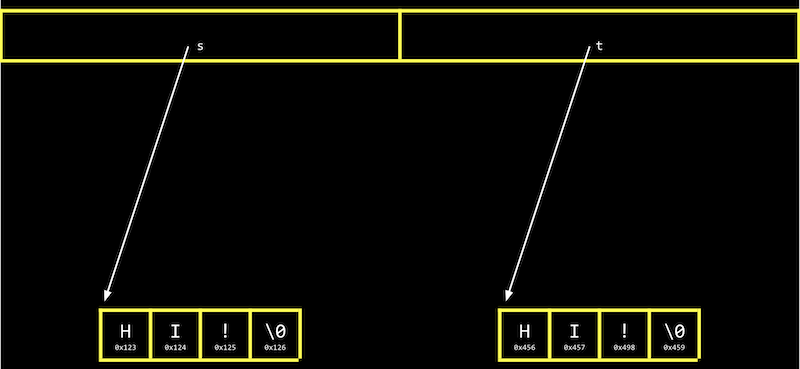

## Hexadecimal

- Na semana 2, falamos sobre memória e como cada byte tem um endereço, ou identificador, para que possamos nos referir a onde nossos dados estão realmente armazenados.
- Acontece que, por convenção, os endereços de memória usam o sistema de contagem **hexadecimal** , ou base-16, onde existem 16 dígitos: 0-9, e AF como equivalentes a 10-15.
- Vamos considerar um número hexadecimal de dois dígitos:

```
16^1 16^0
   0    A
```

- Aqui, o A na casa das unidades (uma vez que 16 ^ 0 = 1) tem um valor decimal de 10. Podemos continuar contando até `0F`, que é equivalente a 15 em decimal.
Depois `0F`, precisamos carregar o um, pois iríamos de 09 para 10 em decimal:

```
16^1 16^0
   1    0
```

- Aqui, o 1tem um valor de 16 ^ 1 * 1 = 16, então `10` em hexadecimal é 16 em decimal.
- Com dois dígitos, podemos ter um valor máximo de `FF`, ou 16 ^ 1 * 15 + 16 ^ 0 * 15 = 240 + 15 = 255, que é o mesmo valor máximo com 8 bits de binário. Portanto, dois dígitos em hexadecimal podem representar convenientemente o valor de um byte em binário. (Cada dígito em hexadecimal, com 16 valores, mapeia para quatro bits em binário.)
- Por escrito, indicamos que um valor está em hexadecimal prefixando-o com `0x`, como em `0x10`, onde o valor é igual a 16 em decimal, em oposição a 10.
- O sistema de cores RGB convencionalmente usa hexadecimal para descrever a quantidade de cada cor. Por exemplo, `000000`em hexadecimal representa 0 para cada um de vermelho, verde e azul, para uma cor combinada de preto. E `FF0000`seria 255, ou a maior quantidade possível de vermelho. `FFFFFF` indicaria o valor mais alto de cada cor, combinando para ser o branco mais brilhante. Com valores diferentes para cada cor, podemos representar milhões de cores diferentes.
Para a memória do nosso computador, também usaremos hexadecimal para cada endereço ou localização.

## Endereços

- Podemos criar um valor ne imprimi-lo:

```c
#include <stdio.h>

int main(void)
{
    int n = 50;
    printf("%i\n", n);
}
```

- Na memória do nosso computador, existem agora 4 bytes em algum lugar que têm o valor binário de 50, rotulados n:

<h1 align="center">
   
</h1>

- Acontece que, com os bilhões de bytes na memória, os bytes da variável `n` começam em algum local, que pode ser semelhante a `0x12345678`.
- Em C, podemos realmente ver o endereço com o `&`operador, o que significa “obter o endereço desta variável”:

```c
#include <stdio.h>

int main(void)
{
    int n = 50;
    printf("%p\n", &n);
}
```

- `%p` é o código de formato de um endereço.
- No IDE CS50, vemos um endereço como `0x7ffd80792f7c`. O valor do endereço em si não é útil, pois é apenas algum local na memória onde a variável está armazenada; em vez disso, a ideia importante é que podemos usar esse endereço mais tarde.
- O `*` operador, ou o operador de **desreferência**, nos permite "ir para" o local para o qual um ponteiro está apontando.
- Por exemplo, podemos imprimir `*&n`, em que “ir para” o endereço `n`, e que irá imprimir o valor de `n`, `50`, já que é o valor no endereço `n`:

```c
#include <stdio.h>

int main(void)
{
    int n = 50;
    printf("%i\n", *&n);
}
```

## Ponteiros


- Uma variável que armazena um endereço é chamada de **ponteiro** , que podemos pensar como um valor que “aponta” para um local na memória. Em C, os ponteiros podem se referir a tipos específicos de valores.
Podemos usar o `*` operador (de uma forma infelizmente confusa) para declarar uma variável que queremos ser um ponteiro:

```c
#include <stdio.h>

int main(void)
{
   int n = 50;
   int *p = &n;
   printf("%p\n", p);
}
```
- Aqui, usamos `int *p` para declarar uma variável,, pque tem o tipo de `*`, um ponteiro, para um valor do tipo int, um inteiro. Então, podemos imprimir seu valor (um endereço, algo parecido `0x12345678`), ou imprimir o valor em sua localização com `printf("%i\n", *p);`.
- Na memória do nosso computador, as variáveis serão assim:

<h1 align="center">
   
</h1>

- Uma vez que pé uma variável em si, está em algum lugar na memória, e o valor armazenado lá é o endereço de `n`.
- Os sistemas de computador modernos são “64 bits”, o que significa que eles usam 64 bits para endereçar a memória, então um ponteiro terá na realidade 8 bytes, duas vezes o tamanho de um inteiro de 4 bytes.
Podemos abstrair o valor real dos endereços, uma vez que eles serão diferentes conforme declaramos variáveis ​​em nossos programas e não muito úteis, e simplesmente pensar pcomo "apontando para" algum valor:

<h1 align="center">
   
</h1>
- No mundo real, podemos ter uma caixa de correio identificada como “p”, entre muitas caixas de correio com endereços. Dentro de nossa caixa de correio, podemos colocar um valor como `0x123`, que é o endereço de alguma outra caixa de correio n, com o endereço `0x123`.

## Strings

- Uma variável declarada com `string s = "HI!";` será armazenada um caractere por vez na memória. E podemos acessar cada caractere com s[0]`, `s[1]`, `s[2]`, e `s[3]`:

<h1 align="center">
   
</h1>

- Mas acontece que cada caractere, por estar armazenado na memória, também possui algum endereço único, e `s` na verdade é apenas um ponteiro com o endereço do primeiro caractere:

<h1 align="center">
   
</h1>

- E a variável `s` armazena o endereço do primeiro caractere da string. O valor `\0` é o único indicador do final da string:

<h1 align="center">
   
</h1>

- Como o resto dos caracteres estão em uma matriz, consecutivamente, podemos começar no endereço em `s` e continuar lendo um caractere por vez da memória até chegarmos `\0`.

- Vamos imprimir uma string:

```c
#include <cs50.h>
#include <stdio.h>

int main(void)
{
    string s = "HI!";
    printf("%s\n", s);
}
#include <cs50.h>
#include <stdio.h>

int main(void)
{
    string s = "HI!";
    printf("%s\n", s);
}

```

- Podemos ver o valor armazenado em `s` com `printf("%p\n", s);` e algo parecido, `0x4006a4` já que estamos imprimindo o endereço na memória do primeiro caractere da string.

- Se acrescentarmos uma outra linha, `printf("%p\n", &s[1]);`, nós, na verdade vamos ver o próximo endereço na memória: `0x4006a5.`

- Acontece que string sé apenas um ponteiro, um endereço para algum caractere na memória.

-  Na verdade, a biblioteca CS50 define um tipo que não existe em C,, `string` as `char *`, com `typedef char *string;`. O tipo personalizado,, `string` é definido como apenas `char *` com `typedef`. Então `string s = "HI!"`é o mesmo que `char *s = "HI!";`. E podemos usar strings em C exatamente da mesma maneira sem a biblioteca CS50, usando `char *`.

## Aritmética de ponteiro

- **A aritmética de ponteiros** são operações matemáticas em endereços com ponteiros.
Podemos imprimir cada caractere em uma string (usando`char *` diretamente):

```c
#include <stdio.h>

int main(void)
{
    char *s = "HI!";
    printf("%c\n", s[0]);
    printf("%c\n", s[1]);
    printf("%c\n", s[2]);
}
```

- Mas podemos ir diretamente para os endereços:

```c
#include <stdio.h>

int main(void)
{
    char *s = "HI!";
    printf("%c\n", *s);
    printf("%c\n", *(s+1));
    printf("%c\n", *(s+2));
}
```
- `*s` vai para o endereço armazenado em `s` e `*(s+1)` vai para o local na memória com um endereço um byte acima, ou o próximo caractere. `s[1]` é um açúcar sintático para `*(s+1)`, equivalente em função, mas mais amigável para o ser humano de ler e escrever.
Podemos até tentar ir para endereços na memória que não deveríamos, como com `*(s+10000)`, e quando executarmos nosso programa, teremos uma **falha de segmentação** ou travar como resultado de nosso programa tocar na memória em um segmento que não deveria t tenho.

## Compare e copie

- Vamos tentar comparar dois inteiros do usuário:
 
```c
#include <cs50.h>
#include <stdio.h>

int main(void)
{
    int i = get_int("i: ");
    int j = get_int("j: ");

    if (i == j)
    {
        printf("Same\n");
    }
    else
    {
        printf("Different\n");
    }
}
```

- Compilamos e executamos nosso programa, e ele funciona como esperávamos, com os mesmos valores dos dois inteiros nos dando “Mesmo” e valores diferentes “Diferentes”.
- Quando tentamos comparar duas strings, vemos que as mesmas entradas estão fazendo com que nosso programa imprima "Different":

```c
#include <cs50.h>
#include <stdio.h>

int main(void)
{
    char *s = get_string("s: ");
    char *t = get_string("t: ");

    if (s == t)
    {
        printf("Same\n");
    }
    else
    {
        printf("Different\n");
    }
}
```

- Mesmo quando nossas entradas são as mesmas, vemos "Diferente" impresso.
- Cada “string” é um ponteiro,, `char *` para um local diferente na memória, onde o primeiro caractere de cada string é armazenado. Portanto, mesmo se os caracteres na string forem iguais, isso sempre imprimirá “Diferente”.
- Por exemplo, nossa primeira string pode estar no endereço `0x123`, a segunda pode estar em `0x456` e `s` terá o valor de `0x123`, apontando para aquele local, e `t` terá o valor de `0x456`, apontando para outro local:


<h1 align="center">
   
</h1>

- E `get_string`, esse tempo todo, vem retornando apenas um `char *`, ou um ponteiro para o primeiro caractere de uma string do usuário. Como ligamos `get_string` duas vezes, recebemos duas dicas diferentes de volta.
Vamos tentar copiar uma string:

```c
#include <cs50.h>
#include <ctype.h>
#include <stdio.h>

int main(void)
{
    char *s = get_string("s: ");

    char *t = s;

    t[0] = toupper(t[0]);

    printf("s: %s\n", s);
    printf("t: %s\n", t);
}
```

- Pegamos uma string se copiamos o valor de sinto `t`. Em seguida, colocamos a primeira letra em maiúscula `t`.
Mas quando executamos nosso programa, vemos que ambos se `t` agora estão com letras maiúsculas.
- Uma vez que definimos `s` e `t` com o mesmo valor, ou o mesmo endereço, eles estão apontando para o mesmo caractere e, portanto, capitalizamos o mesmo caractere na memória!
- Para realmente fazer uma cópia de uma string, temos que trabalhar um pouco mais e copiar cada caractere spara outro lugar na memória:

- Para realmente fazer uma cópia de uma string, temos que trabalhar um pouco mais e copiar cada caractere spara outro lugar na memória:

```c
#include <cs50.h>
#include <ctype.h>
#include <stdio.h>
#include <stdlib.h>
#include <string.h>

int main(void)
{
    char *s = get_string("s: ");

    char *t = malloc(strlen(s) + 1);

    for (int i = 0, n = strlen(s); i < n + 1; i++)
    {
        t[i] = s[i];
    }

    t[0] = toupper(t[0]);

    printf("s: %s\n", s);
    printf("t: %s\n", t);
}
```

- Criamos uma nova variável,, `t` do tipo `char *`, com `char *t`. Agora, queremos apontá-lo para um novo bloco de memória grande o suficiente para armazenar a cópia da string. Com **malloc*, alocamos algum número de bytes na memória (que ainda não são usados para armazenar outros valores) e passamos o número de bytes que gostaríamos de marcar para uso. Já sabemos o comprimento de se adicionamos 1 a isso para o caractere nulo de terminação. Portanto, nossa linha final de código é `char *t = malloc(strlen(s) + 1);`.
- Em seguida, copiamos cada caractere, um de cada vez, com um `for` loop. Usamos `i < n + 1`, uma vez que realmente queremos ir até `n` , o comprimento da string, para garantir que copiaremos o caractere de terminação na string. No loop, configuramos `t[i] = s[i]`, copiando os personagens. Embora possamos usar `*(t+i) = *(s+i)` para o mesmo efeito, é indiscutivelmente menos legível.
- Agora, podemos colocar em maiúscula apenas a primeira letra de `t`.
- Podemos adicionar algumas verificações de erros ao nosso programa:

```c
#include <cs50.h>
#include <ctype.h>
#include <stdio.h>
#include <stdlib.h>
#include <string.h>

int main(void)
{
    char *s = get_string("s: ");

    char *t = malloc(strlen(s) + 1);
    if (t == NULL)
    {
        return 1;
    }

    for (int i = 0, n = strlen(s); i < n + 1; i++)
    {
        t[i] = s[i];
    }

    if (strlen(t) > 0)
    {
        t[0] = toupper(t[0]);
    }

    printf("s: %s\n", s);
    printf("t: %s\n", t);

    free(t);
}
```

- Se nosso computador estiver sem memória, `malloc` retornará `NULL` o ponteiro nulo ou um valor especial que indica que não há um endereço para o qual apontar. Portanto, devemos verificar esse caso e sair se `t` estiver `NULL`.
- Também poderíamos verificar se `t` tem um comprimento, antes de tentar colocar o primeiro caractere em maiúscula.
- Finalmente, devemos **liberar** a memória que alocamos anteriormente, o que a marca como utilizável novamente por algum outro programa. Chamamos a `free` função e passamos o ponteiro `t`, já que terminamos com aquele pedaço de memória. ( `get_string` também, chamadas `malloc` para alocar memória para strings e chamadas `free` pouco antes do `main` retorno da função.)
- Na verdade, também podemos usar a `strcpy` função, da biblioteca de strings do C, com, em `strcpy(t, s);` vez de nosso loop, para copiar a string `s`para `t.`