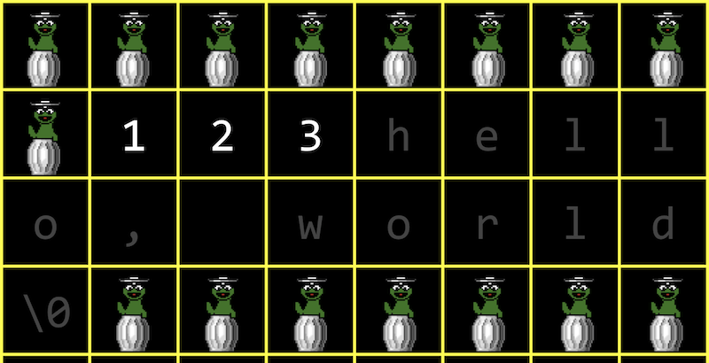
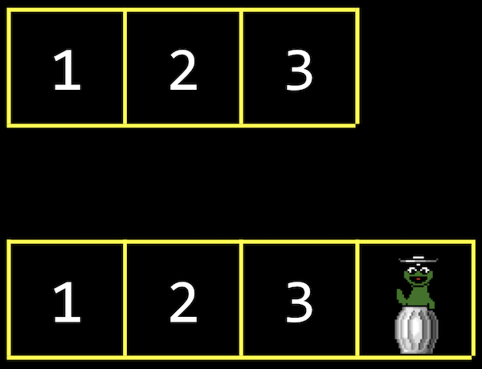
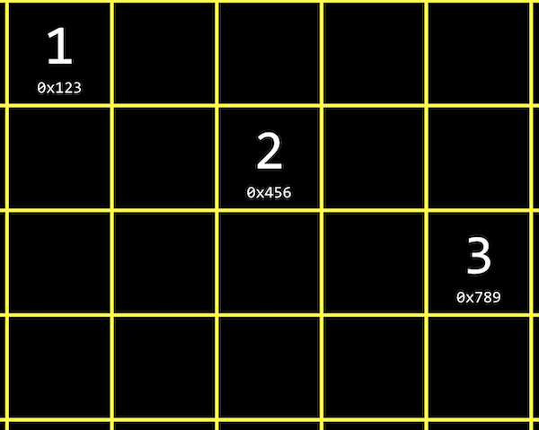
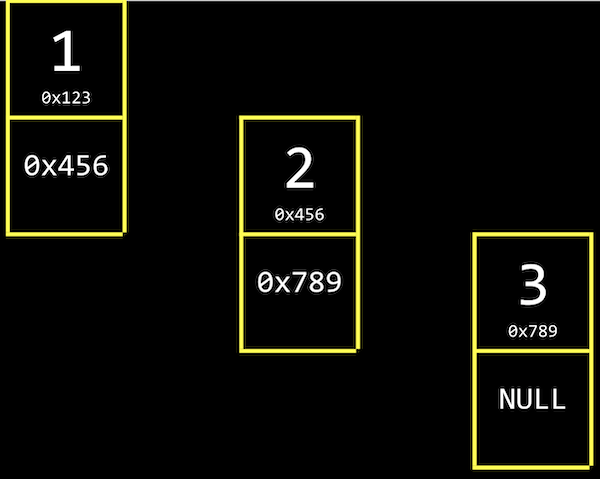

## Redimensionando matrizes

- Da última vez, aprendemos sobre ponteiros malloce outras ferramentas úteis para trabalhar com memória.
- Na semana 2, aprendemos sobre matrizes, onde poderíamos armazenar o mesmo tipo de valor em uma lista, consecutivamente na memória. Quando precisamos inserir um elemento, precisamos aumentar o tamanho do array também. Mas, a memória depois dele em nosso computador já pode ser usada para alguns outros dados, como uma string:

<h1 align="center">

</h1>

- Uma solução pode ser alocar mais memória onde houver espaço suficiente e mover nosso array para lá. Mas precisaremos copiar nosso array lá, o que se torna uma operação com tempo de execução de O ( n ), já que precisamos copiar cada um dos n elementos originais primeiro:

<h1 align="center">

</h1>

- O limite inferior da inserção de um elemento em um array seria O (1), pois já podemos ter espaço para ele no array.


## Estruturas de dados

- **As estruturas de dados** são formas mais complexas de organizar os dados na memória, permitindo-nos armazenar informações em diferentes layouts.
- Para construir uma estrutura de dados, precisaremos de algumas ferramentas:
- `struct` para criar tipos de dados personalizados
- `.` para acessar propriedades em uma estrutura
- `*` para ir para um endereço na memória apontado por um ponteiro
- `->` para acessar propriedades em uma estrutura apontada por um ponteiro

## Listas Ligadas

- Com uma **lista vinculada** , podemos armazenar uma lista de valores que pode ser facilmente aumentada, armazenando valores em diferentes partes da memória:


<h1 align="center">
   
</h1>

- Nós temos os valores `1`, `2` e `3`, cada um, em algum endereço na memória como `0x123`, `0x456`, e `0x789`.
- Isso é diferente de uma matriz, pois nossos valores não estão mais próximos um do outro na memória. Podemos usar quaisquer locais da memória que estejam livres.
- Para rastrear todos esses valores, precisamos vincular nossa lista, alocando, para cada elemento, memória suficiente para o valor que queremos armazenar e o endereço do próximo elemento:

<h1 align="center">
   
</h1>

- Próximo ao nosso valor de `1`, por exemplo, também armazenamos um ponteiro,, `0x456` para o próximo valor. Chamaremos isso de **nó** , um componente de nossa estrutura de dados que armazena um valor e um ponteiro. Em C, implementaremos nossos nós com uma estrutura.
- Para nosso último nó com valor `3`, temos o ponteiro nulo, já que não há próximo elemento. Quando precisamos inserir outro nó, podemos apenas alterar aquele único ponteiro nulo para apontar para nosso novo valor.
- Temos a desvantagem de precisar alocar o dobro de memória para cada elemento, a fim de gastar menos tempo adicionando valores. E não podemos mais usar a pesquisa binária, uma vez que nossos nós podem estar em qualquer lugar da memória. Só podemos acessá-los seguindo os ponteiros, um de cada vez.
- No código, podemos criar nosso próprio struct chamado `node` e precisamos armazenar nosso valor, um `int` chamado `number`, e um ponteiro para o próximo `node`, chamado `next`:

```c
typedef struct node
{
    int number;
    struct node *next;
}
node;
```

- Começamos essa estrutura com `typedef struct node` para que possamos nos referir a uma `node` dentro de nossa estrutura.
- Podemos construir uma lista vinculada no código começando com nossa estrutura. Primeiro, vamos querer lembrar uma lista vazia, para que possamos usar o ponteiro nulo: `node *list = NULL;`.
- Para adicionar um elemento, primeiro precisamos alocar um pouco de memória para um nó e definir seus valores:

```c
// We use sizeof(node) to get the right amount of memory to allocate, and
// malloc returns a pointer that we save as n
node *n = malloc(sizeof(node));

// We want to make sure malloc succeeded in getting memory for us
if (n != NULL)
{
    // This is equivalent to (*n).number, where we first go to the node pointed
    // to by n, and then set the number property. In C, we can also use this
    // arrow notation
    n->number = 1;
    // Then we need to make sure the pointer to the next node in our list
    // isn't a garbage value, but the new node won't point to anything (for now)
    n->next = NULL;
}
```

- Agora nossa lista precisa apontar para este nó `list = n;`

<h1 align="center">
   
</h1>

- Para adicionar à lista, criaremos um novo nó da mesma maneira, alocando mais memória:

```c
n = malloc(sizeof(node));
if (n != NULL)
{
    n->number = 2;
    n->next = NULL;
}
```

- Mas agora precisamos atualizar o ponteiro em nosso primeiro nó para apontar para nosso novo `n`:

```c
list->next = n;
```

- Para adicionar um terceiro nó, faremos o mesmo seguindo o nextponteiro em nossa lista primeiro e, em seguida, definindo o nextponteiro lá para apontar para o novo nó:

```c
n = malloc(sizeof(node));
if (n != NULL)
{
    n->number = 3;
    n->next = NULL;
}
list->next->next = n;
```

- Graficamente, nossos nós na memória se parecem com isto:

<h1 align="center">
   
</h1>

- `n` é uma variável temporária, apontando para nosso novo nó com valor 3.
- Queremos que o ponteiro em nosso nó com valor 2 aponte para o novo nó também, então começamos list(que aponta para o nó com valor 1), seguimos o nextponteiro para chegar ao nosso nó com valor 2 e atualizamos o nextponteiro para apontar n.
- Como resultado, a pesquisa em uma lista encadeada também terá um tempo de execução de O ( n ), uma vez que precisamos olhar todos os elementos em ordem seguindo cada ponteiro, mesmo se a lista estiver ordenada. A inserção em uma lista encadeada pode ter um tempo de execução de O (1), se inserirmos novos nós no início da lista.

## Implementando matrizes

- Vamos ver como podemos implementar o redimensionamento de uma matriz:

```c
#include <stdio.h>
#include <stdlib.h>

int main(void)
{
    // Use malloc to allocate enough space for an array with 3 integers
    int *list = malloc(3 * sizeof(int));
    if (list == NULL)
    {
        return 1;
    }

    // Set the values in our array
    list[0] = 1;
    list[1] = 2;
    list[2] = 3;

    // Now if we want to store another value, we can allocate more memory
    int *tmp = malloc(4 * sizeof(int));
    if (tmp == NULL)
    {
        free(list);
        return 1;
    }

    // Copy list of size 3 into list of size 4
    for (int i = 0; i < 3; i++)
    {
        tmp[i] = list[i];
    }

    // Add new number to list of size 4
    tmp[3] = 4;

    // Free original list of size 3
    free(list);

    // Remember new list of size 4
    list = tmp;

    // Print list
    for (int i = 0; i < 4; i++)
    {
        printf("%i\n", list[i]);
    }

    // Free new list
    free(list);
}
```

- Lembre-se de que `malloc` aloca e libera memória da área de heap. Acontece que podemos chamar outra função de biblioteca `realloc`, para realocar alguma memória que alocamos anteriormente:

```c
int *tmp = realloc(list, 4 * sizeof(int));
```

- E realloccopia nosso antigo array, `list` para nós em um pedaço maior de memória do tamanho que passamos. Se acontecer de haver espaço após nosso pedaço de memória existente, vamos obter o mesmo endereço de volta, mas com a memória depois dele alocado à nossa variável também.

## Implementando listas vinculadas


- Vamos combinar nossos trechos de código anteriores em um programa que implementa uma lista vinculada:

```c
#include <stdio.h>
#include <stdlib.h>

// Represents a node
typedef struct node
{
    int number;
    struct node *next;
}
node;

int main(void)
{
    // List of size 0. We initialize the value to NULL explicitly, so there's
    // no garbage value for our list variable
    node *list = NULL;

    // Allocate memory for a node, n
    node *n = malloc(sizeof(node));
    if (n == NULL)
    {
        return 1;
    }

    // Set the value and pointer in our node
    n->number = 1;
    n->next = NULL;

    // Add node n by pointing list to it, since we only have one node so far
    list = n;

    // Allocate memory for another node, and we can reuse our variable n to
    // point to it, since list points to the first node already
    n = malloc(sizeof(node));
    if (n == NULL)
    {
        free(list);
        return 1;
    }

    // Set the values in our new node
    n->number = 2;
    n->next = NULL;

    // Update the pointer in our first node to point to the second node
    list->next = n;

    // Allocate memory for a third node
    n = malloc(sizeof(node));
    if (n == NULL)
    {
        // Free both of our other nodes
        free(list->next);
        free(list);
        return 1;
    }
    n->number = 3;
    n->next = NULL;

    // Follow the next pointer of the list to the second node, and update
    // the next pointer there to point to n
    list->next->next = n;

    // Print list using a loop, by using a temporary variable, tmp, to point
    // to list, the first node. Then, every time we go over the loop, we use
    // tmp = tmp->next to update our temporary pointer to the next node. We
    // keep going as long as tmp points to somewhere, stopping when we get to
    // the last node and tmp->next is null.
    for (node *tmp = list; tmp != NULL; tmp = tmp->next)
    {
        printf("%i\n", tmp->number);
    }

    // Free list, by using a while loop and a temporary variable to point
    // to the next node before freeing the current one
    while (list != NULL)
    {
        // We point to the next node first
        node *tmp = list->next;
        // Then, we can free the first node
        free(list);
        // Now we can set the list to point to the next node
        list = tmp;
        // If list is null, when there are no nodes left, our while loop will stop
    }
}
```

- Se quisermos inserir um nó na frente de nossa lista vinculada, precisaremos atualizar cuidadosamente nosso nó para apontar para o seguinte, antes de atualizar a variável de lista. Caso contrário, perderemos o resto da nossa lista:

```c
// Here, we're inserting a node into the front of the list, so we want its
// next pointer to point to the original list. Then we can change the list to
// point to n.
n->next = list;
list = n;
```

- A princípio, teremos um nó com valor `1` apontando para o início de nossa lista, um nó com valor `2`:

<h1 align="center">
   
</h1>

- Agora podemos atualizar nossa listvariável para apontar para o nó com valor `1` e não perder o resto de nossa lista.
- Da mesma forma, para inserir um nó no meio de nossa lista, mudamos o `next` ponteiro do novo nó primeiro para apontar para o resto da lista e, em seguida, atualizamos o nó anterior para apontar para o novo nó.
- Uma lista vinculada demonstra como podemos usar ponteiros para construir estruturas de dados flexíveis na memória, embora estejamos apenas visualizando em uma dimensão.

## Arvores

- Com uma matriz classificada, podemos usar a pesquisa binária para encontrar um elemento, começando no meio (amarelo), depois no meio da metade (vermelho) e, finalmente, à esquerda ou à direita (verde), conforme necessário:

<h1 align="center">
   
</h1>

- Com um array, podemos acessar elementos aleatoriamente no tempo O (1), uma vez que podemos usar a aritmética para ir para um elemento em qualquer índice.

- Uma **árvore** é outra estrutura de dados onde cada nó aponta para dois outros nós, um à esquerda (com um valor menor) e um à direita (com um valor maior):
- 
<h1 align="center">
   
</h1>

- Observe que agora visualizamos essa estrutura de dados em duas dimensões (mesmo que os nós na memória possam estar em qualquer local).
- E podemos implementar isso com uma versão mais complexa de um nó em uma lista vinculada, onde cada nó tem não um, mas dois ponteiros para outros nós. Todos os valores à esquerda de um nó são menores e todos os valores dos nós à direita são maiores, o que permite que isso seja usado como uma **árvore de pesquisa binária**. E a própria estrutura de dados é definida recursivamente, então podemos usar funções recursivas para trabalhar com ela.
- Cada nó tem no máximo dois **filhos** , ou nós para os quais está apontando.
- E como uma lista vinculada, queremos manter um ponteiro apenas para o início da lista, mas neste caso queremos apontar para a **raiz** , ou nó central superior da árvore (o 4).
- Podemos definir um nó não com um, mas com dois ponteiros:

```c
typedef struct node
{
    int number;
    struct node *left;
    struct node *right;
}
node;
```

- E escreva uma função para pesquisar recursivamente em uma árvore:

```c
// tree is a pointer to a node that is the root of the tree we're searching in.
// number is the value we're trying to find in the tree.
bool search(node *tree, int number)
{
    // First, we make sure that the tree isn't NULL, if we've reached a node
    // on the bottom, or if our tree is entirely empty
    if (tree == NULL)
    {
        return false;
    }
    // If we're looking for a number that's less than the tree's number,
    // search the left side, using the node on the left as the new root
    else if (number < tree->number)
    {
        return search(tree->left, number);
    }
    // Otherwise, search the right side, using the node on the right as the new root
    else if (number > tree->number)
    {
        return search(tree->right, number);
    }
    // Finally, we've found the number we're looking for, so we can return true.
    // We can simplify this to just "else", since there's no other case possible
    else if (number == tree->number)
    {
        return true;
    }
}
```

- Com uma árvore de pesquisa binária, incorremos no custo de ainda mais memória, uma vez que cada nó agora precisa de espaço para um valor e dois ponteiros. A inserção de um novo valor levaria tempo O (log n ), uma vez que precisamos encontrar os nós entre os quais ele deve ficar.
- No entanto, se adicionarmos nós suficientes, nossa árvore de pesquisa pode começar a se parecer com uma lista vinculada:

<h1 align="center">
   
</h1>

- Começamos nossa árvore com um nó com valor de `1`, depois adicionamos o nó com valor `2` e, finalmente, adicionamos o nó com valor `3`. Mesmo que essa árvore siga as restrições de uma árvore de pesquisa binária, não é tão eficiente quanto poderia ser.
- Podemos tornar a árvore balanceada, ou ótima, tornando o nó com valor `2` o novo nó raiz. Cursos mais avançados cobrirão estruturas de dados e algoritmos que nos ajudam a manter as árvores equilibradas conforme os nós são adicionados.

## Mais estruturas de dados

- Uma estrutura de dados com tempo quase constante, O (1) search é uma **tabela hash** , que é essencialmente uma matriz de listas vinculadas. Cada lista vinculada na matriz possui elementos de uma determinada categoria.
Por exemplo, podemos ter muitos nomes e podemos classificá-los em uma matriz com 26 posições, uma para cada letra do alfabeto:


<h1 align="center">
   
</h1>

- Como temos acesso aleatório com matrizes, podemos definir elementos e índices em um local, ou intervalo, na matriz rapidamente.
- Um local pode ter vários valores correspondentes, mas podemos adicionar um valor a outro valor, já que eles são nós em uma lista vinculada, como vemos com Hermione, Harry e Hagrid. Não precisamos aumentar o tamanho de nossa matriz ou mover qualquer um de nossos outros valores.
- Isso é chamado de tabela hash porque usamos uma **função hash**, que pega alguma entrada e mapeia de forma determinística para o local em que deveria ir. Em nosso exemplo, a função hash apenas retorna um índice correspondente à primeira letra do nome, como quanto `0` a “Alvo” e `25` a “Zacarias”.
- Mas, na pior das hipóteses, todos os nomes podem começar com a mesma letra, então podemos terminar com o equivalente a uma única lista vinculada novamente. Podemos olhar para as duas primeiras letras e alocar baldes suficientes para 26 * 26 valores de hash possíveis, ou mesmo as três primeiras letras, exigindo 26 * 26 * 26 baldes:

<h1 align="center">
   
</h1>

- Agora, estamos usando mais espaço na memória, já que alguns desses depósitos estarão vazios, mas é mais provável que necessitemos apenas uma etapa para procurar um valor, reduzindo nosso tempo de execução para pesquisa.
- Para classificar algumas cartas de jogo padrão, também podemos começar colocando-as em pilhas por naipe, de espadas, ouros, copas e paus. Então, podemos classificar cada pilha um pouco mais rapidamente.
- Acontece que o pior caso de tempo de execução para uma tabela hash é O ( n ), uma vez que, à medida que n fica muito grande, cada depósito terá valores da ordem de n , mesmo que tenhamos centenas ou milhares de depósitos. Na prática, porém, nosso tempo de execução será mais rápido, pois estamos dividindo nossos valores em vários depósitos.
- No conjunto de problemas 5, seremos desafiados a melhorar o tempo de execução do mundo real de busca de valores em nossas estruturas de dados, ao mesmo tempo em que equilibramos nosso uso de memória.
- Podemos usar outra estrutura de dados chamada **trie** (pronuncia-se "try" e é uma abreviação de "recuperação"). Um trie é uma árvore com matrizes como nós:

<h1 align="center">
   
</h1>

- Cada array terá cada letra, AZ, armazenada. Para cada palavra, a primeira letra apontará para um array, onde a próxima letra válida apontará para outro array, e assim por diante, até chegarmos a um valor booleano indicando o final de uma palavra válida, marcada em verde acima. Se nossa palavra não estiver no teste, então uma das matrizes não terá um ponteiro ou caractere de terminação para nossa palavra.
- No trie acima, temos as palavras Hagrid, Harry e Hermione.
- Agora, mesmo que nossa estrutura de dados tenha muitas palavras, o tempo máximo de pesquisa será apenas o comprimento da palavra que estamos procurando. Isso pode ser um máximo fixo, então podemos ter O (1) para pesquisa e inserção.
- O custo disso, porém, é que precisamos de muita memória para armazenar ponteiros e valores booleanos como indicadores de palavras válidas, embora muitos deles não sejam usados.
- Existem construções de nível ainda mais alto, **estruturas de dados abstratas**, onde usamos nossos blocos de construção de arrays, listas vinculadas, tabelas de hash e tentamos implementar uma solução para algum problema.
- Por exemplo, uma estrutura de dados abstrata é uma **fila** , como uma fila de pessoas esperando, onde o primeiro valor que colocamos são os primeiros valores que são removidos, ou **first-in-first-out (FIFO)**. Para adicionar um valor que **enfileirar-lo**, e para remover um valor que **desenfileirar-lo**. Essa estrutura de dados é abstrata porque é uma ideia que podemos implementar de diferentes maneiras: com um array que redimensionamos conforme adicionamos e removemos itens, ou com uma lista vinculada onde acrescentamos valores ao final.
- Uma estrutura de dados “oposta” seria uma **pilha** , onde os itens adicionados mais recentemente são removidos primeiro: **último a entrar , primeiro a sair** **(UEPS)*. Em uma loja de roupas, podemos pegar, ou **abrir** , o suéter de cima de uma pilha, e novos suéteres são adicionados, ou **empurrados** , para cima também.
Outro exemplo de estrutura de dados abstrata é um **dicionário**, onde podemos mapear chaves para valores, como palavras para suas definições. Podemos implementar um com uma tabela hash ou um array, levando em consideração a relação entre tempo e espaço.
Damos uma olhada em [“Jack aprende os fatos sobre filas e pilhas”]() , uma animação sobre essas estruturas de dados.
