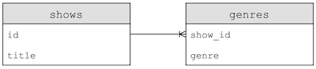
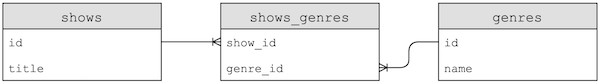
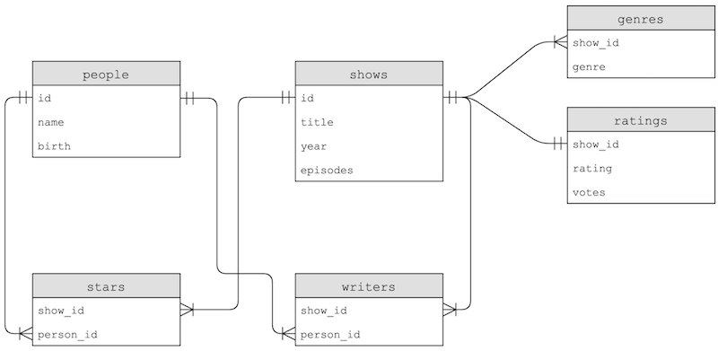

## Processamento de dados

- Na semana passada, coletamos uma pesquisa sobre as preferências de [`casas`](https://en.wikipedia.org/wiki/Hogwarts#Houses) de [`Hogwarts`](https://en.wikipedia.org/wiki/Hogwarts#Houses) e registramos os dados de um arquivo CSV com Python.
- Nesta semana, coletaremos mais alguns dados sobre seus programas de TV favoritos e seus gêneros.
- Com centenas de respostas, podemos começar a olhar as respostas no Planilhas Google, um aplicativo de planilha baseado na web, mostrando nossos dados em linhas e colunas:

<h1 align="center">

</h1>

- Algumas respostas mostram um único gênero selecionado, como “Comédia”, enquanto outras, com vários gêneros, os mostram em uma célula ainda mas separados por uma vírgula, como “Crime, Drama”.
- Com um aplicativo de planilhas como o Google Sheets, Apple's Numbers, Microsoft Excel ou outros, podemos:
- classificar nossos dados
- armazene dados em linhas e colunas, onde cada entrada adicional é uma linha e as propriedades de cada entrada, como título ou gênero, é uma coluna
- decidir sobre o **esquema** , ou formato, de nossos dados com antecedência, escolhendo as colunas
- Um **banco de dados** é um arquivo ou programa que armazena dados para nós.
- Um arquivo CSV é um **banco de dados de arquivo simples** em que os dados de cada coluna são separados por vírgulas e cada linha está em uma nova linha, salva simplesmente como um arquivo.
- Se alguns dados em um CSV contiverem uma vírgula, geralmente estarão entre aspas como uma string para evitar confusão.
- Fórmulas e cálculos em programas de planilhas são integrados aos próprios programas; um arquivo CSV só pode armazenar valores brutos e estáticos.
- Vamos baixar um arquivo CSV com os dados da planilha com “Arquivo> Baixar”, carregá-lo em nosso IDE arrastando e soltando-o em nossa árvore de arquivos e ver se é realmente um arquivo de texto com valores separados por vírgula correspondendo ao dados da planilha.


## Limpeza


- Começaremos escrevendo `favorites.py`, escolhendo Python em vez de C como nossa ferramenta de escolha para suas bibliotecas e abstração:

```py
import csv

with open("Favorite TV Shows - Form Responses 1.csv", "r") as file:
    reader = csv.reader(file)
    next(reader)
    for row in reader:
        print(row[1])
```

- Vamos abrir o arquivo e ter certeza de que podemos imprimir o título de cada linha, usando a `with` palavra - chave em Python que fechará nosso arquivo para nós após sairmos de seu escopo, com base no recuo.
- `open` usa o modo de leitura por padrão, mas para ser claro em nosso código, adicionaremos `r` explicitamente.
- A `csv` biblioteca tem uma `reader` função que criará uma `reader` variável que podemos usar.
- Vamos chamar `next` para pular a primeira linha, já que é a linha do cabeçalho, e então usar um loop para imprimir a segunda coluna em cada linha, que é o título.
- Para melhorar isso, usaremos um `DictReader` leitor de dicionário, que cria um dicionário a partir de cada linha, permitindo-nos acessar cada coluna por seu nome. Também não precisamos pular a linha do cabeçalho neste caso, pois o `DictReader` usará automaticamente.

```py
import csv

with open("Favorite TV Shows - Form Responses 1.csv", "r") as file:
    reader = csv.DictReader(file)

    for row in reader:
        print(row["title"])
```

- Como a primeira linha em nosso CSV tem os nomes das colunas, ela também pode ser usada para rotular cada coluna em nossos dados.
- Agora, vamos dar uma olhada em todos os títulos exclusivos em nossas respostas:

```py
import csv

titles = set()

with open("Favorite TV Shows - Form Responses 1.csv", "r") as file:
    reader = csv.DictReader(file)

    for row in reader:
        titles.add(row["title"])

for title in titles:
    print(title)
```

- Vamos criar um conjunto chamado `title` se adicionar o valor do título de cada linha a ele. Chamar a`dd` um conjunto verificará automaticamente se há duplicatas e garantirá que haja apenas valores exclusivos.
- Em seguida, podemos iterar sobre os elementos do conjunto com um `for` loop, imprimindo cada um deles.
- Para classificar os títulos, podemos apenas alterar nosso loop para `for title in sorted(titles)`, que classificará nosso conjunto antes de iterarmos sobre ele.
- Veremos que nossos títulos são considerados diferentes se a capitalização ou a pontuação forem diferentes, portanto, limparemos a capitalização adicionando o título todo em maiúsculas com `titles.add(row["title"].upper())`.
- Também teremos que remover os espaços antes ou depois, para que possamos adicionar o `titles.add(row["title"].strip().upper())` que retira os espaços em branco do título e depois os converte em maiúsculas.
- Agora, **canonizamos** ou padronizamos nossos dados e nossa lista de títulos está muito mais limpa.

## Contando

- Podemos usar um dicionário, em vez de um conjunto, para contar o número de vezes que vimos cada título, com as chaves sendo os títulos e os valores sendo um número inteiro contando o número de vezes que vemos cada um deles:

```py
import csv

titles = {}

with open("Favorite TV Shows - Form Responses 1.csv", "r") as file:
    reader = csv.DictReader(file)

    for row in reader:
        title = row["title"].strip().upper()
        if title not in titles:
            titles[title] = 0
        titles[title] += 1

for title in sorted(titles):
    print(title, titles[title])
```

- Aqui, primeiro verificamos se não vimos o título antes `(se for not in titles)`. Definimos o valor inicial como 0 se for esse o caso e, então, podemos incrementar com segurança o valor em 1 todas as vezes.
- Finalmente, podemos imprimir as chaves e os valores do nosso dicionário passando-os como argumentos para `print`, o que os separará por um espaço para nós.
- Podemos classificar pelos valores no dicionário mudando nosso loop para:

```py
...
def f(title):
    return titles[title]

for title in sorted(titles, key=f, reverse=True):
...
```

- Definimos uma função `f`,, que apenas retorna a contagem de um título no dicionário com `titles[title]`. A `sorted` função, por sua vez, usará essa função como chave para ordenar os elementos do dicionário. E também passaremos `reverse=True` para classificar do maior para o menor, em vez do menor para o maior.
- Agora veremos os programas mais populares impressos.
- Na verdade, podemos definir nossa função na mesma linha, com esta sintaxe:

```py
for title in sorted(titles, key=lambda title: titles[title], reverse=True):
```

- Passamos um `lambda`, ou função anônima, que não tem nome, mas recebe algum argumento ou argumentos e retorna um valor imediatamente.


## Procurando

- Podemos escrever um programa para pesquisar um título e relatar sua popularidade:

```py
import csv

title = input("Title: ").strip().upper()

with open("Favorite TV Shows - Form Responses 1.csv", "r") as file:
    reader = csv.DictReader(file)

    counter = 0
    for row in reader:
        if row["title"].strip().upper() == title:
            counter += 1

print(counter)
```

- Solicitamos a entrada do usuário e, em seguida, abrimos nosso arquivo CSV. Como estamos procurando apenas um título, podemos ter uma `counter` variável que incrementamos.
- Verificamos as correspondências depois de padronizar a entrada e os dados à medida que verificamos cada linha.
- O tempo de execução disso é O ( n ), uma vez que precisamos examinar cada linha.

## Bancos de dados relacionais

- **Bancos de dados relacionais** são programas que armazenam dados, basicamente em arquivos, mas com estruturas de dados adicionais que nos permitem pesquisar e armazenar dados com mais eficiência.
- Com outra linguagem de programação, **SQL** (pronuncia-se como “sequel”), Structured Query Language, podemos interagir com muitos bancos de dados relacionais e suas **tabelas** , como planilhas, que armazenam dados.
- Usaremos um programa de banco de dados comum chamado **SQLite**, um dos muitos programas disponíveis que oferecem suporte a SQL. Outros programas de banco de dados incluem Oracle Database, MySQL, PostgreSQL e Microsoft Access.
- O SQLite armazena nossos dados em um arquivo binário, com 0s e 1s que representam os dados de maneira eficiente. Vamos interagir com nossas tabelas de dados por meio de um programa de linha de comando sqlite3,.
Vamos executar alguns comandos no IDE CS50 para importar nosso arquivo CSV para uma tabela chamada “shows”:

```py
~/ $ sqlite3
SQLite version 3.22.0 2018-01-22 18:45:57
Enter ".help" for usage hints.
sqlite> .mode csv
sqlite> .import 'Favorite TV Shows (Responses) - Form Responses 1.csv' shows
```

- Com base nas linhas do arquivo CSV, o SQLite criará uma tabela em nosso banco de dados com os dados e colunas.
Vamos definir o SQLite para o modo CSV e usar o `.import` comando para criar uma tabela a partir do nosso arquivo.
- Acontece que, ao trabalhar com dados, geralmente precisamos de quatro tipos de operações suportadas por bancos de dados relacionais:
- `CREATE`
- `READ`
- `UPDATE`
- `DELETE`

## SQL

- No SQL, os comandos para realizar cada uma dessas operações são:

- `CREATE`, `INSERT`

- Por exemplo, para criar uma nova tabela, podemos usar: `CREATE TABLE table (column type, ...);` onde `table` é o nome de nossa nova tabela, e `column` é o nome de uma coluna, seguido de seu tipo.
 
- `SELECT`
-- `SELECT column FROM table;`
- `UPDATE`
- `DELETE`
- Podemos verificar o esquema de nossa nova tabela com `.schema`:

```py
sqlite> .schema
CREATE TABLE shows(
  "Timestamp" TEXT,
  "title" TEXT,
  "genres" TEXT
);
```

- Vemos que `.import` usou o `CREATE TABLE ...` comando listado para criar uma tabela chamada `shows`, com os nomes das colunas copiados automaticamente da linha do cabeçalho do CSV e os tipos assumidos como texto.
- Podemos selecionar uma coluna com:

```py
sqlite> SELECT title FROM shows;
title
...
"Madam Secretary"
"Game of Thrones"
"Still Game"
```

- Observe que capitalizamos as palavras-chave SQL por convenção e veremos os títulos de nossas linhas impressos na ordem do CSV.
- Também podemos selecionar várias colunas com `SELECT Timestamp, title FROM shows;`( `Timestamp` estava em maiúscula no CSV) ou todas as colunas com `SELECT * FROM shows;`.
- O SQL oferece suporte a muitas funções que podemos usar para contar e resumir dados:
- `AVG`
- `COUNT`
- `DISTINCT, para obter valores distintos sem duplicatas`
- `LOWER`
- `MAX`
- `MIN`
- `UPPER`
- `…`

- Podemos limpar nossos títulos como antes, convertendo-os em maiúsculas e imprimindo apenas os valores exclusivos:

```py
sqlite> SELECT DISTINCT(UPPER(title)) FROM shows;
title
...
"GREY'S ANATOMY"
"SCOOBY DOO"
"MADAM SECRETARY"
```

- Também podemos adicionar mais `cláusulas` ou frases que modificam nossa consulta:
- `WHERE`, resultados correspondentes em uma condição estrita
- `LIKE`, resultados correspondentes em uma condição menos estrita
- `ORDER BY`, ordenar os resultados de alguma forma
- `LIMIT`, limitando o número de resultados
- `GROUP BY`, agrupando resultados de alguma forma
- `…`
- Vamos filtrar as linhas por títulos:

```py
sqlite> SELECT title FROM shows WHERE title = "The Office";
title
...
"The Office"
"The Office"
"The Office"
```

- Mas existem outras entradas que gostaríamos de capturar, então podemos usar:

```py
sqlite> SELECT title FROM shows WHERE title LIKE "%Office%";
title
...
office
"The Office"
"the office "
"The Office"
```

- `O %` personagem é um espaço reservado para zero ou mais outros caracteres.
- Podemos solicitar nossos títulos:

```py
sqlite> SELECT DISTINCT(UPPER(title)) FROM shows ORDER BY UPPER(title);
...
X-FILES
"ZETA GUNDAM"
"ZONDAG MET LUBACH"
```

- Podemos até agrupar os mesmos títulos e contar quantas vezes eles aparecem:

```py
sqlite> SELECT UPPER(title), COUNT(title) FROM shows GROUP BY UPPER(title);
...
"THE OFFICE",23
...
"TOP GEAR",1
...
"TWIN PEAKS",4
...
```

- Podemos pedir pela contagem:

```py
sqlite> SELECT UPPER(title), COUNT(title) FROM shows GROUP BY UPPER(title) ORDER BY COUNT(title);
...
"THE OFFICE",23
FRIENDS,26
"GAME OF THRONES",33
```

- E se somarmos `DESC` ao final, poderemos ver os resultados em ordem decrescente.
- Com `LIMIT 10` adicionado também, vemos as 10 linhas principais:

```py
sqlite> SELECT UPPER(title), COUNT(title) FROM shows GROUP BY UPPER(title) ORDER BY COUNT(title) DESC LIMIT 10;
UPPER(title),COUNT(title)
"GAME OF THRONES",33
FRIENDS,26
"THE OFFICE",23
...
```

- Por fim, também cortaremos os espaços em branco de cada título, aninhando essa função:

```py
sqlite> SELECT UPPER(TRIM(title)), COUNT(title) FROM shows GROUP BY UPPER(TRIM(title)) ORDER BY COUNT(title) DESC LIMIT 10;
UPPER(title),COUNT(title)
"GAME OF THRONES",33
FRIENDS,26
"THE OFFICE",23
...
```

- Antes de terminar, queremos salvar nossos dados em um arquivo com .save shows.db, que veremos em nosso IDE depois de executar esse comando.
- Observe que nosso programa para encontrar os programas mais populares de antes, que ocupava dezenas de linhas de código em - Python, agora requer apenas uma (longa) linha de SQL.
- Usamos a interface de linha de comando do SQLite, mas também existem programas gráficos que suportam o trabalho com consultas SQL e a visualização dos resultados de forma mais visual.

## Mesas

- Nossa genrescoluna tem vários gêneros no mesmo campo, então usaremos LIKEpara obter todos os títulos que contenham algum gênero:

```py
sqlite> SELECT title FROM shows WHERE genres LIKE "%Comedy%";
...
```

- Mas os gêneros ainda são armazenados como uma lista separada por vírgulas, o que não é tão claro. Por exemplo, se nossos gêneros incluíssem “Música” e “Musical”, seria difícil selecionar títulos apenas com o gênero “Música”.
- Podemos inserir dados em uma tabela manualmente com `INSERT INTO table (column, ...) VALUES(value, ...);`.
- Por exemplo, podemos dizer:

```py
sqlite> INSERT INTO shows (Timestamp, title, genres) VALUES("now", "The Muppet Show", "Comedy, Musical");
```

- Podemos atualizar uma linha com `UPDATE table SET column = value WHERE condition;` , como:

```py
`sqlite> UPDATE shows SET genres = "Comedy, Drama, Musical" WHERE title = "The Muppet Show";`
```

- Podemos até remover todas as linhas que correspondem a `DELETE FROM table WHERE condition;` :

```py
sqlite> DELETE FROM shows WHERE title LIKE "Friends";
```

- Agora vamos escrever nosso próprio programa Python que usará SQL para importar nossos dados CSV para tabelas com o seguinte design:

<h1 align="center">

</h1>

- Este design começará a **normalizar** nossos dados, ou reduzir a redundância e garantir uma única fonte de verdade.
- Aqui, por exemplo, temos uma mesa chamada `shows`, com cada programa tendo um `id` e `title`, e outra mesa `genre`, que usa os programas de cada um `id` para associar um gênero a um programa. Observe que o programa `title` não precisa ser armazenado várias vezes.
- Agora também podemos adicionar várias linhas na genretabela, para associar um show a mais de um gênero.
- Acontece que o SQL também tem seus próprios tipos de dados para otimizar a quantidade de espaço usado para armazenar dados, que precisaremos especificar ao criar uma tabela manualmente:
- `BLOB`, para "objeto binário grande", dados binários brutos que podem representar arquivos
- `INTEGER`
- `NUMERIC`, como um número, mas não exatamente um número, como uma data ou hora
- `REAL`, para valores de ponto flutuante
- `TEXT`, como cordas
- As colunas também podem ter atributos adicionais:
- `NOT NULL`, que especifica que deve haver algum valor
- `UNIQUE`, o que significa que o valor dessa coluna deve ser único para cada linha da tabela
- `PRIMARY KEY`, como a `i`dcoluna acima, que será usada para identificar exclusivamente cada linha
- `FOREIGN KEY`, como a `show_id` coluna acima que se refere a uma coluna em alguma outra tabela
- Usaremos o recurso SQL da biblioteca CS50 para fazer consultas facilmente e também existem outras bibliotecas para Python:

```py
import csv

from cs50 import SQL

open("shows.db", "w").close()
db = SQL("sqlite:///shows.db")

db.execute("CREATE TABLE shows (id INTEGER, title TEXT, PRIMARY KEY(id))")
db.execute("CREATE TABLE genres (show_id INTEGER, genre TEXT, FOREIGN KEY(show_id) REFERENCES shows(id))")

with open("Favorite TV Shows - Form Responses 1.csv", "r") as file:
    reader = csv.DictReader(file)
    for row in reader:
        title = row["title"].strip().upper()

        id = db.execute("INSERT INTO shows (title) VALUES(?)", title)

        for genre in row["genres"].split(", "):
            db.execute("INSERT INTO genres (show_id, genre) VALUES(?, ?)", id, genre)
```

- Primeiro, vamos abrir um `shows.db` arquivo e fechá-lo, para ter certeza de que o arquivo foi criado.
- Em seguida, criaremos uma `db` variável para armazenar nosso banco de dados criado SQL, que leva o arquivo de banco de dados que acabamos de criar.
- A seguir, executaremos comandos SQL escrevendo-os como uma string e chamando `db.execute` com eles. Aqui, criaremos duas tabelas conforme projetamos acima, indicando os nomes, tipos e propriedades de cada coluna que queremos em cada tabela.
- Agora, podemos ler nosso arquivo CSV original linha por linha, obtendo o título e usando `db.execute` para executar um `INSERT` comando para cada linha. Acontece que podemos usar o `?` espaço reservado em um comando SQL e passar uma variável a ser substituída. Em seguida, obteremos de volta um idque é criado automaticamente para nós para cada linha, já que o declaramos como uma chave primária.
- Por fim, dividiremos a string de gênero em cada linha pela vírgula e inseriremos cada uma delas na `genres` tabela, usando idpara o show como `show_id`.
- Depois de executar este programa, podemos ver os IDs e títulos de cada programa, bem como os gêneros onde a primeira coluna é o ID de um programa:

```py
sqlite> SELECT * FROM shows;
...
511 | MADAM SECRETARY
512 | GAME OF THRONES
513 | STILL GAME
sqlite> SELECT * FROM genres;
...
511 | Drama
512 | Action
512 | Adventure
512 | History
512 | Thriller
512 | War
513 | Comedy
```

- Observe que o programa com id 512, “GAME OF THRONES”, agora tem cinco gêneros associados a ele.
- Para encontrar todos os musicais, por exemplo, podemos executar:

```py
sqlite> SELECT show_id FROM genres WHERE genre = "Musical";
...
422
435
468
```

- E podemos aninhar essa consulta para obter títulos da lista de IDs de programa:

```py
sqlite> SELECT title FROM shows WHERE id IN (SELECT show_id FROM genres WHERE genre = "Musical");
title
BREAKING BAD
...
THE LAWYER
MY BROTHER, MY BROTHER, AND ME
```

- Nossa primeira consulta, entre parênteses, será executada primeiro e, em seguida, usada na consulta externa.
- Podemos encontrar todas as linhas `shows` com o título de “THE OFFICE” e encontrar todos os gêneros associados:

```py
sqlite> SELECT DISTINCT(genre) FROM genres WHERE show_id IN (SELECT id FROM shows WHERE title = "THE OFFICE") ORDER BY genre;
genre
...
Comedy
Documentary
...
```

- Poderíamos melhorar ainda mais o design de nossas mesas, com uma terceira mesa:

<h1 align="center">

</h1>

- Agora, o nome de cada gênero só será armazenado uma vez, com uma nova tabela, uma **tabela de junção**, chamada `shows_genres` que contém chaves estrangeiras que vinculam os gêneros. Essa é uma relação de **muitos para muitos**, em que um programa pode ter vários gêneros e um gênero pode pertencer a muitos programas.
- Se precisássemos mudar o nome de um gênero, teríamos apenas que mudar uma linha agora, em vez de muitas.
- Acontece que também existem subtipos para uma coluna, que podemos ser ainda mais específicos com:

- `INTEGER`
-- `smallint`, com menos bits
-- `integer`
-- `bigint`, com mais bits
- `NUMERIC`
-- `boolean`
-- `date`
-- `datetime`
-- `numeric(scale,precision)`, com um número fixo de dígitos
-- `time`
-- `timestamp`
- `REAL`
-- `real`
-- `double precision`, com o dobro de bits
- `TEXT`
-- `char(n)`, um número fixo de caracteres
-- `varchar(n)`, um número variável de caracteres, até certo limite `n`
-- `text`, uma corda sem limite

## IMDb

- IMDb, ou Internet Movie Database, tem conjuntos de dados disponíveis para download como arquivos TSV (valores separados por tabulação).
- Depois de importar um desses conjuntos de dados, veremos tabelas com o seguinte esquema:

<h1 align="center">

</h1>

- A `genres` tabela tem alguma duplicação, uma vez que a genrecoluna é repetida, mas a tabela starse writersjunta linhas na tabela peoplee com showsbase em seu relacionamento.
- Com `SELECT COUNT(*) FROM shows;` podemos ver que existem mais de 150.000 shows em nossa tabela, então, com uma grande quantidade de dados, podemos usar **índices**, o que diz ao nosso programa de banco de dados para criar estruturas de dados adicionais para que possamos pesquisar e classificar com tempo logarítmico:

```py
sqlite> CREATE INDEX title_index ON shows (title);
```

- Acontece que essas estruturas de dados são geralmente *árvores B**, como árvores binárias que vimos em C, com nós organizados de forma que possamos pesquisar mais rápido do que linearmente.
- A criação de um índice leva algum tempo, mas depois podemos executar consultas muito mais rapidamente.
- Com nossos dados espalhados entre diferentes tabelas, podemos usar **JOIN** comandos para combiná-los em nossas consultas:

```py
sqlite3> SELECT title FROM people
    ...> JOIN stars ON people.id = stars.person_id
    ...> JOIN shows ON stars.show_id = shows.id
    ...> WHERE name = "Steve Carell";
...
The Morning Show
LA Times: the Envelope
```

- Com a `JOIN` sintaxe, podemos combinar tabelas virtualmente com base em suas chaves estrangeiras e usar suas colunas como se fossem uma única tabela.
- Depois de criar mais alguns índices, nosso `JOIN` comando também é executado com muito mais rapidez.

## Problemas

- Um problema em SQL é chamado de **ataque de injeção de SQL**, em que alguém pode injetar ou colocar seus próprios comandos em entradas que executamos em nosso banco de dados.
Nossa consulta para fazer o login de um usuário pode ser `rows = db.execute("SELECT * FROM users WHERE username = ? AND password = ?", username, password)`. Ao usar os `?` espaços reservados, nossa biblioteca SQL escapará da entrada ou evitará que caracteres perigosos sejam interpretados como parte do comando.
- Em contraste, podemos ter uma consulta SQL que é uma string formatada, como:

```py
f"SELECT * FROM users WHERE username = '{username}' AND password = '{password}'"
```

- Se um usuário digitar `malan@harvard.edu'--`, a consulta acabará sendo:

```py
f"SELECT * FROM users WHERE username = 'malan@harvard.edu'--' AND password = '{password}'"
```

- Esta consulta irá realmente selecionar a linha onde `username = 'malan@harvard.edu'`, sem verificar a senha, já que `--` transforma o resto da linha em um comentário no SQL.
- Outro problema com bancos de dados são **as condições de corrida**, em que o código em um ambiente multithread pode ser combinado, ou misturado, em cada thread.
- Um exemplo é um post popular que recebe muitos gostos. Um servidor pode tentar incrementar o número de curtidas, solicitando ao banco de dados o número atual de curtidas, adicionando um e atualizando o valor no banco de dados:

```py
rows = db.execute("SELECT likes FROM posts WHERE id = ?", id);
likes = rows[0]["likes"]
db.execute("UPDATE posts SET likes = ? WHERE id = ?", likes + 1, id);
```

- Mas para aplicativos com vários servidores, cada um deles pode tentar adicionar curtidas ao mesmo tempo. Dois servidores, respondendo a dois usuários diferentes, podem obter o mesmo número inicial de curtidas, já que a primeira linha do código é executada ao mesmo tempo em cada servidor. Em seguida, ambos definirão o mesmo novo número de curtidas, embora deva haver dois incrementos separados.
- Para resolver esse problema, o SQL oferece suporte a **transações**, nas quais podemos bloquear linhas em um banco de dados, de forma que um determinado conjunto de ações aconteça em conjunto, com sintaxe como:

- `BEGIN TRANSACTION`
- `COMMIT`
- `ROLLBACK`

- Por exemplo, podemos resolver nosso problema acima com:

```py
db.execute("BEGIN TRANSACTION")
rows = db.execute("SELECT likes FROM posts WHERE id = ?", id);
likes = rows[0]["likes"]
db.execute("UPDATE posts SET likes = ? WHERE id = ?", likes + 1, id);
db.execute("COMMIT")
```

- O banco de dados garantirá que todas as consultas intermediárias sejam executadas juntas.
- Outro exemplo pode ser de dois colegas de quarto e uma geladeira compartilhada em seu dormitório. O primeiro colega de quarto chega em casa e vê que não há leite na geladeira. Assim, o primeiro colega de quarto sai na loja para comprar leite e, enquanto eles estão na loja, o segundo colega de quarto chega em casa, vê que não há leite e sai para outra loja para pegar leite também. Mais tarde, haverá duas jarras de leite na geladeira.
- Podemos resolver esse problema trancando a geladeira para que nosso colega de quarto não verifique se há leite antes de voltarmos.