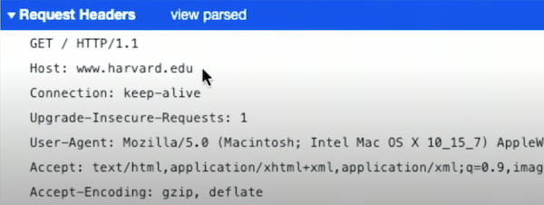
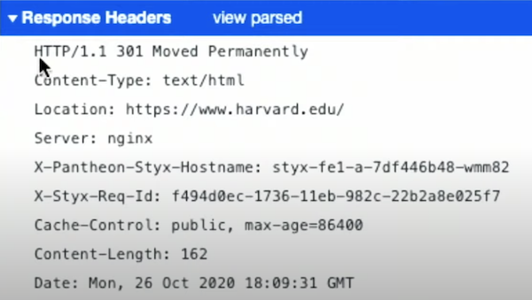
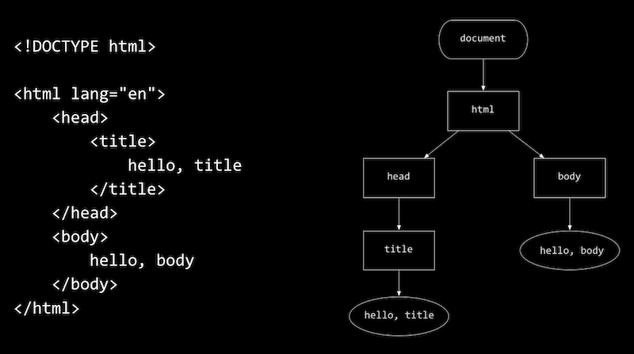
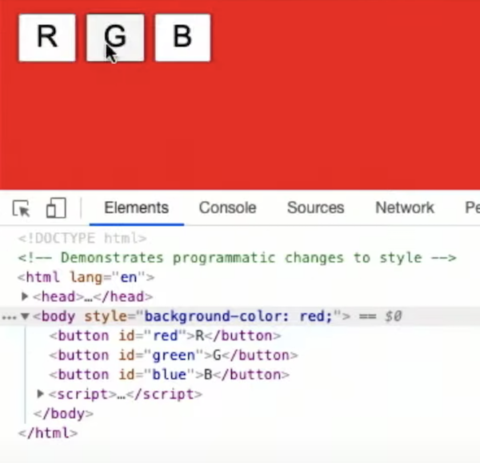

## A Internet

- Hoje vamos dar uma olhada na programação web, usando um conjunto de novas linguagens e tecnologias para criar aplicativos gráficos e visuais para a internet.
- A **internet** é a rede de redes de computadores que se comunicam entre si, fornecendo a infraestrutura para enviar zeros e uns. No topo dessa base, podemos construir aplicativos que enviam e recebem dados.
- **Roteadores** são computadores especializados, com CPUs e memória, cujo objetivo é retransmitir dados por cabos ou tecnologias sem fio, entre outros dispositivos na internet.
- Os **protocolos** são um conjunto de convenções padrão, como um handshake físico, com o qual o mundo concordou para que os computadores se comuniquem. Por exemplo, existem certos padrões de zeros e uns, ou mensagens, que um computador deve usar para informar a um roteador para onde deseja enviar os dados.
- **TCP / IP** são dois protocolos para enviar dados entre dois computadores. No mundo real, podemos escrever um endereço em um envelope para enviar uma carta a alguém, junto com nosso próprio endereço para receber uma carta. A versão digital de um envelope, ou mensagem com endereços de e para, é chamada de **pacote**.
**IP** significa protocolo de internet, um protocolo suportado por softwares de computadores modernos, que inclui uma forma padrão para os computadores se endereçarem. Os **endereços IP** são **endereços** exclusivos para computadores conectados à Internet, de forma que um pacote enviado de um computador para outro será passado pelos roteadores até chegar ao seu destino.
- Os roteadores têm, em sua memória, uma tabela que mapeia os endereços IP para os cabos, cada um conectado a outros roteadores, para que saibam para onde encaminhar os pacotes. Acontece que existem protocolos para os roteadores se comunicarem e descobrirem esses caminhos também.
**DNS** , sistema de nome de domínio, é outra tecnologia que traduz nomes de domínio como cs50.harvard.edu em endereços IP. O DNS geralmente é fornecido como um serviço pelo provedor de serviços de Internet mais próximo, ou ISP.
- Finalmente, o **TCP**, protocolo de controle de transmissão, é um protocolo final que permite que um único servidor, no mesmo endereço IP, forneça vários serviços por meio do uso de um **número de porta**, um pequeno número inteiro adicionado ao endereço IP. Por exemplo, HTTP, HTTPS, e-mail e até mesmo Zoom têm seus próprios números de porta para esses programas usarem para se comunicar na rede.
- O TCP também fornece um mecanismo para reenviar pacotes se um pacote for perdido e não recebido. Acontece que, na internet, existem vários caminhos para um pacote a ser enviado, uma vez que muitos roteadores estão interconectados. Portanto, um navegador da web, fazendo uma solicitação para um gato, pode ver seu pacote enviado por um caminho de roteadores, e o servidor de resposta pode ver seus pacotes de resposta enviados por outro.
- Uma grande quantidade de dados, como uma imagem, será dividida em blocos menores para que os pacotes tenham todos tamanhos semelhantes. Dessa forma, os roteadores ao longo da Internet podem enviar os pacotes de todos de forma mais justa e fácil. **Neutralidade da rede** refere-se à ideia de que esses roteadores públicos tratam os pacotes igualmente, em oposição a permitir que pacotes de certas empresas ou de certos tipos sejam priorizados.
- Quando houver vários pacotes para uma única resposta, o TCP também especificará que cada um deles seja rotulado, como “1 de 2” ou “2 de 2”, para que possam ser combinados ou reenviados conforme necessário.
- Com todas essas tecnologias e protocolos, somos capazes de enviar dados de um computador para outro e podemos abstrair a Internet para construir aplicativos no topo.

## desenvolvimento web

- A web é um aplicativo executado sobre a Internet, o que nos permite obter páginas da web. Outros aplicativos, como o Zoom, fornecem videoconferência, e o e-mail também é outro aplicativo.
- **HTTP**, ou protocolo de transferência de hipertexto, rege como os navegadores da web e os servidores da web se comunicam nos pacotes TCP / IP.
- Dois comandos suportados por HTTP incluem **GET** e **POST** . GET permite que um navegador solicite uma página ou arquivo, e POST permite que um navegador envie dados para o servidor.
- Pode ser semelhante a um **URL** ou endereço da web `https://www.example.com/`.
- `https` é o protocolo que está sendo usado e, neste caso, HTTPS é a versão segura do HTTP, garantindo que o conteúdo dos pacotes entre o navegador e o servidor sejam criptografados.
- `example.com` é o nome de domínio, onde `.com` é o domínio de nível superior, convencionalmente indicando o “tipo” de site, como um site comercial para `.com`, ou uma organização para `.org`. Agora, existem centenas de domínios de nível superior, e suas restrições variam quanto a quem pode usá-los, mas muitos deles permitem que qualquer pessoa se registre para um domínio.
- `www` é o nome do host que, por convenção, nos indica que se trata de um serviço “world wide web”. Não é obrigatório, então hoje muitos sites não estão configurados para incluí-lo.
- Finalmente, o `/` no final é uma solicitação para o arquivo padrão, como o index.htmlqual o servidor web irá responder.
- Uma solicitação HTTP começará com:

```
GET / HTTP/1.1
Host: www.example.com
...
```

- O `GET` indica que a solicitação é para algum arquivo e `/` indica o arquivo padrão. Uma solicitação pode ser mais específica e começar com GET `/index.html`.
- Existem diferentes versões do protocolo HTTP, portanto, `HTTP/1.1` indica que o navegador está usando a versão 1.1.
`Host: www.example.com` indica que a solicitação é para www.example.com, uma vez que o mesmo servidor da web pode hospedar vários sites e domínios.
- Uma resposta começará com:

```
HTTP/1.1 200 OK
Content-Type: text/html
...
```

- O servidor web responderá com a versão do HTTP, seguido por um código de status, que está `200 OK` aqui, indicando que a solicitação era válida.
- Em seguida, o servidor da web indica o tipo de conteúdo em sua resposta, que pode ser texto, imagem ou outro formato.
- Finalmente, o resto do pacote ou pacotes incluirão o conteúdo.
- Podemos ver um redirecionamento em um navegador digitando uma URL, como `http://www.harvard.edu`, e olhando para a barra de endereço após o carregamento da página, que será exibida `https://www.harvard.edu`. Os navegadores incluem ferramentas de desenvolvedor, que nos permitem ver o que está acontecendo. No menu do Chrome, por exemplo, podemos ir para Exibir> Desenvolvedor> Ferramentas do desenvolvedor, que abrirá um painel na tela. Na guia Rede, podemos ver que houve muitos pedidos de texto, imagens e outros dados que foram baixados separadamente para as páginas da web individuais.
- A primeira solicitação, na verdade, retornou um código de status de `301 Moved Permanently`, redirecionando nosso navegador de `http://...` para `https://...`:

<h1 align="center">

</h1>

<h1 align="center">

</h1>

- Observe que a resposta inclui um Location:cabeçalho para o navegador para o qual nos redirecionar.
- Outros códigos de status HTTP incluem:
- `200 OK`
- `301 Moved Permanently`
- `304 Not Modified`
- Isso permite que o navegador use seu cache, ou cópia local, de algum recurso como uma imagem, em vez de fazer com que o servidor o envie de volta.
- `307 Temporary Redirect`
- `401 Unauthorized`
- `403 Forbidden`
- `404 Not Found`
- `418 I'm a Teapot`
- `500 Internal Server Error`
- O código com erros em um servidor pode resultar neste código de status.
-`503 Service Unavailable`
- …

- Podemos usar uma ferramenta de linha de comando,, curlpara conectar a um URL. Podemos executar:

```c
curl -I http://safetyschool.org
HTTP/1.1 301 Moved Permanently
Server: Sun-ONE-Web-Server/6.1
Date: Wed, 26 Oct 2020 18:17:05 GMT
Content-length: 122
Content-type: text/html
Location: http://www.yale.edu
Connection: close
```

- Acontece que `safetyschool.org` redireciona para `yale.edu`!
E `harvardsucks.org` é um site com mais uma pegadinha em Harvard!
Por fim, uma solicitação HTTP pode incluir entradas para servidores, como a string `q=cats` após `?`:

```c
GET /search?q=cats HTTP/1.1
Host: www.google.com
...
```

- Isso usa um formato padrão para passar entrada, como argumentos de linha de comando, para servidores da web.

## HTML

- Agora que podemos usar a Internet e o HTTP para enviar e receber mensagens, é hora de ver o que há no conteúdo das páginas da web. HTML , Hypertext Markup Language, não é uma linguagem de programação, mas sim usada para formatar páginas da web e dizer ao navegador como exibir as páginas, usando tags e atributos.
Uma página simples em HTML pode ter a seguinte aparência:

```html
<!DOCTYPE html>

<html lang="en">
    <head>
        <title>
            hello, title
        </title>
    </head>
    <body>
        hello, body
    </body>
</html>
```

- A primeira linha é uma declaração de que a página segue o padrão HTML.
A seguir está uma **tag** , uma palavra entre colchetes como <html>e </html>. A primeira é uma tag de início ou de abertura e a segunda é uma tag de fechamento. Nesse caso, as tags indicam o início e o fim da página HTML. A tag de início aqui também tem um **atributo**, `lang="en"` que especifica que o idioma da página será em inglês, para ajudar o navegador a traduzir a página, se necessário.
- Dentro da `<html>tag` há mais duas tags, `<head>` e `<body>`, que são como nós filhos em uma árvore. E dentro <head>está a `<title>`tag, cujo conteúdo vemos em uma guia ou título de janela em um navegador. Dentro <body>está o conteúdo da própria página, que também veremos na visualização principal de um navegador.
- A página acima será carregada no navegador como uma estrutura de dados, como esta árvore:


<h1 align="center">

</h1>

- Observe que há uma hierarquia mapeando cada tag e seus filhos. Nós retangulares são marcas, enquanto os ovais são texto.
- Podemos salvar o código acima como um HTML em nossos computadores locais, o que funcionaria em um navegador, mas apenas para nós. Com o IDE CS50, podemos criar um arquivo HTML e realmente disponibilizá-lo na Internet.
- Vamos criar `hello.html`com o código acima, e iniciar um servidor web instalado no CS50 IDE com http-server, um programa que irá ouvir HTTP solicitações e responder com páginas ou outro conteúdo.
- O próprio CS50 IDE já está sendo executado em algum servidor web, usando as portas 80 e 443, portanto, nosso próprio servidor web dentro do IDE terá que usar uma porta diferente, `8080` por padrão. Veremos um URL longo terminando em `cs50.wse`, se abrirmos esse URL, veremos uma lista de arquivos, inclusive `hello.html`.
- De volta ao terminal de nosso IDE, veremos novas linhas de texto impressas por nosso servidor web, um log de solicitações que ele está recebendo.
- Vamos dar uma olhada em `paragraphs.html`.
- Com a `<p>tag`, podemos indicar que cada seção do texto deve ser um parágrafo.
- Depois de salvar este arquivo, precisaremos atualizar o índice no navegador da web e, em seguida, abri-lo `paragraphs.html`.
- Podemos adicionar títulos com tags que começam com `h` e têm níveis de `1` até `6` em `headings.html`.
- Damos uma olhada em `list.html`, `table.html` e `image.html` também, para adicionar listas, tabelas e imagens.
- Podemos usar a `<ul>tag` para criar uma lista não ordenada, como marcadores, e `<ol>`para uma lista ordenada com números.
- As tabelas começam com uma `<table>tag` e têm `<tr>tags` como linhas e `<td>tags` para células individuais.
- Pois `image.html`, podemos fazer o upload de uma imagem para o IDE CS50, para incluí-la em nossa página, bem como usar o `alt` atributo para adicionar texto alternativo para acessibilidade.
- Procurando por documentação ou outros recursos online, podemos aprender as tags que existem em HTML e como usá-las.
- Podemos criar links `link.html` com a `<a>` tag ou âncora. O `href`atributo é para uma referência de hipertexto, ou simplesmente para onde o link deve nos levar, e dentro da tag está o texto que deve aparecer como o link.
- Poderíamos definir o hrefcomo `https://www.yale.edu`, mas deixar `Harvard` dentro da tag, o que pode enganar os usuários ou até mesmo induzi-los a visitar uma versão falsa de algum site. **Phishing** é um ato de enganar os usuários, uma forma de engenharia social que inclui links enganosos.
- Em `search.html`, podemos criar um formulário mais complexo que recebe a entrada do usuário e a envia para o mecanismo de pesquisa do Google:

```html
<!DOCTYPE html>

<html lang="en">
    <head>
        <title>search</title>
    </head>
    <body>
        <form action="https://www.google.com/search" method="get">
            <input name="q" type="search">
            <input type="submit" value="Search">
        </form>
    </body>
</html>
```

- Primeiro, temos uma  `<form>` tag que possui um `action` URL de pesquisa do Google, com um método de GET.
- Dentro do formulário, temos um `<input>`, com o nome `q`, e outro `<input>` com o tipo de `submit`. Quando a segunda entrada, um botão, é clicada, o formulário irá anexar o texto da primeira entrada ao URL da ação, terminando com `search?q=....`
- Assim, quando abrimos search.htmlem nosso navegador, podemos usar o formulário para pesquisar via Google.
- Um formulário também pode usar um método POST, que não inclui os dados do formulário no URL, mas em outro lugar na solicitação.

## CSS

- Podemos melhorar a estética de nossas páginas com `CSS` , Cascading Style Sheets, outra linguagem que informa ao nosso navegador como exibir tags em uma página. CSS usa **propriedades**, ou pares de valores-chave, como color: red;tags com seletores.
- Em HTML, temos algumas opções para incluir CSS. Podemos adicionar uma <style>tag dentro da <head>tag, com estilos diretamente dentro, ou podemos vincular a um `styles.css` arquivo com uma `<link>` tag dentro da `<head>`tag.
- Também podemos incluir CSS diretamente em cada tag:

```html
<!DOCTYPE html>

<html lang="en">
    <head>
        <title>css</title>
    </head>
    <body>
        <header style="font-size: large; text-align: center;">
            John Harvard
        </header>
        <main style="font-size: medium; text-align: center;">
            Welcome to my home page!
        </main>
        <footer style="font-size: small; text-align: center;">
            Copyright &#169; John Harvard
        </footer>
    </body>
</html>
```

- `<header>`, `<main>`E`<footer>` as tags são como `<p>` etiquetas, indicando as seções que o texto em nossa página estão em.
- Para cada tag, podemos adicionar um `style` atributo, com o valor sendo uma lista de propriedades de valores-chave CSS, separadas por ponto e vírgula. Aqui, estamos configurando `font-size` para cada tag e alinhando o texto no centro.
Observe que podemos usar `&#169;`, uma **entidade HTML** , como um código para incluir algum símbolo em nossa página da web.
- Podemos alinhar todo o texto de uma vez:

```html
<!DOCTYPE html>

<html lang="en">
    <head>
        <title>css</title>
    </head>
    <body style="text-align: center;">
        <header style="font-size: large;">
            John Harvard
        </header>
        <main style="font-size: medium;">
            Welcome to my home page!
        </main>
        <footer style="font-size: small;">
            Copyright &#169; John Harvard
        </footer>
    </body>
</html>
```

- Aqui, o estilo aplicado à `<body>` tag é aplicado em cascata, ou se aplica a seus filhos, de forma que todas as seções internas também terão texto centralizado.
- Para fatorar ou separar nosso CSS do HTML, podemos incluir estilos na `<head>` tag:

```html
<!DOCTYPE html>

<html lang="en">
    <head>
        <style>

            header
            {
                font-size: large;
                text-align: center;
            }

            main
            {
                font-size: medium;
                text-align: center;
            }

            footer
            {
                font-size: small;
                text-align: center;
            }

        </style>
        <title>css</title>
    </head>
    <body>
        <header>
            John Harvard
        </header>
        <main>
            Welcome to my home page!
        </main>
        <footer>
            Copyright &#169; John Harvard
        </footer>
    </body>
</html>
```

- Para cada tipo de tag, usamos um **seletor de tipo** CSS para **estilizá-lo**.
Também podemos usar um **seletor de classe** mais específico :

```html
<!DOCTYPE html>

<html lang="en">
    <head>
        <style>

            .centered
            {
                text-align: center;
            }

            .large
            {
                font-size: large;
            }

            .medium
            {
                font-size: medium;
            }

            .small
            {
                font-size: small;
            }

        </style>
        <title>css</title>
    </head>
    <body>
        <header class="centered large">
            John Harvard
        </header>
        <main class="centered medium">
            Welcome to my home page!
        </main>
        <footer class="centered small">
            Copyright &#169; John Harvard
        </footer>
    </body>
</html>
```

- Podemos definir a nossa própria classe CSS com um `.` seguido por uma palavra-chave que escolher, então aqui nós criamos `.large`, `.mediume` `.small`, cada um com alguma propriedade para o tamanho da fonte.
Então, em qualquer número de tags no HTML de nossa página, podemos adicionar uma ou mais dessas classes com class="centered large", reutilizando esses estilos.
- Podemos remover a redundância para `centered` e aplicá-la apenas à `<body>` tag também.
- Por fim, podemos pegar todo o CSS das propriedades e movê-los para outro arquivo com a `<link>` tag:

```
<!DOCTYPE html>

<html lang="en">
    <head>
        <link href="styles.css" rel="stylesheet">
        <title>css</title>
    </head>
    <body>
        <header class="centered large">
            John Harvard
        </header>
        <main class="centered medium">
            Welcome to my home page!
        </main>
        <footer class="centered small">
            Copyright &#169; John Harvard
        </footer>
    </body>
</html>
```

- Agora, uma pessoa pode trabalhar no HTML e outra pode trabalhar no CSS, de forma mais independente.
- Com CSS, também contaremos com referências e outros recursos para descobrir como usar as propriedades conforme precisamos delas.
- Podemos usar pseudoseletores , que selecionam certos estados:

```html
<!DOCTYPE html>

<html lang="en">
    <head>
        <style>

            #harvard
            {
                color: #ff0000;
            }

            #yale
            {
                color: #0000ff;
            }

            a
            {
                text-decoration: none;
            }

            a:hover
            {
                text-decoration: underline;
            }

        </style>
        <title>link</title>
    </head>
    <body>
        Visit <a href="https://www.harvard.edu/" id="harvard" >Harvard</a> or <a href="https://www.yale.edu/" id="yale" >Yale</a>.
    </body>
</html>
```

- Aqui, estamos usando a:hoverpara definir propriedades em <a>tags quando o usuário passa o mouse sobre elas.
- Também temos um idatributo em cada <a>tag, para definir cores diferentes em cada um com seletores de ID que começam com um #em CSS.

## JavaScript

- Para escrever um código que pode ser executado nos navegadores dos usuários ou no cliente, usaremos uma nova linguagem, JavaScript .
- A sintaxe do JavaScript é semelhante à do C e do Python para construções básicas:


```js
let counter = 0;
```

```js
counter = counter + 1;
counter += 1;
counter++;
```

```js
if (x < y)
{

}
```

```js
if (x < y)
{

}
else
{

}
```

```js
if (x < y)
{

}
else if (x > y)
{

}
else
{

}
```

```js
while (true)
{

}
```

```js
for (let i = 0; i < 3; i++)
{

}
```

- Observe que o JavaScript também é digitado livremente, `let` sendo a palavra-chave para declarar variáveis de qualquer tipo.
- Com JavaScript, podemos alterar o HTML no navegador em tempo real. Podemos usar `<script>` tags para incluir nosso código diretamente ou de um `.js` arquivo.
- Vamos criar outro formulário:

```js
<!DOCTYPE html>

<html lang="en">
    <head>
        <script>

            function greet()
            {
                alert('hello, body');
            }

        </script>
        <title>hello</title>
    </head>
    <body>
        <form onsubmit="greet(); return false;">
            <input id="name" type="text">
            <input type="submit">
        </form>
    </body>
</html>
```

- Aqui, não adicionaremos um actionao nosso formulário, pois ele permanecerá na mesma página. Em vez disso, teremos um onsubmitatributo que chamará uma função que definimos em JavaScript e usará return false;para evitar que o formulário seja realmente enviado em qualquer lugar.
Agora, se carregarmos essa página, veremos hello, bodysendo mostrado quando enviarmos o formulário.
Como nossa tag de entrada, ou **elemento**, tem um ID de name, podemos usá-lo em nosso script:

```js
<script>

    function greet()
    {
        let name = document.querySelector('#name').value;
        alert('hello, ' + name);
    }

</script>
```

- `document`é uma variável global que vem com o JavaScript no navegador e querySelectoré outra função que podemos usar para selecionar um nó no **DOM** , no **Modelo de Objeto do Documento** ou na **estrutura em árvore da página HTML**. Depois de selecionar o elemento com o ID name, obtemos valuea entrada interna e a adicionamos ao nosso alerta.
- Observe que JavaScript usa aspas simples para strings por convenção, embora aspas duplas também possam ser usadas, desde que correspondam a cada string.
- Podemos adicionar mais atributos ao nosso formulário, para alterar o texto do marcador, alterar o texto do botão, desativar o preenchimento automático ou focar a entrada automaticamente:


```js
<form>
    <input autocomplete="off" autofocus id="name" placeholder="Name" type="text">
    <input type="submit">
</form>
```

- Também podemos ouvir **eventos** em JavaScript, que ocorrem quando algo acontece na página. Por exemplo, podemos ouvir o `submit` evento em nosso formulário e chamar a greetfunção:

```js
<script>

    function greet()
    {
        let name = document.querySelector('#name').value;
        alert('hello, ' + name);
    }

    function listen() {
        document.querySelector('form').addEventListener('submit', greet);
    }

    document.addEventListener('DOMContentLoaded', listen);

</script>
```

- Aqui, `listen` passamos a função `greet` pelo nome, e não a chamamos ainda. O ouvinte de evento irá chamá-lo para nós quando o evento acontecer.
- Precisamos primeiro ouvir o DOMContentLoadedevento, uma vez que o navegador lê nosso arquivo HTML de cima para baixo e formnão existiria até que ele lesse todo o arquivo e carregasse o conteúdo. Então, ouvindo este evento e chamando nossa `listen` função, sabemos `form` que existirá.
- Também podemos usar **funções anônimas** em JavaScript:

```js
<script>

    document.addEventListener('DOMContentLoaded', function() {
        document.querySelector('form').addEventListener('submit', function() {
            let name = document.querySelector('#name').value;
            alert('hello, ' + name);
        });
    });

</script>
````

- Podemos passar uma função lambda com a `function()` sintaxe, então aqui passamos os dois ouvintes diretamente para `addEventListener`.
- Além disso `submit`, existem muitos outros eventos que podemos ouvir:

- `blur`
- `change`
- `click`
- `drag`
- `focus`
- `keyup`
- `load`
- `mousedown`
- `mouseover`
- `mouseup`
- `submit`
- `touchmove`
- `unload`
- `...`

- Por exemplo, podemos ouvir o `keyup` evento e alterar o DOM assim que soltarmos uma tecla:

```html
<!DOCTYPE html>

<html lang="en">
    <head>
        <script>

            document.addEventListener('DOMContentLoaded', function() {
                let input = document.querySelector('input');
                input.addEventListener('keyup', function(event) {
                    let name = document.querySelector('#name');
                    if (input.value) {
                        name.innerHTML = `hello, ${input.value}`;
                    }
                    else {
                        name.innerHTML = 'hello, whoever you are';
                    }
                });
            });

        </script>
        <title>hello</title>
    </head>
    <body>
        <form>
            <input autocomplete="off" autofocus placeholder="Name" type="text">
        </form>
        <p id="name"></p>
    </body>
</html>
```

- Observe que também podemos substituir strings em JavaScript, com o `${input.value}` interior de uma string cercado por crases,.
- Também podemos alterar o estilo de forma programática:

```js
<!DOCTYPE html>

<html lang="en">
    <head>
        <title>background</title>
    </head>
    <body>
        <button id="red">R</button>
        <button id="green">G</button>
        <button id="blue">B</button>
        <script>

            let body = document.querySelector('body');
            document.querySelector('#red').onclick = function() {
                body.style.backgroundColor = 'red';
            };
            document.querySelector('#green').onclick = function() {
                body.style.backgroundColor = 'green';
            };
            document.querySelector('#blue').onclick = function() {
                body.style.backgroundColor = 'blue';
            };

        </script>
    </body>
</html>
```

- Depois de selecionar um elemento, podemos usar a `style` propriedade para definir os valores das propriedades CSS também. Aqui, temos três botões, cada um dos quais com um `onclick` ouvinte que altera a cor de fundo do `<body>` elemento.
- Observe aqui que nossa `<script>` tag está no final de nosso arquivo HTML, então não precisamos ouvir o `DOMContentLoaded` evento, uma vez que o resto do DOM já terá sido lido pelo navegador.
- Também nas ferramentas de desenvolvedor de um navegador, podemos ver o DOM e todos os estilos aplicados por meio da `Elements` guia:


<h1 align="center">

</h1>

- Podemos até usar isso para alterar uma página em nosso navegador depois de carregada, clicando em algum elemento e editando o HTML. Mas essas mudanças só serão feitas em nosso navegador, não em nosso arquivo HTML original ou em alguma página da web em outro lugar.
- Em `size.html`, podemos definir o tamanho da fonte com um menu suspenso via JavaScript, e em blink.htmlpodemos fazer um elemento “piscar”, alternando entre visível e oculto.
- Com `geolocation.html`, podemos pedir ao navegador as coordenadas GPS de um usuário e `autocomplete.html`, com , podemos preencher automaticamente algo que digitamos, com palavras de um arquivo de dicionário.
- Finalmente, podemos usar Python para escrever código que se conecta a outros dispositivos em uma rede local, como uma lâmpada, por meio de uma **API** , interface de programação de aplicativo. A API da nossa lâmpada, em particular, aceita solicitações em determinados URLs:


```js
import os
import requests

USERNAME = os.getenv("USERNAME")
IP = os.getenv("IP")

URL = f"http://{IP}/api/{USERNAME}/lights/1/state"

requests.put(URL, json={"on": False})
```

- Com este código, podemos usar o método PUT para enviar uma mensagem para a nossa lâmpada, desligando-a.
- Usamos variáveis de ambiente, valores armazenados em outro lugar em nosso computador, para nosso nome de usuário e endereço IP.
- Agora, com um pouco mais de lógica, podemos fazer nossa lâmpada piscar:

```js
import os
import requests
import time

USERNAME = os.getenv("USERNAME")
IP = os.getenv("IP")
URL = f"http://{IP}/api/{USERNAME}/lights/1/state"

while True:
    requests.put(URL, json={"bri": 254, "on": True})
    time.sleep(1)
    requests.put(URL, json={"on": False})
    time.sleep(1)
```
- Vamos montar HTML, CSS, JavaScript, Python e SQL na próxima vez!