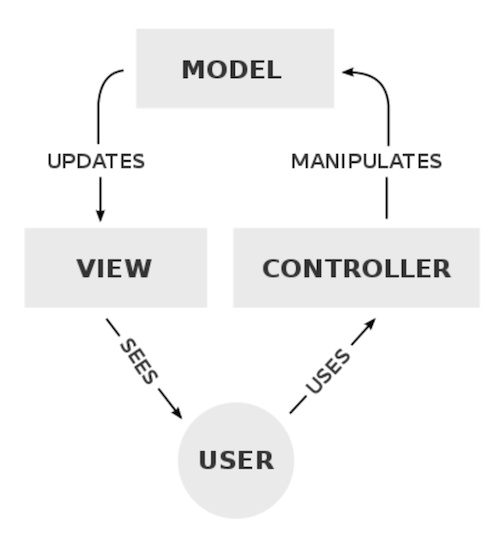
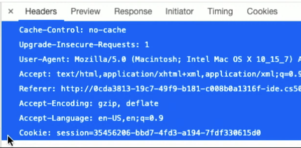
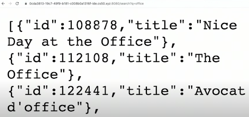
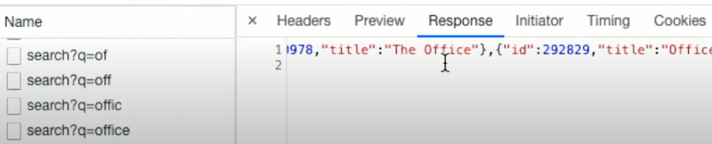

## Programação da Web


- Hoje vamos criar aplicativos da web mais avançados escrevendo código que é executado no servidor.
- Na semana passada, usamos http-serverno CS50 IDE como um **servidor web**, um programa que escuta conexões e solicitações e responde com páginas web ou outros recursos.
- Uma solicitação HTTP possui cabeçalhos, como:

```
GET / HTTP/1.1
...
```

- Esses cabeçalhos podem solicitar algum arquivo ou página ou enviar dados do navegador de volta ao servidor.
Embora `http-server` responda apenas com páginas estáticas, podemos usar outros servidores da web que analisam ou analisam cabeçalhos de solicitação, como `GET /search?q=cats HTTP/1.1`, para retornar páginas dinamicamente.

## Flask

Usaremos Python e uma biblioteca chamada Flask para escrever nosso próprio servidor web, implementando recursos adicionais. O Flask também é uma estrutura , onde a biblioteca de código também vem com um conjunto de convenções de como deve ser usada. Por exemplo, como outras bibliotecas, o Flask inclui funções que podemos usar para analisar solicitações individualmente, mas como uma estrutura, também requer que o código do nosso programa seja organizado de uma determinada maneira:

```py
application.py
requirements.txt
static/
templates/
```

- `application.py` terá o código Python para nosso servidor web.
- `requirements.txt` inclui uma lista de bibliotecas necessárias para nosso aplicativo.
- `static/` é um diretório de arquivos estáticos, como arquivos CSS e JavaScript.
- `templates/` é um diretório para arquivos que serão usados ​​para criar nosso HTML final.
- Existem muitas estruturas de servidor web para cada uma das linguagens populares, e o Flask será um representante que usamos hoje.
- O Flask também implementa um **padrão de design** específico , ou a maneira como nosso programa e código são organizados. Para Flask, o padrão de design é geralmente **MVC**, ou Model – view – controller:


<h1 align="center">

</h1>

- O controlador é nossa lógica e código que gerencia nossa aplicação de maneira geral, com base na entrada do usuário. No Flask, este será o nosso código Python.
- A visualização é a interface do usuário, como o HTML e CSS que o usuário verá e com os quais interagirá.
- O modelo são os dados de nosso aplicativo, como um banco de dados SQL ou arquivo CSV.
- O aplicativo Flask mais simples pode ter a seguinte aparência:

```py
from flask import Flask

app = Flask(__name__)

@app.route("/")
def index():
    return "hello, world"
```

- Primeiro, importaremos Flaskda flaskbiblioteca, que usa uma letra maiúscula como nome principal.
- Então, vamos criar uma appvariável dando o nome do nosso arquivo para a Flaskvariável.
- A seguir, rotularemos uma função para a /rota ou URL com @app.route. O @símbolo em Python é chamado de decorador, que aplica uma função a outra.
- Chamaremos a função index, pois ela deve responder a uma solicitação /da página padrão. E nossa função responderá apenas com uma string por enquanto.
- No IDE CS50, podemos ir para o diretório com o código do nosso aplicativo e digitar `flask run`para iniciá-lo. Veremos um URL e podemos abri-lo para ver hello, world.
- Atualizaremos nosso código para realmente retornar HTML com a `render_template` função, que encontra um arquivo fornecido e retorna seu conteúdo:

```py
from flask import Flask, render_template

app = Flask(__name__)


@app.route("/")
def index():
    return render_template("index.html")
```

- Precisamos criar um `templates/` diretório e criar um index.htmlarquivo com algum conteúdo dentro dele.
- Agora, a digitação `flask run` retornará esse arquivo HTML quando visitarmos o URL do nosso servidor.
- Vamos passar um argumento para `render_template` em nosso código de controlador:

```py
from flask import Flask, render_template, request

app = Flask(__name__)

@app.route("/")
def index():
    return render_template("index.html", name=request.args.get("name", "world"))
```

- Acontece que podemos fornecer `render_template` qualquer argumento nomeado, como `name`, e ele irá substituí-lo em nosso modelo ou em nosso arquivo HTML com espaços reservados.
- Em `index.html`, substituiremos `hello, world` por `hello`, para informar ao Flask onde substituir a `name` variável:

```
<!DOCTYPE html>

<html lang="en">
    <head>
        <title>hello</title>
    </head>
    <body>
        hello, {{ name }}
    </body>
</html>
```

- Podemos usar a `request` variável da biblioteca Flask para obter um parâmetro da solicitação HTTP, neste caso também `name`, e voltar para o padrão worldcaso não tenha sido fornecido.
- Agora, quando reiniciarmos nosso servidor após fazer essas alterações, e visitarmos a página padrão com uma URL como `/?name=David`, veremos essa mesma entrada retornada para nós no HTML gerado por nosso servidor.
- Podemos presumir que a consulta de pesquisa do Google, em `/search?q=cats`, também é analisada por algum código para o `q`parâmetro e passada para algum banco de dados para obter todos os resultados relevantes. Esses resultados são usados para gerar a página HTML final.
 
## Formulários

- Vamos mover nosso modelo original para `greet.html`, de forma que ele cumprimente o usuário com seu nome. Em index.html, vamos criar um formulário:

```html
<!DOCTYPE html>

<html lang="en">
    <head>
        <title>hello</title>
    </head>
    <body>
        <form action="/greet" method="get">
            <input name="name" type="text">
            <input type="submit">
        </form>
    </body>
</html>
```

- Enviaremos o formulário para a `/greet` rota, e teremos uma entrada para o `name`parâmetro e outra para o botão enviar.
- Em nosso `applications.py` controlador, também precisaremos adicionar uma função para a `/greet` rota, que é quase exatamente o que tínhamos `/` antes:
 
```py
@app.route("/")
def index():
    return render_template("index.html")


@app.route("/greet")
def greet():
    return render_template("greet.html", name=request.args.get("name", "world"))
```

- Nosso formulário `index.html` será estático, pois pode ser o mesmo sempre.
- Agora, podemos executar nosso servidor, ver nosso formulário na página padrão e usá-lo para gerar outra página.

## PUBLICAR

- Nosso formulário acima usa o método GET, que inclui os dados do nosso formulário na URL.
Nós vamos mudar o método em nosso HTML: `<form action="/greet" method="post">`. Nosso controlador também precisará ser alterado para aceitar o método POST e procurar o parâmetro em outro lugar:

```py
@app.route("/greet", methods=["POST"])
def greet():
    return render_template("greet.html", name=request.form.get("name", "world"))
```

- Embora `request.args` seja para parâmetros em uma solicitação GET, temos que usar request.formno Flask para parâmetros em uma solicitação POST.
- Agora, quando reiniciamos nosso aplicativo após fazer essas alterações, podemos ver que o formulário nos leva a /greet, mas o conteúdo não está mais incluído na URL.

## Layouts

- Em `index.html` e `greet.html`, temos algum código HTML repetido. Com apenas HTML, não podemos compartilhar código entre arquivos, mas com modelos Flask (e outras estruturas da web), podemos fatorar esse conteúdo comum.
- Vamos criar outro modelo `layout.html`:

```html
<!DOCTYPE html>

<html lang="en">
    <head>
        <title>hello</title>
    </head>
    <body>
        
    </body>
</html>
```

- O Flask suporta Jinja, uma linguagem de modelos, que usa a `` sintaxe para incluir blocos de espaço reservado ou outros pedaços de código. Aqui, nomeamos nosso bloco, `body` pois ele contém o HTML que deve entrar no `<body>` elemento.
Em `index.html`, usaremos o `layout.html` blueprint e apenas definiremos o `body` bloco com:

```html




    <form action="/greet" method="post">
        <input autocomplete="off" autofocus name="name" placeholder="Name" type="text">
        <input type="submit">
    </form>


```

- Da mesma forma, em `greet.html`, definimos o `body` bloco apenas com a saudação:

```py




    hello, {{ name }}


```

- Agora, se reiniciarmos nosso servidor e visualizarmos o código-fonte de nosso HTML após abrirmos a URL de nosso servidor, veremos uma página completa com nosso formulário dentro de nosso arquivo HTML, gerado pelo Flask.
- Podemos até reutilizar a mesma rota para oferecer suporte aos métodos GET e POST:

```py
@app.route("/", methods=["GET", "POST"])
def index():
    if request.method == "POST":
        return render_template("greet.html", name=request.form.get("name", "world"))
    return render_template("index.html")
```

- Primeiro, verificamos se o methodde requesté uma solicitação POST. Nesse caso, procuraremos o nameparâmetro e retornaremos o HTML do greet.htmlmodelo. Caso contrário, retornaremos o HTML do index.html, que contém nosso formulário.
- Também precisaremos alterar o formulário `action` para a `/rota` padrão .

Frosh IMs

- Um dos primeiros aplicativos da web de David foi para que os alunos do campus se registrassem em “IMs frosh”, esportes internos.
- Usaremos um layout.htmlsemelhante ao que tínhamos antes:

```html
<!DOCTYPE html>

<html lang="en">
    <head>
        <meta name="viewport" content="initial-scale=1, width=device-width">
        <title>froshims</title>
    </head>
    <body>
        
    </body>
</html>
```

- Uma `<meta>` tag nos `<head>` permite adicionar mais metadados à nossa página. Neste caso, estamos adicionando um `content` atributo para os `viewport` metadados, a fim de dizer ao navegador para dimensionar automaticamente o tamanho e as fontes de nossa página para o dispositivo.
Em nosso `application.py`, retornaremos nosso `index.html` modelo para a `/` rota padrão :


```py
from flask import Flask, render_template, request

app = Flask(__name__)

SPORTS = [
    "Dodgeball",
    "Flag Football",
    "Soccer",
    "Volleyball",
    "Ultimate Frisbee"
]

@app.route("/")
def index():
    return render_template("index.html")
```


- Nosso `index.html` modelo será semelhante a este:

```html



    <h1>Register</h1>

    <form action="/register" method="post">

        <input autocomplete="off" autofocus name="name" placeholder="Name" type="text">
        <select name="sport">
            <option disabled selected value="">Sport</option>
            <option value="Dodgeball">Dodgeball</option>
            <option value="Flag Football">Flag Football</option>
            <option value="Soccer">Soccer</option>
            <option value="Volleyball">Volleyball</option>
            <option value="Ultimate Frisbee">Ultimate Frisbee</option>
        </select>
        <input type="submit" value="Register">

    </form>

```

- Teremos um formulário como antes, e teremos um `<select>` menu com opções para cada esporte.
- Em nosso `application.py`, vamos permitir POST para nossa `/register` rota:


```py
@app.route("/register", methods=["POST"])
def register():

  if not request.form.get("name") or not request.form.get("sport"):
      return render_template("failure.html")

  return render_template("success.html")
```

Verificaremos se os valores do nosso formulário são válidos e, em seguida, retornaremos um modelo dependendo dos resultados, embora não estejamos realmente fazendo nada com os dados ainda.
Mas um usuário pode alterar o HTML do formulário em seu navegador e enviar uma solicitação que contenha algum outro esporte como opção selecionada!
Verificaremos se o valor de sporté válido criando uma lista em application.py:

```py
from flask import Flask, render_template, request

app = Flask(__name__)

SPORTS = [
    "Dodgeball",
    "Flag Football",
    "Soccer",
    "Volleyball",
    "Ultimate Frisbee"
]

@app.route("/")
def index():
    return render_template("index.html", sports=SPORTS)
...
```

- Em seguida, passaremos essa lista para o `index.html` modelo.
- Em nosso modelo, podemos até usar loops para gerar uma lista de opções da lista de strings passada como sports:

```html
...
<select name="sport">
    <option disabled selected value="">Sport</option>
    
        <option value="{{ sport }}">{{ sport }}</option>
    
</select>
...
````

- Por fim, podemos verificar se o `sport` enviado na solicitação POST está na lista SPORT Sem `application.py`:

```
...
@app.route("/register", methods=["POST"])
def register():

    if not request.form.get("name") or request.form.get("sport") not in SPORTS:
        return render_template("failure.html")

    return render_template("success.html")
```

- Podemos alterar o menu de seleção em nosso formulário para caixas de seleção, para permitir vários esportes:

```html



    <h1>Register</h1>

    <form action="/register" method="post">

        <input autocomplete="off" autofocus name="name" placeholder="Name" type="text">
        
            <input name="sport" type="checkbox" value="{{ sport }}"> {{ sport }}
        
        <input type="submit" value="Register">

    </form>

```

- Em nossa registerfunção, podemos chamar request.form.getlistpara obter a lista de opções marcadas.
- Também podemos usar botões de opção, o que permitirá que apenas uma opção seja escolhida por vez.

## Armazenamento de dados

- Vamos armazenar nossos alunos registrados, ou inscritos, em um dicionário na memória de nosso servidor web:

```py
from flask import Flask, redirect, render_template, request

app = Flask(__name__)

REGISTRANTS = {}

...

@app.route("/register", methods=["POST"])
def register():

    name = request.form.get("name")
    if not name:
        return render_template("error.html", message="Missing name")

    sport = request.form.get("sport")
    if not sport:
        return render_template("error.html", message="Missing sport")
    if sport not in SPORTS:
        return render_template("error.html", message="Invalid sport")

    REGISTRANTS[name] = sport

    return redirect("/registrants")
```

- Criaremos um dicionário chamado `REGISTRANTS`, e em `register` primeiro verificaremos o `name` e `sport`, retornando uma mensagem de erro diferente em cada caso. Então, podemos armazenar com segurança o nome e o esporte em nosso `REGISTRANTS` dicionário e redirecionar para outra rota que exibirá os alunos registrados.
- O modelo de mensagem de erro, por sua vez, exibirá apenas a mensagem:

```py



    {{ message }}

```

- Vamos adicionar a /registrantsrota e o modelo para mostrar aos alunos registrados:

```py
@app.route("/registrants")
def registrants():
    return render_template("registrants.html", registrants=REGISTRANTS)
```

- Em nossa rota, passaremos o `REGISTRANTS` dicionário para o modelo como um parâmetro chamado `registrants`:

```



    <h1>Registrants</h1>
    <table>
        <thead>
            <tr>
                <th>Name</th>
                <th>Sport</th>
            </tr>
        </thead>
        <tbody>
            
                <tr>
                    <td>{{ name }}</td>
                    <td>{{ registrants[name] }}</td>
                </tr>
            
        </tbody>
    </table>

```

- Nosso modelo terá uma tabela, com uma linha de título e uma linha para cada chave e valor armazenado em `registrants`.
- Se nosso servidor da web parar de funcionar, perderemos os dados armazenados, então usaremos um banco de dados SQLite com a biblioteca SQL de `cs50`:

```py
from cs50 import SQL
from flask import Flask, redirect, render_template, request

app = Flask(__name__)

db = SQL("sqlite:///froshims.db")

...
```

- No terminal do IDE, podemos executar `sqlite3 froshims.db` para abrir o banco de dados e usar o `.schema` comando para ver a tabela com colunas de `id`, namee sport, que foi criado com antecedência.
- Agora, em nossas rotas, podemos inserir e selecionar linhas com SQL:

```py
@app.route("/register", methods=["POST"])
def register():

    name = request.form.get("name")
    if not name:
        return render_template("error.html", message="Missing name")
    sport = request.form.get("sport")
    if not sport:
        return render_template("error.html", message="Missing sport")
    if sport not in SPORTS:
        return render_template("error.html", message="Invalid sport")

    db.execute("INSERT INTO registrants (name, sport) VALUES(?, ?)", name, sport)

    return redirect("/registrants")


@app.route("/registrants")
def registrants():
    registrants = db.execute("SELECT * FROM registrants")
    return render_template("registrants.html", registrants=registrants)
```

- Depois de validar a solicitação, podemos usar `INSERT INTO` para adicionar uma linha e, da mesma forma, em `registrants()`, podemos `SELECT` todas as linhas e passá-las para o modelo como uma lista de linhas.
- Nosso `registrants.html` modelo também precisará ser ajustado, já que cada linha retornada de `db.execute` é um dicionário. Portanto, podemos usar registrant.namee registrant.sportacessar o valor de cada chave em cada linha:

```html
<tbody>
    
        <tr>
            <td>{{ registrant.name }}</td>
            <td>{{ registrant.sport }}</td>
            <td>
                <form action="/deregister" method="post">
                    <input name="id" type="hidden" value="{{ registrant.id }}">
                    <input type="submit" value="Deregister">
                </form>
            </td>
        </tr>
    
</tbody>
```

- Podemos até enviar e-mail aos usuários com outra biblioteca flask_mail:

```py
import os
import re

from flask import Flask, render_template, request
from flask_mail import Mail, Message

app = Flask(__name__)
app.config["MAIL_DEFAULT_SENDER"] = os.getenv("MAIL_DEFAULT_SENDER")
app.config["MAIL_PASSWORD"] = os.getenv("MAIL_PASSWORD")
app.config["MAIL_PORT"] = 587
app.config["MAIL_SERVER"] = "smtp.gmail.com"
app.config["MAIL_USE_TLS"] = True
app.config["MAIL_USERNAME"] = os.getenv("MAIL_USERNAME")
mail = Mail(app)
```

- Definimos algumas variáveis ​​sensíveis fora de nosso código, no ambiente do IDE, para que possamos evitar incluí-las em nosso código.
- Acontece que podemos fornecer detalhes de configuração como nome de usuário e senha e servidor de e-mail, neste caso do Gmail, para a Mailvariável, que enviará e-mail para nós.
- Finalmente, em nossa `register` rota, podemos enviar um e-mail para o usuário:

```py
@app.route("/register", methods=["POST"])
def register():

    email = request.form.get("email")
    if not email:
        return render_template("error.html", message="Missing email")
    sport = request.form.get("sport")
    if not sport:
        return render_template("error.html", message="Missing sport")
    if sport not in SPORTS:
        return render_template("error.html", message="Invalid sport")

    message = Message("You are registered!", recipients=[email])
    mail.send(message)

    return render_template("success.html")
```

- Em nosso formulário, também precisaremos solicitar um e-mail em vez de um nome:
```
<input autocomplete="off" name="email" placeholder="Email" type="email">
```
- Agora, se reiniciarmos nosso servidor e usarmos o formulário para fornecer um e-mail, veremos que de fato recebemos um!

## Sessões

- As **sessões** são como os servidores da web lembram as informações sobre cada usuário, o que ativa recursos como permitir que os usuários permaneçam logados.
- Acontece que os servidores podem enviar outro cabeçalho em uma resposta, chamado `Set-Cookie`:

```
HTTP/1.1 200 OK
Content-Type: text/html
Set-Cookie: session=value
...
```

- **Cookies** são pequenos pedaços de dados de um servidor web que o navegador salva para nós. Em muitos casos, eles são grandes números aleatórios ou sequências usadas para identificar e rastrear um usuário de forma exclusiva entre as visitas.
- Nesse caso, o servidor está pedindo ao nosso navegador para definir um cookie para esse servidor, chamado sessioncom um valor de value.
- Então, quando o navegador fizer outra solicitação ao mesmo servidor, ele enviará de volta os cookies que o mesmo servidor configurou antes:

```
GET / HTTP/1.1
Host: gmail.com
Cookie: session=value
```

- No mundo real, os parques de diversões podem dar a você um carimbo manual para que você possa voltar depois de sair. Da mesma forma, nosso navegador está apresentando nossos cookies de volta ao servidor da web, para que ele possa se lembrar de quem somos.
- As empresas de publicidade podem definir cookies de vários sites, a fim de rastrear os usuários em todos eles. No modo de navegação anônima, por outro lado, o navegador não envia cookies definidos anteriormente.
- No Flask, podemos usar a `flask_session` biblioteca para gerenciar isso para nós:

```py
from flask import Flask, redirect, render_template, request, session
from flask_session import Session

app = Flask(__name__)
app.config["SESSION_PERMANENT"] = False
app.config["SESSION_TYPE"] = "filesystem"
Session(app)


@app.route("/")
def index():
    if not session.get("name"):
        return redirect("/login")
    return render_template("index.html")


@app.route("/login", methods=["GET", "POST"])
def login():
    if request.method == "POST":
        session["name"] = request.form.get("name")
        return redirect("/")
    return render_template("login.html")


@app.route("/logout")
def logout():
    session["name"] = None
    return redirect("/")
```

- Vamos configurar a biblioteca de sessão para usar o sistema de arquivos do IDE e usar sessioncomo um dicionário para armazenar o nome de um usuário. Acontece que o Flask usará cookies HTTP para nós, para manter essa sessionvariável para cada usuário que visita nosso servidor web. Cada visitante obterá sua própria sessionvariável, embora pareça ser global em nosso código.
- Para nossa `/` rota padrão , redirecionaremos para `/login` se ainda não houver um nome definido sessionpara o usuário e, caso contrário, mostraremos um index.htmlmodelo padrão .
- Para o nosso `/login` caminho, vamos definir `name` em `session` que o valor do formulário enviado via POST, e, em seguida, redirecionar para a rota padrão. Se visitamos a rota via GET, renderizaremos o formulário de login em login.html.
- Para a `/logou` trota, podemos limpar o valor de `name` in `session` definindo-o como Nonee redirecionando para `/` novamente.
- Geralmente, também precisaremos de um `requirements.txt` que inclua os nomes das bibliotecas que desejamos usar, para que possam ser instaladas em nosso aplicativo, mas as que usamos aqui foram pré-instaladas no IDE.
- Em nosso `login.html`, teremos um formulário com apenas um nome:

```




    <form action="/login" method="post">
        <input autocomplete="off" autofocus name="name" placeholder="Name" type="text">
        <input type="submit" value="Log In">
    </form>


```

- E no nosso index.html, podemos verificar se session.nameexiste, e mostrar diferentes conteúdos:

```




    
        You are logged in as {{ session.name }}. <a href="/logout">Log out</a>.
    
        You are not logged in. <a href="/login">Log in</a>.
    


```

- Quando reiniciamos nosso servidor, acessamos seu URL e logamos, podemos ver na aba Rede que nosso navegador está realmente enviando um Cookie:cabeçalho na solicitação:

<h1 align="center">

</h1>

## store, shows

- Veremos um exemplo [`store`](https://cdn.cs50.net/2020/fall/lectures/9/src9/store/):
- `application.py` inicializa e configura nosso aplicativo para usar um banco de dados e sessões. Em `index()`, a rota padrão renderiza uma lista de livros armazenados no banco de dados.
- `templates/books.html` mostra a lista de `books`, bem como um formulário que permite clicar em “Adicionar ao carrinho” para cada um deles.
- A `/cart` rota, por sua vez, armazena um `id` de uma solicitação POST na sessionvariável de uma lista. Se a solicitação usasse um método GET, entretanto, `/cart` mostraria uma lista de livros com `id`s correspondendo à lista de ids armazenados em `session`.
- Assim, “carrinhos de compras” em sites podem ser implementados com cookies e variáveis de sessão armazenadas no servidor.
- Quando visualizamos a fonte gerada por nossa rota padrão, vemos que cada livro tem seu próprio `<form>` elemento, cada um com uma identrada diferente que é ocultada e gerada. Isso idvem do banco de dados SQLite em nosso servidor e é enviado de volta para a `/cart` rota.
- Veremos outro exemplo, `shows` onde podemos usar JavaScript no **front-end** , ou lado que o usuário vê, e Python no **back-end** , ou lado do servidor.
- Em `application.py` aqui, vamos abrir um banco de dados, `shows.db`:

```py
from cs50 import SQL
from flask import Flask, render_template, request

app = Flask(__name__)

db = SQL("sqlite:///shows.db")


@app.route("/")
def index():
    return render_template("index.html")


@app.route("/search")
def search():
    shows = db.execute("SELECT * FROM shows WHERE title LIKE ?", "%" + request.args.get("q") + "%")
    return render_template("search.html", shows=shows)
```

- A `/`rota padrão mostrará um formulário, onde podemos digitar algum termo de pesquisa.
- O formulário usará o método GET para enviar a consulta de pesquisa `/search`, que por sua vez usará o banco de dados para encontrar uma lista de programas que correspondam. Finalmente, um search.htmlmodelo mostrará a lista de programas.
- Com JavaScript, podemos mostrar uma lista parcial de resultados à medida que digitamos. Primeiro, usaremos uma função chamada `jsonify` para retornar nossos programas no formato JSON, um formato padrão que o JavaScript pode usar.

```
@app.route("/search")
def search():
    shows = db.execute("SELECT * FROM shows WHERE title LIKE ?", "%" + request.args.get("q") + "%")
    return jsonify(shows)
```

- Agora podemos enviar uma consulta de pesquisa e ver se obtemos uma lista de dicionários:

<h1 align="center">

</h1>

- Então, nosso index.htmlmodelo pode converter esta lista em elementos no DOM:

```html
<!DOCTYPE html>

<html lang="en">
    <head>
        <meta name="viewport" content="initial-scale=1, width=device-width">
        <title>shows</title>
    </head>
    <body>

        <input autocomplete="off" autofocus placeholder="Query" type="search">

        <ul></ul>

        <script crossorigin="anonymous" integrity="sha256-9/aliU8dGd2tb6OSsuzixeV4y/faTqgFtohetphbbj0=" src="https://code.jquery.com/jquery-3.5.1.min.js"></script>
        <script>

            let input = document.querySelector('input');
            input.addEventListener('keyup', function() {
                $.get('/search?q=' + input.value, function(shows) {
                  let html = '';
                  for (let id in shows)
                  {
                      let title = shows[id].title;
                      html += '<li>' + title + '</li>';
                  }

                  document.querySelector('ul').innerHTML = html;
                });
            });

        </script>

    </body>
</html>
```

- Usaremos outra biblioteca, JQuery, para fazer solicitações com mais facilidade.
- Ouviremos as mudanças no `input` elemento e usaremos o `$.get`, que chama uma função de biblioteca JQuery para fazer uma solicitação GET com o valor da entrada. Em seguida, a resposta será passada para uma função anônima como a variável `shows`, que definirá o DOM com os `<li>` elementos gerados com base nos dados da resposta.
- `$.get`é uma chamada **AJAX** , que permite ao JavaScript fazer solicitações HTTP adicionais após o carregamento da página, para obter mais dados. Se abrirmos a guia Rede novamente, podemos ver de fato que cada tecla pressionada fez outra solicitação, com uma resposta:

<h1 align="center">

</h1>

- Como a solicitação de rede pode ser lenta, a função anônima que passamos $.geté uma função de **retorno de chamada**, que só é chamada depois de obtermos uma resposta do servidor. Enquanto isso, o navegador pode executar outro código JavaScript.
- Por hoje é isso!
